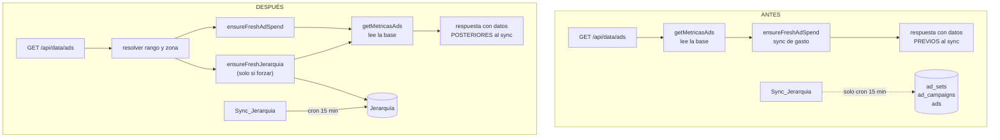

# Design Document

## Overview

Los siete requisitos se agrupan en tres cambios de fondo y cuatro arreglos localizados.

Los tres de fondo:

1. **La Jerarquía gana una noción de frescura por objeto.** Hoy `synced_at` existe en las tres tablas pero nadie lo lee, y un objeto que Meta dejó de devolver es indistinguible de uno recién confirmado. Se agrega una marca explícita de desaparición, las dos cosas viajan hasta la fila de la tabla, y el Preflight las usa para decidir.
2. **La Sync_Jerarquia entra al camino en vivo**, con su propio TTL, su propio freno y su propia marca de frescura, replicando la forma que ya tiene `lib/ads/live.ts` para el gasto. No se comparte el mecanismo del gasto porque las dos sincronizaciones tienen costos y cadencias distintas.
3. **El endpoint de datos invierte el orden**: sincroniza y después lee. Hoy hace lo contrario y devuelve la foto anterior.

Los cuatro localizados: el importe del presupuesto pasa a tener una sola fuente de verdad, el toggle pasa a informar lo que realmente ocurrió, los mensajes de celda no editable dicen el nivel correcto, y los totales de la barra de KPIs se calculan en el servidor sobre el filtro completo.

### Principio que ordena las decisiones

El panel opera cuentas que gastan plata. Ante la duda entre mostrar un dato cómodo y mostrar un dato honesto, gana el honesto: un total incompleto se marca como incompleto, un estado viejo se marca como viejo, y una escritura que no se sabe si se aplicó se dice indeterminada. Ninguna de estas condiciones puede quedar codificada como un valor que parece normal.

## Architecture

### El camino de datos, antes y después



### Por qué la Sync_Jerarquia no cuelga del polling

`usePollingGasto` dispara un pedido por minuto por pestaña visible. El Sync_Gasto tolera eso porque su freno es el TTL del servidor, global a todas las pestañas, y una corrida es una llamada a Insights por cuenta. La Sync_Jerarquia es una llamada por cuenta **y por nivel** más la lectura de DSA, y escribe cientos de filas en una transacción. Colgarla del polling convertiría una pestaña olvidada en un generador de carga constante contra Meta y contra la base.

Por eso el disparador en vivo es únicamente el Boton_Actualizar (R4.1, R4.8): un acto explícito del usuario, con freno propio. El cron sigue siendo la cadencia de fondo (R4.6).

## Components and Interfaces

### 1. Frescura y desaparición en la Jerarquía (R3)

**Migración `db/migrations/025_ads_frescura.sql`**

Agrega a `ad_campaigns`, `ad_sets` y `ads`:

- `desaparecido_at timestamptz NULL` — cuándo se detectó que Meta dejó de devolver el objeto. `NULL` = presente en la última corrida.

Agrega a `ad_accounts`:

- `last_hierarchy_sync_at timestamptz NULL`
- `last_hierarchy_sync_error text NULL`

Y una fila en `settings`:

- `ads_frescura_umbral_segundos` (default `900`) — a partir de cuántos segundos una Frescura_Objeto se considera vieja.

Se agregan columnas nuevas en lugar de reutilizar `synced_at` porque son dos hechos distintos: `synced_at` responde "cuándo lo vimos por última vez" y `desaparecido_at` responde "desde cuándo Meta no lo devuelve". Con una sola columna, un objeto desaparecido hace cinco días y uno cuyo sync falló hace cinco días serían el mismo dato.

**`lib/ads/jerarquia.ts`**

`sincronizarCuenta` ya calcula los desaparecidos para el reporte (`r.desaparecidos`), pero sólo los cuenta. Se extiende `escribirCuenta` para que dentro de la misma transacción:

- ponga `desaparecido_at = now()` en las filas de la cuenta cuyo id **no** vino en esta corrida y que hoy tienen `desaparecido_at IS NULL`;
- ponga `desaparecido_at = NULL` en las filas que sí vinieron y la tenían marcada (R3.6).

Va en la misma transacción que el upsert porque un corte entre las dos escrituras dejaría objetos marcados como desaparecidos que en realidad se acababan de confirmar.

Nada se borra (R3.5): un objeto desaparecido puede tener gasto histórico atribuido en `ad_spend`, y la desaparición puede ser transitoria.

**`lib/queries/ads.ts`**

Los tres fragmentos de jerarquía (`campaign`, `adset`, `ad`) suman `o.synced_at` y `o.desaparecido_at` al SELECT, y `filaDesdeRow` los mapea a dos campos nuevos de `MetricasObjeto`:

```ts
syncedAt: string | null;        // ISO
desaparecidoAt: string | null;  // ISO, null = Meta lo sigue devolviendo
```

Las filas que salen del `UNION ALL` con `gasto` (objetos con gasto que no están en la Jerarquía) llevan los dos campos en `NULL`.

**`app/(panel)/anuncios/celdas.tsx` y `TablaAds.tsx`**

Una marca en la celda de nombre cuando la fila está vieja o desaparecida (R3.1). Dos estados visualmente distintos:

- **vieja**: `synced_at` supera `ads_frescura_umbral_segundos`. Badge neutro con la antigüedad.
- **desaparecida**: `desaparecido_at` no es nulo. Badge de advertencia, porque es la condición más grave: no se va a arreglar sola.

`GestorAnuncios` cuenta las filas en cada condición y muestra un Banner con el total (R3.3).

### 2. Sync_Jerarquia en vivo (R4)

**`lib/ads/liveJerarquia.ts`** (nuevo)

Espeja la forma de `lib/ads/live.ts`, que ya resolvió este problema para el gasto:

```ts
export type FrescuraJerarquia = {
  syncedAt: string | null;
  ageSeconds: number | null;
  refreshed: boolean;
  error: string | null;
};

export async function ensureFreshJerarquia(
  accountId: string,
  opts?: { forzar?: boolean; timeoutMs?: number },
): Promise<FrescuraJerarquia>;
```

Cuatro propiedades que se heredan de `live.ts` a propósito:

1. **Nunca tira.** Un fallo de Meta no puede dejar la pantalla sin filas (R4.4).
2. **TTL propio**: `ADS_JERARQUIA_TTL_SECONDS`, default `300`. Más alto que el del gasto porque el sync es más caro (R4.2).
3. **Timeout propio**: default `10_000`, y el Boton_Actualizar pide `30_000`. Si se agota, la pantalla se dibuja con lo guardado y el sync sigue de fondo (R4.3).
4. **Promise en vuelo compartido**, pero **por cuenta**: un `Map<string, Promise<void>>` en lugar de la única variable de `live.ts`, porque acá el sync es por cuenta y dos cuentas distintas no deberían esperarse entre sí.

La frescura se lee de `ad_accounts.last_hierarchy_sync_at`, que `sincronizarCuenta` escribe al terminar, con el mismo criterio que `syncAdSpend` usa para `last_sync_at`: se escribe también cuando falla, y el error queda en `last_hierarchy_sync_error`, para que un fallo no se vea como un dato fresco.

**`app/api/data/ads/route.ts`**

Se llama sólo cuando viene `forzar` (R4.8). La respuesta gana `jerarquiaFreshness`.

**`app/(panel)/anuncios/BarraFrescura.tsx`**

Dos edades en lugar de una (R4.5): la del gasto y la de la jerarquía, cada una con su texto de `textoEdadGasto` (que se renombra a `textoEdad` porque deja de ser sólo del gasto). Son dos sincronizaciones que se atrasan por separado y colapsarlas en un número esconde justamente el problema que este spec vino a arreglar.

**`app/api/ads/acciones/route.ts`**

`refrescarJerarquia` (la que ya existe, para un objeto después de una escritura confirmada) se extiende para escribir también `desaparecido_at = NULL`: si Meta acaba de confirmar una escritura sobre ese objeto, existe (R4.7).

### 3. Sincronizar antes de leer (R5)

**`app/api/data/ads/route.ts`**

Hoy el orden es: `getMetricasAds` → `ensureFreshAdSpend`. La razón por la que quedó así es que `ensureFreshAdSpend` necesita `data.rango.timezone` para calcular `hoy`, y ese dato sale de la lectura.

Se rompe la dependencia izando la resolución del rango, que ya existe como función independiente y ya se usa así en la rama del alcance:

```
1. resolver la zona de la cuenta y el rango  (rangoDePeriodo, ya importado)
2. ensureFreshAdSpend(rango.hasta, hoy, ...)  ┐ en paralelo
   ensureFreshJerarquia(accountId, ...)       ┘ (solo si forzar)
3. asegurarAlcance (si alguna columna lo pide)
4. getMetricasAds
5. respuesta
```

Los dos sync van en paralelo porque son independientes: uno escribe `ad_spend` y el otro la Jerarquía. El rango se calcula una sola vez y se le pasa a `getMetricasAds` para no resolverlo dos veces.

El comentario que hoy afirma que el gasto se refresca antes de leer pasa a ser verdadero (R5.3).

**`app/(panel)/anuncios/GestorAnuncios.tsx`**

Un contador monótono de pedidos para descartar respuestas fuera de orden (R5.4):

```ts
const seqEmitida = useRef(0);
const seqAplicada = useRef(0);
```

`pedirFilas` toma el número al emitir; cada `setData` verifica que su número no sea menor que `seqAplicada.current` antes de aplicar. Esto cubre las tres fuentes de pedidos concurrentes que hoy conviven sin coordinación: el efecto de filtros, el Boton_Actualizar (que puede tardar hasta 60 s) y el refetch posterior a un lote.

El `AbortController` que ya existe por pedido no alcanza: aborta por timeout, no cancela el anterior cuando llega uno nuevo.

### 4. El presupuesto con una sola fuente de verdad (R1)

**`lib/ads/presupuesto.ts`** (nuevo)

La regla de validez vive hoy duplicada e implícita en tres lugares: el `valido` de `FormularioPresupuesto`, el `onBlur`/`onKeyDown` de `PresupuestoCelda` y el schema del route. Se extrae:

```ts
export type PresupuestoParseado =
  | { ok: true; valor: number }
  | { ok: false; motivo: 'vacio' | 'no_numero' | 'bajo_el_minimo' | 'sobre_el_techo' | 'mas_de_dos_decimales' };

export function parsearPresupuesto(texto: string, techoEur: number): PresupuestoParseado;
export const MINIMO_EUR = 0.01;
```

La usan el formulario (para el borde rojo y el `aria-invalid`), la habilitación del botón Ejecutar y el armado del payload. Una sola regla significa que no puede haber un importe que el formulario acepta y el endpoint rechaza (R1.5).

**`app/(panel)/anuncios/GestorAnuncios.tsx`**

- `abrirConfirmacion` deja de pisar el campo con `''`: lo siembra desde `params.budgetEur` cuando viene (R1.2).
- `ejecutarLote` arma `budgetEur` desde `parsearPresupuesto(dialogoPresupuesto, maxPresupuesto)` y aborta con un mensaje propio si no es válido, en lugar de mandar `undefined` (R1.1, R1.3).

**`app/(panel)/anuncios/DialogoConfirmacion.tsx`**

Gana una prop opcional `bloqueo?: string | null`. Cuando no es nula, el botón Ejecutar queda deshabilitado y el texto se muestra al lado (R1.4). El padre es el que sabe si el formulario de la acción está completo; meter esa lógica adentro del diálogo obligaría a que el diálogo conozca los cinco formularios.

**`app/api/ads/acciones/route.ts`**

El schema de `budget_set` gana mensajes explícitos en lugar de los de la librería (R1.6):

```ts
budgetEur: z.number({ required_error: 'falta el presupuesto en euros (budgetEur)' })
  .positive('el presupuesto tiene que ser mayor que cero')
  .finite()
  .refine(dosDecimales, 'el presupuesto admite como máximo dos decimales'),
```

**`app/(panel)/anuncios/celdas.tsx`**

El motivo de celda no editable se corrige (R1.7). Hoy dice "el presupuesto se maneja en la campaña" para cualquier caso de `budgetLevel !== level`, que en estas cuentas (ABO, `budget_level = 'adset'`) es exactamente al revés. El texto pasa a derivarse de `fila.budgetLevel`:

- `budgetLevel === 'campaign'` → "el presupuesto se maneja en la campaña (CBO)"
- `budgetLevel === 'adset'` → "el presupuesto se maneja en cada conjunto (ABO)"
- `budgetLevel === null` → "este objeto no tiene presupuesto propio"

### 5. El toggle que informa lo que pasó (R2)

**`lib/ads/mensajes.ts`** (nuevo)

Un traductor único de la respuesta del Endpoint_Acciones a texto para el usuario:

```ts
export function mensajeDeResultado(
  httpStatus: number,
  cuerpo: RespuestaAcciones | ErrorAcciones,
): { tono: 'ok' | 'aviso' | 'error'; texto: string } | null;
```

Reglas, en orden:

1. `resultados[0].estado === 'confirmado'` → `null` (no hay nada que decir).
2. `estado === 'omitido'` → tono aviso, texto del catálogo de motivos (el mismo `MOTIVO_TEXTO` que ya usa `Previsualizacion.tsx`), más la antigüedad del dato con el que se decidió (R2.4, R6.1).
3. `estado === 'indeterminado'` → tono aviso, "no se sabe si el cambio se aplicó" (R2.7).
4. `estado === 'fallido'` → tono error, `mensaje` del catálogo de errores.
5. Cuerpo con `{ ok: false, error, detail }` → tono error, `detail` y si no `error` (R2.5).
6. Sólo si nada de lo anterior aplica y el status **no** es 2xx, un texto con el código HTTP.

La regla 6 es la que hace imposible el `HTTP 200` de hoy (R2.6): un status exitoso nunca puede producir un mensaje de error genérico.

`ejecutarLote` pasa a usar el mismo traductor, así el lote y el toggle dicen lo mismo ante la misma respuesta.

**`app/(panel)/anuncios/GestorAnuncios.tsx`**

`toggleEstado` se reescribe con cuatro cambios:

```ts
const enVueloToggle = useRef<Set<string>>(new Set());

const toggleEstado = async (fila: MetricasObjeto): Promise<void> => {
  if (enVueloToggle.current.has(fila.objectId)) return;   // R2.8
  enVueloToggle.current.add(fila.objectId);

  const statusPrevio = fila.status;                        // para revertir
  const destino = fila.status === 'ACTIVE' ? 'pause' : 'activate';  // R2.1, R2.2
  // ... pintado optimista ...
  // en cualquier desenlace distinto de confirmado: restaurar statusPrevio (R2.3)
  // y setAviso(mensajeDeResultado(...))
};
```

`destino` deriva de la misma comparación con la que `ToggleEstado` dibuja el interruptor (`status === 'ACTIVE'`), de modo que la fila y la acción no pueden discrepar. Con esto un objeto de `status` desconocido pide activar, que es lo accionable (R2.2).

El `Set` de ids en vuelo se elige por sobre un booleano global porque el usuario puede tocar dos filas distintas a la vez y eso es legítimo; lo que no es legítimo es dos escrituras sobre la misma fila.

### 6. La Discrepancia con Meta (R6)

**`lib/ads/acciones.ts`, en `preflight`**

Para `pause` y `activate`, entre la lectura de la base y el cálculo de la Previsualizacion, se agrega un paso de relectura selectiva:

- Se seleccionan los objetos cuya Frescura_Objeto supera `ads_frescura_umbral_segundos`, o que tienen `desaparecido_at` no nulo.
- Para esos, y sólo esos, se llama a `fetchObjeto(objectId, level)` (lectura, nunca escritura), acotado a los primeros N objetos del lote y con presupuesto de tiempo, para que un lote de 100 objetos viejos no se transforme en 100 llamadas sincrónicas.
- El estado devuelto reemplaza al de la base para decidir la Omisión (R6.2, R6.3).

Se relee sólo lo viejo y no todo porque el caso normal (dato de hace menos de 15 minutos) ya es confiable, y una lectura por objeto en cada click convertiría el toggle en una operación de red doble.

Cuando el estado real difiere del de la base, la Discrepancia se registra en `ad_actions.metrics` (jsonb, sin cambio de schema) como `{ discrepancia: { local, real, syncedAt } }` y se nombra en la `explicacion` (R6.3).

**Padre pausado (R6.4)**

`leerObjetos` ya trae `campaignId` para los conjuntos. Se agrega el `status` del padre a la consulta, y `calcularFila` para `activate` a nivel `adset` marca `advertencia` cuando el padre está pausado: *"el conjunto queda activo pero no entrega hasta que se active la campaña"*. Es una advertencia y no un bloqueo: activar un conjunto con la campaña pausada es una operación legítima cuando se está preparando algo.

Esto explica el síntoma reportado como "parece que lo habilita pero realmente no lo hace" en el caso en que la escritura sí se confirmó en Meta.

**Auditoría (R6.5)**

`ad_actions.estado` ya distingue `omitido` de `fallido`, y `skipped_reason` guarda el motivo. No hace falta schema nuevo: hace falta que el cliente lo lea, que es lo que resuelve el traductor de mensajes.

### 7. Los totales del filtro completo (R7)

**`lib/queries/ads.ts`**

`getMetricasAds` devuelve hoy `filas` (una página) y `total` (cantidad de filas), pero ningún agregado. El KPI se calcula en el cliente con `data.filas.reduce(...)`, así que muestra el gasto de la página.

Se agrega un agregado que corre sobre la misma cadena de CTEs **sin** `OFFSET`/`LIMIT`:

```ts
totales: {
  spendEur: number; revenueEur: number; netEur: number;
  profitEur: number; sales: number; filas: number;
}
```

Va en el mismo `Promise.all` que ya tiene la consulta de filas y la de ventas sin atribuir, así no agrega una vuelta de red.

**`app/(panel)/anuncios/GestorAnuncios.tsx`**

Los cuatro `StatCard` y el ROI leen `data.totales` en lugar de reducir `data.filas` (R7.1, R7.3).

Sobre R7.4: el gasto del período no depende del estado actual del objeto, pero el **filtro** de estado sí decide qué filas entran al agregado. Los totales pasan a rotular el filtro vigente ("gasto de los conjuntos activos", no "gasto") para que un cambio de estado que mueve filas dentro o fuera del filtro no se lea como una caída de gasto (R7.2).

## Data Models

Cambios de schema, todos aditivos y en una sola migración `025_ads_frescura.sql`:

| Tabla | Columna | Tipo | Significado |
|---|---|---|---|
| `ad_campaigns` | `desaparecido_at` | `timestamptz NULL` | Desde cuándo Meta no devuelve el objeto |
| `ad_sets` | `desaparecido_at` | `timestamptz NULL` | idem |
| `ads` | `desaparecido_at` | `timestamptz NULL` | idem |
| `ad_accounts` | `last_hierarchy_sync_at` | `timestamptz NULL` | Fin de la última Sync_Jerarquia |
| `ad_accounts` | `last_hierarchy_sync_error` | `text NULL` | Error de la última Sync_Jerarquia |
| `settings` | `ads_frescura_umbral_segundos` | fila, default `900` | Umbral de Frescura_Objeto |

Sin `NOT NULL` y sin default en las columnas nuevas de objetos: `NULL` significa "presente", que es el estado de todas las filas existentes al migrar, así que la migración no necesita backfill.

Tipos del contrato (`lib/ads/tipos.ts`), aditivos a `MetricasObjeto`:

```ts
syncedAt: string | null;
desaparecidoAt: string | null;
```

Son opcionales en la práctica para las filas que vienen del gasto sin jerarquía, donde van en `null`.

## Error Handling

| Situación | Comportamiento | Requisito |
|---|---|---|
| Sync_Jerarquia en vivo falla | La pantalla dibuja lo guardado; el error viaja en `jerarquiaFreshness.error` y se muestra al lado de la edad | R4.4 |
| Sync_Jerarquia en vivo excede su timeout | Se dibuja lo guardado, el sync sigue de fondo, la próxima carga lo encuentra escrito | R4.3 |
| `fetchObjeto` de la relectura selectiva falla | Se decide con el dato de la base y se anota que no se pudo revalidar; no se bloquea la acción | R6.2 |
| Respuesta de datos fuera de orden | Se descarta sin tocar la pantalla ni avisar: no es un error del usuario | R5.4 |
| Presupuesto inválido en el diálogo | El botón queda deshabilitado con el motivo al lado; no se emite el pedido | R1.4 |
| Objeto omitido por el Preflight | Aviso con tono de advertencia y el motivo en castellano; la fila vuelve a su valor previo | R2.3, R2.4 |
| Escritura indeterminada | Aviso explícito de que no se sabe; la fila queda en el valor del servidor y la reconciliación la cierra | R2.7 |
| Acción sobre un Objeto_Desaparecido | Advertencia previa en la Previsualizacion, sin bloquear | R3.4 |

## Correctness Properties

Invariantes que el diseño tiene que sostener. Están escritas como propiedades y no como casos porque cada una cubre una familia entera de entradas, y porque varias son exactamente lo que hoy está roto.

### Property 1: Coherencia entre lo que se dibuja y lo que se pide

Para todo valor posible de `status`, la acción que deriva el toggle es la inversa del estado con el que el interruptor se dibuja: si se dibuja encendido la acción es `pause`, y si se dibuja apagado la acción es `activate`. No existe un valor de `status` para el que la fila se dibuje apagada y el click pida pausar.

**Validates: Requirements 2.1, 2.2**

Hoy falla con `status = null`.

### Property 2: No hay éxito silencioso

Para toda respuesta del Endpoint_Acciones cuyo primer resultado no sea `confirmado`, se cumplen las dos cosas a la vez: la fila vuelve al valor que tenía antes del Pintado_Optimista, y se muestra un aviso no vacío. No existe una respuesta que deje la fila cambiada sin haber confirmado el cambio.

**Validates: Requirements 2.3, 2.6**

### Property 3: El mensaje nunca es un código de éxito

Para toda respuesta con status HTTP en el rango 2xx, el texto del aviso no contiene la representación de ese status. Un `200` no puede producir el texto `HTTP 200`.

**Validates: Requirements 2.6**

Es el síntoma exacto que se observa hoy.

### Property 4: Conservación del importe

Para todo texto que el usuario deje en el campo de presupuesto, si el botón Ejecutar está habilitado entonces el importe que viaja en el payload es igual al que `parsearPresupuesto` devuelve para ese texto. No existe un texto que habilite el botón y produzca un payload sin `budgetEur` o con otro valor.

**Validates: Requirements 1.1, 1.3, 1.5**

Hoy falla para todo texto en el camino de la barra de lote.

### Property 5: Idempotencia de la marca de desaparición

Para toda secuencia de corridas de Sync_Jerarquia, un objeto presente en la última corrida termina con `desaparecido_at IS NULL`, y un objeto ausente termina con `desaparecido_at` igual al momento de la primera corrida consecutiva en que faltó. Dos corridas seguidas con la misma respuesta de Meta dejan la base igual.

**Validates: Requirements 3.2, 3.6**

Preserva la idempotencia que la Sync_Jerarquia ya declara tener.

### Property 6: Ningún objeto se pierde

Para toda corrida de Sync_Jerarquia, la cantidad de filas de la Jerarquía por cuenta no decrece. Un objeto que Meta deja de devolver se marca, nunca se borra.

**Validates: Requirements 3.5**

### Property 7: Monotonía del estado de pantalla

Para todo orden de llegada de un conjunto de respuestas del endpoint de datos, el estado final dibujado es el de la respuesta con el número de secuencia más alto emitido. Una respuesta que llega tarde no puede pisar a una posterior.

**Validates: Requirements 5.4**

### Property 8: Sincronizar precede a leer

Para todo pedido al endpoint de datos que dispare un sync, el instante en que la lectura de métricas comienza es posterior al instante en que el sync terminó o agotó su presupuesto de espera. No existe un camino en el que la respuesta se arme con datos leídos antes de un sync que ese mismo pedido disparó.

**Validates: Requirements 5.1, 5.2**

Es la inversión del orden actual.

### Property 9: Los totales no dependen de la paginación

Para todo filtro y todo par de páginas de su resultado, los totales de la barra de KPIs son iguales. El total es una función del filtro, no de la página.

**Validates: Requirements 7.1, 7.3**

### Property 10: Toda escritura queda auditada y clasificada

Para toda llamada de escritura a Meta existe exactamente una fila de `ad_actions` abierta antes y cerrada después, y su `estado` distingue si la llamada ocurrió (`confirmado`, `fallido`, `indeterminado`) de si no ocurrió (`omitido`). Una acción omitida nunca tiene una llamada a Meta asociada.

**Validates: Requirements 6.5**

Ya se cumple en el código actual; la propiedad lo fija para que los cambios de este spec no la rompan.

## Testing Strategy

Se apoya en la infraestructura que ya existe: vitest contra la base `panel_test`, con los mocks de `lib/ads/meta` que usan `app/api/ads/acciones/route.test.ts` y `app/api/data/ads/route.test.ts`.

**Unitarios, sin base ni red**

- `parsearPresupuesto`: vacío, no numérico, `0`, mínimo exacto, techo exacto, techo más un céntimo, tres decimales, notación exponencial.
- `mensajeDeResultado`: los seis caminos, con foco en el que hoy falla — `200` con `estado: 'omitido'` y `mensaje: null` **no** puede producir un texto que contenga `200`.
- La dirección del toggle: para cada valor posible de `status` (`ACTIVE`, `PAUSED`, `null`, un valor inesperado), la acción derivada y el estado dibujado tienen que ser coherentes entre sí.

**Integración con base**

- `sincronizarJerarquia`: sembrar tres objetos, correr con Meta devolviendo dos, verificar que el tercero queda con `desaparecido_at` y los dos primeros en `NULL`; correr de nuevo devolviendo los tres y verificar que la marca se limpia.
- `preflight` con un objeto viejo: `synced_at` forzado más allá del umbral y `fetchObjeto` mockeado devolviendo un estado distinto al de la base; verificar que la acción se ejecuta según el estado real y que la Discrepancia queda en `ad_actions.metrics`.
- `getMetricasAds`: con más filas que el límite de página, verificar que `totales.spendEur` es igual a la suma de todas las páginas y distinto de la suma de la primera.
- `GET /api/data/ads` con `forzar`: con los dos sync mockeados, verificar que ambos se llamaron **antes** de la lectura. Es el test que fija el orden y evita la regresión que este spec vino a arreglar.

**Property-based, donde ya hay precedente en el repo**

- Idempotencia de la marca de desaparición: para cualquier secuencia de corridas de Sync_Jerarquia, un objeto que aparece en la última corrida termina con `desaparecido_at IS NULL`, y uno que no aparece termina con la marca puesta en la primera corrida en que faltó.
- Monotonía de las respuestas: para cualquier orden de llegada de respuestas con números de secuencia, el estado final es el de la respuesta con el número más alto.

**Verificación manual, contra la cuenta real**

Un caso end to end que hoy falla y que no se puede cubrir con mocks: cambiar el presupuesto de un conjunto en el administrador de anuncios, apretar Actualizar en el panel, y ver el valor nuevo sin esperar el cron.
