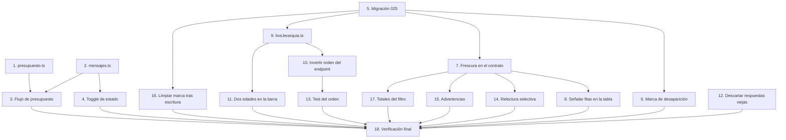

# Implementation Plan

## Overview

El plan arregla, en este orden, los dos botones que el usuario reportó y la causa de fondo que los rompe.

El orden no es arbitrario. Las fases A y B arreglan lo reportado y son verificables sin migración y sin red, así que pueden ir a producción solas y temprano. La fase C toca el contrato de `MetricasObjeto` y la migración, y es la más invasiva. Las fases D y E dependen de la C.

Dos restricciones del repo condicionan el tamaño de algunas tareas:

- `lib/ads/tipos.ts` documenta que todo campo nuevo de los tipos de salida es **obligatorio y anulable**, para que el compilador obligue al único productor a poblarlo. Agregar dos campos a `MetricasObjeto` rompe siete constructores, incluido el generador de fast-check.
- `textoEdadGasto` lo consumen cuatro archivos de tres pantallas distintas, no sólo la barra de frescura del gestor.

Ninguna tarea borra datos. Un objeto que Meta deja de devolver se marca, nunca se elimina: puede tener gasto histórico atribuido en `ad_spend` y su desaparición puede ser transitoria.

## Task Dependency Graph



Sin dependencias de entrada: **1**, **2**, **5** y **12**. Se pueden arrancar en paralelo.

Olas de ejecución. Las tareas de una misma ola no dependen entre sí y pueden correrse en paralelo; cada ola espera a que la anterior termine.

```json
{
  "waves": [
    {
      "wave": 1,
      "description": "Módulos puros, migración y guarda de concurrencia. Sin dependencias de entrada.",
      "tasks": [
        { "id": "1", "title": "Extraer la regla de validez del presupuesto", "dependsOn": [], "files": ["lib/ads/presupuesto.ts", "lib/ads/presupuesto.test.ts"] },
        { "id": "2", "title": "Centralizar la traducción de respuestas", "dependsOn": [], "files": ["lib/ads/mensajes.ts", "lib/ads/mensajes.test.ts"] },
        { "id": "5", "title": "Migración 025_ads_frescura", "dependsOn": [], "files": ["db/migrations/025_ads_frescura.sql"] },
        { "id": "12", "title": "Descartar respuestas de datos fuera de orden", "dependsOn": [], "files": ["app/(panel)/anuncios/GestorAnuncios.tsx"] }
      ]
    },
    {
      "wave": 2,
      "description": "Los dos botones reportados, la marca de desaparición, el contrato de frescura y el sync en vivo.",
      "tasks": [
        { "id": "3", "title": "Flujo de presupuesto end to end", "dependsOn": ["1", "2"], "files": ["app/(panel)/anuncios/GestorAnuncios.tsx", "app/(panel)/anuncios/DialogoConfirmacion.tsx", "app/(panel)/anuncios/FormularioPresupuesto.tsx", "app/(panel)/anuncios/celdas.tsx", "app/api/ads/acciones/route.ts"] },
        { "id": "4", "title": "Reescribir el toggle de estado", "dependsOn": ["2"], "files": ["app/(panel)/anuncios/GestorAnuncios.tsx"] },
        { "id": "6", "title": "Marcar y desmarcar objetos desaparecidos", "dependsOn": ["5"], "files": ["lib/ads/jerarquia.ts", "lib/ads/jerarquia.test.ts"] },
        { "id": "7", "title": "Llevar la frescura al contrato de salida", "dependsOn": ["5"], "files": ["lib/ads/tipos.ts", "lib/queries/ads.ts", "lib/ads/acciones.ts", "lib/test/generadores-ads.ts"] },
        { "id": "9", "title": "Crear el sync de Jerarquía en vivo", "dependsOn": ["5"], "files": ["lib/ads/liveJerarquia.ts", "lib/ads/liveJerarquia.test.ts"] },
        { "id": "16", "title": "Limpiar la marca tras una escritura confirmada", "dependsOn": ["5"], "files": ["app/api/ads/acciones/route.ts"] }
      ]
    },
    {
      "wave": 3,
      "description": "Todo lo que consume el contrato de frescura o el sync en vivo.",
      "tasks": [
        { "id": "8", "title": "Señalar filas viejas y desaparecidas", "dependsOn": ["7"], "files": ["app/(panel)/anuncios/celdas.tsx", "app/(panel)/anuncios/GestorAnuncios.tsx"] },
        { "id": "10", "title": "Invertir el orden del endpoint de datos", "dependsOn": ["9"], "files": ["app/api/data/ads/route.ts"] },
        { "id": "11", "title": "Dos edades en la barra de frescura", "dependsOn": ["9"], "files": ["lib/ads/polling.ts", "app/(panel)/anuncios/BarraFrescura.tsx", "app/(panel)/anuncios/GestorAnuncios.tsx", "app/(panel)/resumen/ResumenView.tsx", "lib/widgets/catalogo-ventas.tsx"] },
        { "id": "14", "title": "Relectura selectiva contra Meta en el preflight", "dependsOn": ["7"], "files": ["lib/ads/acciones.ts"] },
        { "id": "15", "title": "Advertencias de padre pausado y objeto desaparecido", "dependsOn": ["7"], "files": ["lib/ads/previsualizacion.ts", "lib/ads/acciones.ts", "lib/ads/previsualizacion.test.ts"] },
        { "id": "17", "title": "Totales calculados sobre el filtro completo", "dependsOn": ["7"], "files": ["lib/queries/ads.ts", "lib/ads/tipos.ts", "app/(panel)/anuncios/GestorAnuncios.tsx"] }
      ]
    },
    {
      "wave": 4,
      "description": "El test que fija el orden, una vez que el orden existe.",
      "tasks": [
        { "id": "13", "title": "Test del orden del endpoint", "dependsOn": ["10"], "files": ["app/api/data/ads/route.test.ts"] }
      ]
    },
    {
      "wave": 5,
      "description": "Cierre: build, tests y verificación manual contra la cuenta real.",
      "tasks": [
        { "id": "18", "title": "Verificar el conjunto", "dependsOn": ["3", "4", "6", "8", "10", "11", "12", "13", "14", "15", "16", "17"], "files": [] }
      ]
    }
  ],
  "conflicts": [
    { "files": ["lib/ads/tipos.ts"], "tasks": ["7", "17"], "nota": "No correr en paralelo sin coordinar." },
    { "files": ["app/(panel)/anuncios/GestorAnuncios.tsx"], "tasks": ["3", "4", "8", "11", "12", "17"], "nota": "Seis tareas tocan este archivo; serializar o coordinar los hunks." },
    { "files": ["app/api/ads/acciones/route.ts"], "tasks": ["3", "16"], "nota": "Zonas distintas del archivo, pero conviene coordinar." },
    { "files": ["lib/ads/acciones.ts"], "tasks": ["7", "14", "15"], "nota": "7 va antes; 14 y 15 tocan zonas distintas." }
  ]
}
```

## Tasks

### Fase A — Módulos puros

- [x] 1. Extraer la regla de validez del presupuesto a un módulo propio
- [x] 1.1 Crear `lib/ads/presupuesto.ts`
  - Definir `MINIMO_EUR = 0.01` y el tipo `PresupuestoParseado` como unión discriminada con `ok: true | false` y los motivos `vacio`, `no_numero`, `bajo_el_minimo`, `sobre_el_techo`, `mas_de_dos_decimales`.
  - Implementar `parsearPresupuesto(texto: string, techoEur: number): PresupuestoParseado` replicando exactamente la regla que hoy está en el `valido` de `FormularioPresupuesto.tsx` línea 21, para no cambiar de comportamiento al centralizarla.
  - Exportar `textoDeMotivo(motivo)` con el mensaje en castellano de cada motivo, para que el formulario y el diálogo digan lo mismo.
  - _Requirements: 1.5, 1.6_

- [x] 1.2 Escribir `lib/ads/presupuesto.test.ts`
  - Casos borde: cadena vacía, espacios, texto no numérico, `0`, `0.01`, el techo exacto, el techo más un céntimo, tres decimales, notación exponencial, `NaN`, `Infinity`, negativos.
  - Propiedad con fast-check: para todo `texto` y todo `techoEur` positivo, si `parsearPresupuesto` devuelve `ok: true` entonces `valor >= MINIMO_EUR`, `valor <= techoEur` y `Number(valor.toFixed(2)) === valor`.
  - _Requirements: 1.5_
  - _Properties: 4_

- [x] 2. Centralizar la traducción de respuestas del Endpoint_Acciones
- [x] 2.1 Crear `lib/ads/mensajes.ts`
  - Implementar `mensajeDeResultado(httpStatus, cuerpo)` con las seis reglas en el orden del design: `confirmado` devuelve `null`; `omitido` usa el catálogo de motivos; `indeterminado` dice que no se sabe; `fallido` usa el mensaje del catálogo de errores; el cuerpo `{ ok: false, error, detail }` usa `detail` y si no `error`; y sólo si nada aplica y el status **no** es 2xx, un texto con el código.
  - Reutilizar el mapa `MOTIVO_TEXTO` que hoy vive en `app/(panel)/anuncios/Previsualizacion.tsx`: moverlo a este módulo y que la vista lo importe, para no tener dos catálogos de motivos.
  - _Requirements: 2.4, 2.5, 2.6, 2.7_

- [x] 2.2 Escribir `lib/ads/mensajes.test.ts`
  - El caso que hoy falla: status `200` con `resultados: [{ estado: 'omitido', mensaje: null }]` no puede producir un texto que contenga `200`.
  - Un caso por rama, incluyendo `400` con `{ ok: false, error: 'invalid_payload', detail: 'Required' }`.
  - Propiedad con fast-check: para todo status en 200..299 y todo cuerpo, el texto devuelto no contiene la representación decimal de ese status.
  - _Requirements: 2.6_
  - _Properties: 3_

### Fase B — Los dos botones reportados

- [x] 3. Hacer que el presupuesto que se envía sea el que el usuario escribió
- [x] 3.1 Dar al diálogo de confirmación un bloqueo declarado por el padre
  - Agregar a `DialogoConfirmacion.tsx` la prop opcional `bloqueo?: string | null`; cuando no es nula, deshabilitar Ejecutar y mostrar el texto al lado del botón.
  - Mantener las condiciones actuales (`previa.completa`, `hayEjecutable`, `confirmado`, `!ejecutando`): el bloqueo se suma, no las reemplaza.
  - _Requirements: 1.4_

- [x] 3.2 Corregir el armado del payload en `GestorAnuncios.tsx`
  - En `abrirConfirmacion`, sembrar `dialogoPresupuesto` desde `params.budgetEur` cuando viene, en lugar de pisarlo siempre con `''`.
  - En `ejecutarLote`, obtener el importe con `parsearPresupuesto(dialogoPresupuesto, maxPresupuesto)` y usar ese valor para `body.budgetEur`; si no es válido, cortar con un aviso propio en lugar de enviar el pedido.
  - Calcular el `bloqueo` del diálogo para `budget_set` con el mismo `parsearPresupuesto`, y pasárselo a `DialogoConfirmacion`.
  - Hacer que `FormularioPresupuesto.tsx` use `parsearPresupuesto` en vez de su regla propia.
  - _Requirements: 1.1, 1.2, 1.3, 1.4, 1.5_
  - _Properties: 4_

- [x] 3.3 Poner mensajes explícitos en el schema del route
  - En `app/api/ads/acciones/route.ts`, agregar `required_error` y mensajes a `positive` y al `refine(dosDecimales)` de la rama `budget_set`, para que un rechazo nombre el campo y la regla en lugar de devolver `Required`.
  - _Requirements: 1.6_

- [x] 3.4 Corregir el motivo de celda de presupuesto no editable
  - En `celdas.tsx`, derivar el texto de `fila.budgetLevel`: `campaign` dice que el presupuesto se maneja en la campaña (CBO), `adset` que se maneja en cada conjunto (ABO), y `null` que el objeto no tiene presupuesto propio.
  - Hoy afirma siempre lo primero, que en estas cuentas (ABO) es al revés.
  - _Requirements: 1.7_

- [x] 4. Reescribir el toggle de estado
- [x] 4.1 Corregir dirección, reversión y guarda de doble disparo
  - En `toggleEstado` de `GestorAnuncios.tsx`, derivar `destino` de `fila.status === 'ACTIVE' ? 'pause' : 'activate'`, la misma comparación con la que `ToggleEstado` dibuja el interruptor.
  - Capturar `statusPrevio` antes del Pintado_Optimista y restaurarlo en todo desenlace distinto de `confirmado`, incluido el error de red.
  - Agregar un `useRef<Set<string>>` de ids en vuelo: si el id ya está, ignorar el click; quitarlo en el `finally`. Un Set por id y no un booleano global, porque tocar dos filas distintas a la vez es legítimo.
  - Reemplazar el `throw new Error(... ?? HTTP ${res.status})` por `mensajeDeResultado`.
  - _Requirements: 2.1, 2.2, 2.3, 2.6, 2.7, 2.8_
  - _Properties: 1, 2, 3_

- [x] 4.2 Usar el mismo traductor en la ejecución de lote
  - Hacer que `ejecutarLote` derive su aviso de `mensajeDeResultado`, para que el lote y el toggle digan lo mismo ante la misma respuesta.
  - _Requirements: 2.5_

- [x] 4.3 Escribir tests del toggle
  - Test de la dirección para cada valor de `status` (`ACTIVE`, `PAUSED`, `null`, un valor inesperado): la acción derivada tiene que ser coherente con el estado dibujado.
  - Test de la guarda: dos invocaciones seguidas sobre el mismo id producen una sola llamada `fetch`.
  - Test de la reversión: una respuesta `omitido` deja la fila en su valor original.
  - _Requirements: 2.1, 2.2, 2.3, 2.8_
  - _Properties: 1, 2_

### Fase C — Frescura de la Jerarquía

- [x] 5. Crear la migración `db/migrations/025_ads_frescura.sql`
  - Agregar `desaparecido_at timestamptz NULL` a `ad_campaigns`, `ad_sets` y `ads`. Sin default y sin `NOT NULL`: `NULL` significa "presente", que es el estado correcto de todas las filas existentes, así que no hace falta backfill.
  - Agregar `last_hierarchy_sync_at timestamptz NULL` y `last_hierarchy_sync_error text NULL` a `ad_accounts`.
  - Insertar la fila de `settings` `ads_frescura_umbral_segundos` con valor `900`, de forma idempotente como el resto de las migraciones.
  - Agregar un índice parcial por `desaparecido_at IS NOT NULL` en las tres tablas si el conteo de desaparecidos se va a consultar por pantalla.
  - _Requirements: 3.1, 3.2, 4.5_

- [x] 6. Marcar y desmarcar los objetos que Meta deja de devolver
- [x] 6.1 Escribir la marca en `lib/ads/jerarquia.ts`
  - Extender `escribirCuenta` para que, **dentro de la misma transacción** del upsert, ponga `desaparecido_at = now()` en las filas de la cuenta cuyo id no vino en esta corrida y hoy la tienen en `NULL`, y `desaparecido_at = NULL` en las que sí vinieron y la tenían marcada.
  - Va en la misma transacción porque un corte entre las dos escrituras dejaría objetos marcados como desaparecidos que se acababan de confirmar.
  - No borrar nada.
  - _Requirements: 3.2, 3.5, 3.6_
  - _Properties: 5, 6_

- [x] 6.2 Escribir `last_hierarchy_sync_at` y su error
  - En `sincronizarCuenta`, escribir `ad_accounts.last_hierarchy_sync_at = now()` al terminar, y `last_hierarchy_sync_error` con el mensaje cuando falla, siguiendo el criterio que `syncAdSpend` ya usa para `last_sync_at`: se escribe también en el fallo, para que un error no se vea como un dato fresco.
  - _Requirements: 4.4, 4.5_

- [x] 6.3 Escribir tests de la marca de desaparición
  - Con base: sembrar tres objetos, correr con Meta devolviendo dos, verificar que el tercero queda marcado y los otros en `NULL`; correr de nuevo con los tres y verificar que la marca se limpia.
  - Verificar que la cantidad de filas por cuenta no decrece en ninguna corrida.
  - Propiedad: dos corridas seguidas con la misma respuesta de Meta dejan la base igual (idempotencia, que la Sync_Jerarquia ya declara tener).
  - _Requirements: 3.2, 3.5, 3.6_
  - _Properties: 5, 6_

- [x] 7. Llevar la frescura al contrato de salida
- [x] 7.1 Agregar los dos campos a `MetricasObjeto`
  - En `lib/ads/tipos.ts`, agregar `syncedAt: string | null` y `desaparecidoAt: string | null`, obligatorios y anulables como exige la regla documentada del archivo.
  - Actualizar **todos** los productores, que el compilador va a marcar: `filaDesdeRow` en `lib/queries/ads.ts`, `aMetricas` en `lib/ads/acciones.ts`, `genMetricasObjeto` en `lib/test/generadores-ads.ts`, y los helpers `fila()` de `previsualizacion.test.ts`, `catalogo.test.ts`, `orden.test.ts` y `ads.orden.test.ts`.
  - _Requirements: 3.1_

- [x] 7.2 Traer las columnas en la consulta
  - Sumar `o.synced_at` y `o.desaparecido_at` a los tres fragmentos de jerarquía de `lib/queries/ads.ts` y mapearlos en `filaDesdeRow`.
  - Las filas que salen del `UNION ALL` con `gasto` (objetos con gasto que no están en la Jerarquía) llevan los dos campos en `NULL`.
  - _Requirements: 3.1_

- [x] 7.3 Exponer el umbral de frescura al cliente
  - Devolver `ads_frescura_umbral_segundos` en la respuesta de `/api/data/ads` junto a los otros topes de `settings`, con un default si la fila no está.
  - _Requirements: 3.1_

- [x] 8. Señalar en la tabla las filas viejas y las desaparecidas
  - En `celdas.tsx`, agregar la marca en la celda de nombre con dos estados distintos: **vieja** (badge neutro con la antigüedad) cuando `syncedAt` supera el umbral, y **desaparecida** (badge de advertencia) cuando `desaparecidoAt` no es nulo. La segunda es más grave: no se arregla sola.
  - En `GestorAnuncios.tsx`, contar las filas en cada condición y mostrar un Banner con el total.
  - _Requirements: 3.1, 3.3_

- [x] 9. Crear el sync de Jerarquía en vivo
- [x] 9.1 Crear `lib/ads/liveJerarquia.ts`
  - Implementar `ensureFreshJerarquia(accountId, opts?)` devolviendo `FrescuraJerarquia`, espejando la forma de `lib/ads/live.ts`.
  - TTL propio `ADS_JERARQUIA_TTL_SECONDS` con default `300`, más alto que el del gasto porque el sync es una llamada por cuenta y por nivel.
  - Timeout propio con default `10_000`; el Boton_Actualizar pide `30_000`.
  - Promise en vuelo **por cuenta** (`Map<string, Promise<void>>`), no una única variable global como en `live.ts`, porque dos cuentas distintas no deberían esperarse entre sí.
  - Nunca tira: el catch va adentro del promise compartido, así el `Promise.race` del llamador no puede rechazar.
  - Leer la frescura de `ad_accounts.last_hierarchy_sync_at` y el error de `last_hierarchy_sync_error`.
  - _Requirements: 4.1, 4.2, 4.3, 4.4_

- [x] 9.2 Escribir `lib/ads/liveJerarquia.test.ts`
  - Que respete el TTL, que `forzar` lo saltee, que el timeout devuelva sin esperar el sync, que un fallo de Meta no propague la excepción, y que dos llamadas simultáneas para la misma cuenta compartan un solo sync mientras dos cuentas distintas disparen dos.
  - _Requirements: 4.2, 4.3, 4.4_

- [x] 10. Invertir el orden en el endpoint de datos y enchufar la jerarquía
  - En `app/api/data/ads/route.ts`, izar la resolución del rango y la zona con `rangoDePeriodo` (ya importado y ya usado así en la rama del alcance) para romper la dependencia que obligaba a leer antes de sincronizar.
  - Reordenar a: resolver rango → `ensureFreshAdSpend` y `ensureFreshJerarquia` en paralelo → `asegurarAlcance` → `getMetricasAds` → respuesta.
  - Llamar a `ensureFreshJerarquia` **sólo** cuando viene `forzar`, para que el polling no la dispare.
  - Pasar el rango ya resuelto a `getMetricasAds` para no calcularlo dos veces.
  - Devolver `jerarquiaFreshness` en la respuesta.
  - Corregir el comentario que hoy afirma que el gasto se refresca antes de leer.
  - _Requirements: 4.1, 4.8, 5.1, 5.2, 5.3_
  - _Properties: 8_

- [x] 11. Mostrar las dos edades en la barra de frescura
  - Renombrar `textoEdadGasto` a `textoEdad` en `lib/ads/polling.ts` y actualizar los cuatro consumidores: `BarraFrescura.tsx`, `GestorAnuncios.tsx`, `ResumenView.tsx` y `lib/widgets/catalogo-ventas.tsx`. El compilador los marca a todos.
  - Generalizar la firma para aceptar tanto `FrescuraAds` como `FrescuraJerarquia`.
  - En `BarraFrescura.tsx`, mostrar la edad del gasto y la de la jerarquía por separado, con el error de cada una al lado. Colapsarlas en un número esconde justo el problema que este spec arregla.
  - _Requirements: 4.5_

- [x] 12. Descartar respuestas de datos fuera de orden
  - En `GestorAnuncios.tsx`, agregar `seqEmitida` y `seqAplicada` como refs; `pedirFilas` toma el número al emitir y cada `setData` verifica que su número no sea menor que `seqAplicada.current` antes de aplicar.
  - Cubrir las tres fuentes concurrentes que hoy conviven sin coordinación: el efecto de filtros, el Boton_Actualizar (que puede tardar 60 s) y el refetch posterior a un lote.
  - El `AbortController` que ya existe no alcanza: aborta por timeout, no cancela el pedido anterior cuando llega uno nuevo.
  - Test de propiedad: para todo orden de llegada, el estado final es el de la respuesta con el número más alto.
  - _Requirements: 5.4_
  - _Properties: 7_

- [x] 13. Escribir el test que fija el orden del endpoint
  - En `app/api/data/ads/route.test.ts`, con los dos sync mockeados, verificar que ambos se llamaron **antes** de la lectura de métricas. Es el test que evita la regresión que este spec vino a arreglar.
  - Verificar que sin `forzar` no se llama a `ensureFreshJerarquia`.
  - _Requirements: 4.8, 5.1_
  - _Properties: 8_

### Fase D — Decisiones del servidor

- [x] 14. Releer contra Meta los objetos viejos antes de decidir una omisión
- [x] 14.1 Agregar la relectura selectiva al preflight
  - En `lib/ads/acciones.ts`, para `pause` y `activate`, entre `leerObjetos` y el cálculo de la Previsualizacion, seleccionar los objetos cuya frescura supera `ads_frescura_umbral_segundos` o que tienen `desaparecido_at` no nulo.
  - Para esos, y sólo esos, llamar a `fetchObjeto(objectId, level)` (lectura, nunca escritura), acotado a los primeros N del lote y con presupuesto de tiempo, para que un lote de 100 objetos viejos no se vuelva 100 llamadas sincrónicas.
  - Usar el estado real devuelto para decidir la omisión.
  - Si `fetchObjeto` falla, decidir con el dato de la base y anotar que no se pudo revalidar; no bloquear la acción.
  - _Requirements: 6.2, 6.3_

- [x] 14.2 Registrar la Discrepancia en la auditoría
  - Cuando el estado real difiere del de la base, guardar `{ discrepancia: { local, real, syncedAt } }` en `ad_actions.metrics` (jsonb, sin cambio de schema) y nombrarlo en la `explicacion`.
  - _Requirements: 6.3, 6.5_
  - _Properties: 10_

- [x] 14.3 Incluir la antigüedad en el mensaje de omisión
  - Hacer que el motivo de omisión que viaja al cliente lleve la antigüedad del dato con el que se decidió, para que `mensajeDeResultado` pueda decir "según un dato de hace X".
  - _Requirements: 6.1_

- [x] 15. Advertir cuando el padre está pausado y cuando el objeto desapareció
  - Sumar el `status` del objeto padre a la consulta de `leerObjetos` (para conjuntos ya se trae `campaignId`).
  - En `calcularFila` de `lib/ads/previsualizacion.ts`, para `activate` a nivel `adset` con el padre pausado, poner `advertencia` diciendo que el conjunto queda activo pero no entrega hasta que se active la campaña. Advertencia y no bloqueo: activar un conjunto con la campaña pausada es legítimo cuando se prepara algo.
  - Poner `advertencia` también cuando el objeto tiene `desaparecido_at` no nulo.
  - Tests de las dos advertencias en `previsualizacion.test.ts`.
  - _Requirements: 3.4, 6.4_

- [x] 16. Limpiar la marca de desaparición después de una escritura confirmada
  - Extender `refrescarJerarquia` en `app/api/ads/acciones/route.ts` para escribir `desaparecido_at = NULL`: si Meta acaba de confirmar una escritura sobre el objeto, existe.
  - _Requirements: 3.6, 4.7_

### Fase E — Totales

- [x] 17. Calcular los totales en el servidor sobre el filtro completo
- [x] 17.1 Agregar el agregado a `getMetricasAds`
  - Agregar una consulta que corra sobre la misma cadena de CTEs **sin** `OFFSET`/`LIMIT` y devuelva `totales: { spendEur, revenueEur, netEur, profitEur, sales, filas }`.
  - Sumarla al `Promise.all` que ya tiene la consulta de filas y la de ventas sin atribuir, para no agregar una vuelta de red.
  - Agregar `totales` a `ResultadoMetricas` en `lib/ads/tipos.ts`.
  - _Requirements: 7.1_

- [x] 17.2 Hacer que la barra de KPIs lea el agregado
  - En `GestorAnuncios.tsx`, reemplazar los `data.filas.reduce(...)` de gasto, ingresos, ganancia, neto y ROI por `data.totales`.
  - Rotular los totales con el filtro vigente (por ejemplo "gasto de los conjuntos activos" en lugar de "gasto"), para que un cambio de estado que mueve filas dentro o fuera del filtro no se lea como una caída de gasto.
  - _Requirements: 7.1, 7.2, 7.3, 7.4_
  - _Properties: 9_

- [x] 17.3 Escribir el test de los totales
  - Con base: sembrar más filas que el límite de página y verificar que `totales.spendEur` es igual a la suma de todas las páginas y distinto de la suma de la primera.
  - Propiedad: para todo filtro y todo par de páginas de su resultado, los totales son iguales.
  - _Requirements: 7.1, 7.3_
  - _Properties: 9_

### Fase F — Cierre

- [x] 18. Verificar el conjunto
  - Correr `npm test` y `npm run build`, y arreglar lo que rompa.
  - Correr `npm run db:migrate` contra la base local y verificar que la migración es idempotente corriéndola dos veces.
  - Verificación manual contra la cuenta real, que es el caso que ningún mock cubre: cambiar el presupuesto de un conjunto en el administrador de anuncios, apretar Actualizar en el panel y ver el valor nuevo sin esperar el cron.
  - Verificar en `ad_actions` que un `budget_set` manual ahora deja fila, que es lo que hoy no ocurre nunca.
  - _Requirements: 1.1, 4.1, 4.7_

## Notes

### Qué se puede shippear por separado

- **Fases A y B solas** arreglan los dos botones reportados sin migración, sin cambios de schema y sin tocar el camino de sincronización. Es el corte de menor riesgo y el que resuelve lo que se ve.
- **Fase C** necesita la migración desplegada antes que el código, con el orden habitual de `deploy.sh` (migra la base después de buildear, así que la migración aditiva es segura: las columnas nuevas son anulables y el código viejo las ignora).
- **Tarea 12** es independiente de todo y se puede adelantar: no toca schema ni red.

### Paralelización

Cuatro tareas no tienen dependencias de entrada (1, 2, 5, 12) y pueden repartirse. Después de la 5, las tareas 6, 7 y 9 son independientes entre sí y tocan archivos distintos (`jerarquia.ts`, `tipos.ts`/`queries/ads.ts`, `liveJerarquia.ts`).

Ojo con dos puntos de conflicto: las tareas 7 y 17 tocan `lib/ads/tipos.ts`, y las tareas 3, 4, 8, 11, 12 y 17 tocan `GestorAnuncios.tsx`. Conviene no correrlas en paralelo sin coordinar.

### Decisiones tomadas en el design que estas tareas dan por cerradas

- El polling **no** dispara la Sync_Jerarquia (tarea 10): sólo el Boton_Actualizar. Una pestaña olvidada no puede generar carga constante contra Meta.
- La relectura contra Meta en el preflight (tarea 14) es **selectiva**, sólo para objetos viejos o desaparecidos. Releer todo en cada click convertiría el toggle en una operación de red doble.
- Los objetos desaparecidos **no se borran** (tarea 6.1).

### Verificaciones que ya se hicieron y no hay que repetir

- El cron de Sync_Jerarquia está instalado en la VPS y corre cada 15 minutos con éxito.
- Las dos cuentas activas tienen `currency = EUR`, así que no hay que tocar la conversión ni las cotizaciones.
- Las dos cuentas son ABO: `budget_level = 'adset'` y presupuesto de campaña en `NULL`.
