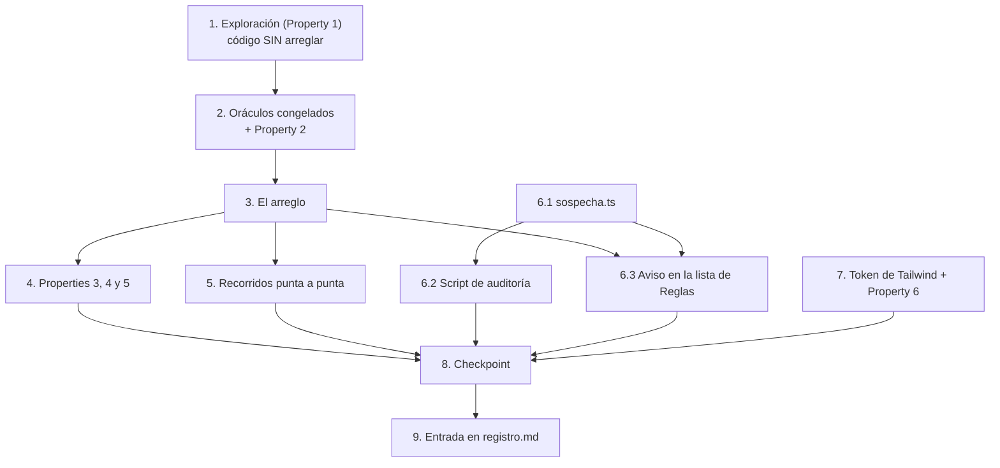

# Implementation Plan

## Overview

El plan tiene una restricción de orden que no es preferencia de estilo: **dos
tareas tienen que correr contra el código SIN arreglar y no se pueden recuperar
después.**

1. El test de exploración (tarea 1) confirma la hipótesis de §Hypothesized Root
   Cause. Si alguno de sus seis casos no falla como el diseño predice, la
   hipótesis está mal y hay que volver al diseño antes de escribir una línea de
   arreglo.
2. Los dos oráculos congelados (tarea 2) son copias del `parsearPresupuesto` y
   del `numeroDeTexto` de hoy. La tarea 3 los reemplaza: si no se copiaron antes,
   el oráculo de la preservación deja de existir y la Property 2 —la que de verdad
   protege— ya no se puede escribir.

Después de eso el orden es el habitual: el arreglo, las propiedades que el
arreglo habilita, la auditoría de lo ya guardado, la verificación y el registro.

Dos cosas son independientes de todo lo demás y se pueden adelantar: el token de
Tailwind con su guarda permanente (tarea 7) y el módulo de sospecha con su script
(6.1 y 6.2).

Las siete propiedades de §Correctness Properties están mapeadas: 1 → tareas 1 y
3.7; 2 → tareas 2 y 3.8; 3, 4 y 5 → tarea 4; 6 → tarea 7; 7 → tarea 6.

## Task Dependency Graph



Sin dependencias de entrada: **1**, **6.1** y **7**.

```json
{
  "waves": [
    {
      "wave": 1,
      "description": "Contra el código SIN arreglar. La 1 es un gate: si no falla como el diseño predice, se para y se vuelve al diseño.",
      "tasks": [
        { "id": "1", "title": "Test de exploración de la Bug_Condition", "dependsOn": [], "files": ["app/(panel)/anuncios/montoAmbiguo.test.ts", "app/(panel)/anuncios/reglas/ReglasView.tsx"] },
        { "id": "6.1", "title": "lib/ads/reglas/sospecha.ts", "dependsOn": [], "files": ["lib/ads/reglas/sospecha.ts", "lib/ads/reglas/sospecha.test.ts"] },
        { "id": "7", "title": "Token de Tailwind y guarda permanente", "dependsOn": [], "files": ["app/(panel)/anuncios/ChipCascada.tsx", "lib/paleta.test.ts"] }
      ]
    },
    {
      "wave": 2,
      "description": "Los oráculos, todavía contra el código SIN arreglar. Última ventana para copiarlos.",
      "tasks": [
        { "id": "2", "title": "Congelar los dos oráculos y escribir la preservación", "dependsOn": ["1"], "files": ["lib/ads/presupuesto.preservacion.test.ts", "app/(panel)/anuncios/reglas/numeroDeCampo.preservacion.test.ts"] },
        { "id": "6.2", "title": "Script de auditoría de sólo lectura", "dependsOn": ["6.1"], "files": ["scripts/verificar-montos-reglas.ts", "package.json"] }
      ]
    },
    {
      "wave": 3,
      "description": "El arreglo. Serializado: 3.1 y 3.2 habilitan 3.3, que habilita 3.4 y 3.5.",
      "tasks": [
        { "id": "3", "title": "Un solo parseo compartido", "dependsOn": ["2"], "files": ["lib/monto.ts", "lib/monto.test.ts", "app/(panel)/finanzas/FinanzasView.tsx", "lib/ads/presupuesto.ts", "lib/ads/presupuesto.test.ts", "app/(panel)/anuncios/FormularioPresupuesto.tsx", "app/(panel)/anuncios/GestorAnuncios.tsx", "app/(panel)/anuncios/reglas/ReglasView.tsx", "app/(panel)/anuncios/presupuestoDialogo.test.ts"] }
      ]
    },
    {
      "wave": 4,
      "description": "Lo que sólo se puede escribir con el arreglo puesto.",
      "tasks": [
        { "id": "4", "title": "Properties 3, 4 y 5", "dependsOn": ["3"], "files": ["app/(panel)/anuncios/reglas/payloadFiel.test.ts", "lib/ads/veredictoCompartido.test.ts", "app/(panel)/anuncios/presupuestoTexto.test.ts"] },
        { "id": "5", "title": "Recorridos punta a punta", "dependsOn": ["3"], "files": ["lib/ads/presupuesto.puntaAPunta.test.ts", "app/(panel)/anuncios/reglas/reglas.puntaAPunta.test.ts"] },
        { "id": "6.3", "title": "Aviso de sospecha en la lista de Reglas", "dependsOn": ["3", "6.1"], "files": ["app/(panel)/anuncios/reglas/ReglasView.tsx"] }
      ]
    },
    {
      "wave": 5,
      "description": "Cierre.",
      "tasks": [
        { "id": "8", "title": "Checkpoint: typecheck, suite completa y CSS compilado", "dependsOn": ["4", "5", "6.2", "6.3", "7"], "files": [] },
        { "id": "9", "title": "Entrada en registro.md", "dependsOn": ["8"], "files": ["registro.md"] }
      ]
    }
  ],
  "conflicts": [
    { "files": ["app/(panel)/anuncios/reglas/ReglasView.tsx"], "tasks": ["1", "3.5", "6.3"], "nota": "La 1 sólo agrega dos `export`. La 3.5 reescribe el parseo y los cinco call sites. La 6.3 agrega el badge en la celda de acción. Serializar en ese orden." },
    { "files": ["lib/ads/presupuesto.test.ts"], "tasks": ["3.6"], "nota": "Único editor. La tarea 2 escribe archivos nuevos y no lo toca." },
    { "files": ["lib/monto.test.ts"], "tasks": [], "nota": "NADIE lo edita. Se mueve y punto (cláusula 3.13)." }
  ]
}
```

## Tasks

### Fase 0 — Contra el código sin arreglar

- [x] 1. Escribir el test de exploración de la Bug_Condition
  - **Property 1: Bug Condition** — el texto ambiguo se rechaza y se explica en los cuatro campos
  - **CRÍTICO: este test se escribe ANTES de tocar el arreglo y TIENE QUE FALLAR.** El fallo es el entregable: confirma que la causa raíz es la que hipotetizó §Hypothesized Root Cause y no otra.
  - **NO arreglar el test ni el código cuando falle.** El test codifica el comportamiento esperado; la tarea 3.7 lo vuelve a correr y ahí sí tiene que pasar.
  - Archivo propuesto: `app/(panel)/anuncios/montoAmbiguo.test.ts`. Cruza `lib/ads/presupuesto` y `reglas/ReglasView`, que es lo que hace de este bug uno y no cuatro.
  - **Precondición mecánica:** `numeroDeTexto` (`ReglasView.tsx:574`) y `payloadDeForm` (`:698`) hoy son privadas. Hay que exportarlas para poder llamarlas. Es lo **único** que se toca del código sin arreglar, no cambia comportamiento y sigue el criterio que `problema`/`problemaAccion` ya usan («exportada para los tests»).
  - **Los seis casos de §Exploratory Bug Condition Checking**, con el veredicto de hoy que cada uno tiene que reproducir:
    1. `parsearPresupuesto('1.000', 5000)` → `{ok:true,valor:1}`. El importe que llega a Meta como `daily_budget: '100'`.
    2. `numeroDeTexto('1.000')` → `1`, y `problemaAccion` con `actionValue: '1.000'` → `null`. El contraejemplo de 1.8 y 2.9: la validación aprueba un valor mil veces menor porque sólo ve el número ya corrompido.
    3. `problemaCondiciones` con una condición `spend > '1.000'` → `null`, y `payloadDeForm` → `value: 1`.
    4. `problemaProgramacion` con `maxRunsPerDay: '1.000'` → `null`, y el payload → `1`.
    5. Borde de la regla ancha: `parsearPresupuesto('1000.000', 5000)` → `{ok:true,valor:1000}`. Confirma que la familia (e) de §Alcance existe y que hoy se acepta.
    6. `parsearPresupuesto('100,50', 5000)` → `no_numero` contra `parsearMonto('100,50')` → `100.5`. La incoherencia de 1.4 medida en un solo test.
  - **PBT acotado**: la familia de C se genera con `fc.tuple(fc.integer({min:0,max:999}), fc.integer({min:0,max:999}))` formateado como `${izq}.${String(der).padStart(3,'0')}`, más la familia (e) con 4 a 8 dígitos a la izquierda. Los seis casos de arriba van además como tabla concreta, para que el contraejemplo sea reproducible y no dependa de la semilla.
  - **Aserciones (el comportamiento esperado, no el actual)**: rechazo en los cuatro campos; el mensaje contiene las dos escrituras (`textoSinPunto` y `textoTruncadoEnElPunto`); ningún valor en ningún payload — ni `budgetEur`, ni `actionValue`/`budgetMax`/`budgetMin`/`maxRunsPerDay`, ni el `value` de una condición.
  - **RESULTADO ESPERADO: el test FALLA.** Documentar los contraejemplos que aparecen (texto exacto y valor devuelto) en el cuerpo del test como comentario.
  - **CONDICIÓN DE CORTE — leer antes de seguir:** si **alguno** de los seis casos no reproduce el veredicto de hoy que está escrito arriba, la hipótesis del diseño está mal. **Parar. No escribir el arreglo. Volver a §Hypothesized Root Cause del diseño y re-hipotetizar.** No hay ningún caso en que la respuesta correcta sea ajustar el caso esperado para que la exploración cierre.
  - La tarea está lista cuando el test está escrito, corrido, fallando, y los contraejemplos anotados.
  - _Requirements: 1.1, 1.6, 1.7, 1.8, 1.9, 2.1, 2.6, 2.7, 2.8, 2.9_

- [x] 2. Congelar los dos oráculos y escribir la preservación
  - **Property 2: Preservation** — el veredicto sólo cambia donde está declarado
  - **IMPORTANTE: metodología de observación primero, y última ventana para hacerlo.** La tarea 3 borra las dos implementaciones que este test necesita como oráculo. Si esta tarea no se completa antes, el oráculo se pierde y la propiedad no se puede escribir.
  - **Oráculo 1 — `parsearPresupuestoOriginal`.** Copiar el cuerpo actual de `parsearPresupuesto` (`lib/ads/presupuesto.ts:86`, seis líneas: el `trim()` a `vacio`, `Number()`, `Number.isFinite`, `!(n >= MINIMO_EUR)`, `!(n <= techoEur)`, `Number(n.toFixed(2)) !== n`) dentro de `lib/ads/presupuesto.preservacion.test.ts`. Duplicada **a propósito**, con el comentario que diga que es el oráculo de la refactorización. El precedente está en el mismo módulo: `presupuesto.test.ts:192` ya congela la `reglaOriginal` del `valido` de `FormularioPresupuesto`.
  - **Oráculo 2 — `numeroDeTextoOriginal`.** Copiar el cuerpo actual de `numeroDeTexto` (`ReglasView.tsx:574`, dos líneas: `trim().replace(',', '.')` y `t === '' ? NaN : Number(t)`) dentro de `app/(panel)/anuncios/reglas/numeroDeCampo.preservacion.test.ts`.
  - **Observar antes de afirmar:** correr los dos oráculos contra el código de hoy y verificar que coinciden con las implementaciones reales sobre los generadores de texto que ya existen en `lib/ads/presupuesto.test.ts` (incluyen `0x10`, `0b11`, `0o17`, `+5`, `.5`, `5.`, los espacios unicode y el BOM). Un oráculo que no reproduce el presente no sirve de nada.
  - **La propiedad**: para todo texto y todo techo positivo, si el veredicto nuevo difiere del del oráculo, entonces el texto cumple `isBugCondition` o cae en una de las seis familias declaradas. Fuera de eso: mismo `ok`, mismo `valor` cuando acepta y **mismo motivo** cuando rechaza. `numRuns` ≥ 1000: es el test que protege de verdad y es barato.
  - **Guarda 1 — el predicado son seis regex nombradas, una por familia**, cada una con su número de cláusula al lado, tomadas de la tabla de §Alcance: (a) tiene coma → 2.2; (b) más de un punto → 2.3; (c) tras limpiar el ruido no cumple `^-?[\d.]*$` → 2.5; (d) trae `€`, `$` o espacios que `Number` no tolera → 2.5; (e) `^\d{4,}\.\d{3}$` → la regla ancha del diseño; (f) no hay ningún dígito y el núcleo resuelve 0 (`.`, `€.`) → sin cláusula, declarada en §Alcance. **No** escribirlo como una condición compuesta: un predicado que se puede ensanchar de a poco vuelve la propiedad trivialmente verdadera, y eso es su único punto débil.
  - **Guarda 2 — el test de tabla que prueba que cada flip OCURRE.** Aparte de la propiedad, una tabla con un caso por familia que afirma **las dos** columnas: el veredicto viejo con el oráculo y el nuevo con el arreglo. Sin esto, alguien puede ensanchar el predicado para tapar un flip nuevo y ni la propiedad ni la Property 1 lo agarran.
  - **RESULTADO ESPERADO en esta tarea, que es mixto y hay que entenderlo:** la propiedad de preservación y la mitad «viejo» de la tabla de flips **PASAN** contra el código sin arreglar (baseline confirmado). La mitad «nuevo» de la tabla de flips **FALLA** hasta la tarea 3.8, porque afirma un veredicto que todavía no existe. Dejar esa mitad escrita y fallando; no comentarla ni marcarla como `skip`.
  - La tarea está lista cuando los dos oráculos están copiados, verificados contra el presente, la propiedad pasa sobre el código sin arreglar y la tabla de flips está completa.
  - _Requirements: 3.1, 3.2, 3.3, 3.4, 3.8, 3.13_

### Fase 1 — El arreglo

- [x] 3. Un solo parseo compartido
  - Las especificaciones que las seis sub-tareas de abajo tienen que satisfacer, todas del diseño:
  - _Bug_Condition: `isBugCondition(input)` de §Bug Condition — un punto, cero comas, 1 a 3 dígitos a la izquierda y exactamente 3 a la derecha, sobre el texto ya limpio de ruido. La regla implementada es más ancha a propósito (familia (e)) y se conserva_
  - _Expected_Behavior: `expectedBehavior(resultado, texto)` de §Expected Behavior — `aceptado = false`, el mensaje contiene `sinElPunto(texto)` **y** `truncadoEnElPunto(texto)`, y ni `valorGuardado` ni `valorAplicado` existen_
  - _Preservation: §Preservation Requirements y las seis familias de excepción de §Alcance (a–f), cerradas. Nada fuera de esas seis puede cambiar de veredicto_
  - _Requirements: 2.1, 2.2, 2.3, 2.4, 2.5, 2.6, 2.7, 2.8, 2.9, 2.10, 2.11, 3.1, 3.2, 3.3, 3.4, 3.5, 3.6, 3.7, 3.8, 3.9, 3.10, 3.11, 3.12, 3.13_

  - [x] 3.1 Mover `monto.ts` y su test a `lib/`, sin editar el test
    - `git mv "app/(panel)/finanzas/monto.ts" lib/monto.ts` y `git mv "app/(panel)/finanzas/monto.test.ts" lib/monto.test.ts`. **Los dos juntos y sin renombrar.**
    - **`lib/monto.test.ts` NO se edita. Ni una línea.** Su único import es `from './monto'`, así que mover los dos archivos juntos lo deja idéntico byte por byte, y eso es la forma literal de cumplir 3.13. **Si en algún momento hace falta abrir ese archivo para que la suite pase, es la señal de que algo se hizo mal antes: el error está en `lib/monto.ts`, no en el test.** Verificable con `git diff --stat` sobre el archivo movido: tiene que dar 0 líneas cambiadas.
    - Un rename (`lib/parseoDeMonto.ts`, por ejemplo) obligaría a editar la única línea de import que la cláusula congela. Por eso el nombre se conserva aunque `lib/monto.ts` sea un nombre más genérico de lo que uno elegiría de cero.
    - Único import que se actualiza, en otro archivo: `app/(panel)/finanzas/FinanzasView.tsx`, `'./monto'` → `'@/lib/monto'`.
    - Correr `npx tsc --noEmit` y `npm test -- lib/monto` antes de seguir: los 12 tests de Finanzas tienen que pasar desde su ubicación nueva sin ningún cambio.
    - _Requirements: 2.4, 3.13_

  - [x] 3.2 Extraer `leerNumeroEscrito` y dejar `parsearMonto` como núcleo + política
    - En `lib/monto.ts`, definir `MotivoNumero` (`vacio`, `caracteres`, `ilegible`, `ambiguo`) y `NumeroEscrito` como la unión del diseño, con `comoMiles`, `comoDecimal` y `explicacion` en la rama `ambiguo`.
    - `leerNumeroEscrito(raw)` es el cuerpo actual de `parsearMonto` desde el `test(/^[\d.,]+$/)` hasta el `Number(...)`, con tres diferencias declaradas en el diseño: acepta `-` inicial y devuelve el valor negativo (el signo es política del llamador); devuelve `decimales` como cantidad; y **no chequea `Number.isFinite`**, porque hoy `parsearMonto` mira los decimales antes de la finitud y mover ese orden cambiaría el mensaje de un texto de 400 dígitos. Anotar las tres en el tipo para que ningún consumidor las dé por hechas.
    - Conservar la **regla ancha**: el corte es `derecha.length === 3 && corte > 0`, sin mirar cuántos dígitos hay a la izquierda. Angostarla a 1–3 dígitos haría que `parsearMonto('1000.000')` pase de rechazar a devolver 1000, que es exactamente lo que 3.13 prohíbe.
    - `parsearMonto` queda como núcleo + política de Finanzas **con el orden de cortes intacto**: ruido → vacío → signo → núcleo → decimales > 2 → finitud → `<= 0` → `>= MAX` → redondeo. El chequeo del signo sigue **antes** del de caracteres: hoy `-abc` devuelve el mensaje del signo y no el de «sólo números, coma o punto».
    - `errorDeLectura(n, raw)` mapea los tres motivos no ambiguos a los textos de hoy, palabra por palabra.
    - Tests del núcleo: los cuatro motivos; coma y punto decimal; las dos agrupaciones (`1.000.000`, `1,000,000`); las dos mixtas (`1.234,56`, `1,234.56`); la agrupación mal formada (`1.00.000`); `.5`, `5.` y `.` solo (que resuelve como 0); los negativos, que vuelven como valor negativo y no como error; la cantidad de decimales reportada; el ruido (`€`, espacio fino, duro y BOM).
    - _Requirements: 2.1, 2.2, 2.3, 2.4, 2.5, 3.13_

  - [x] 3.3 `lib/ads/presupuesto.ts`: el motivo `ambiguo` y el campo `texto`
    - Sumar `ambiguo` a `MotivoPresupuesto` y cambiar la rama de rechazo de `PresupuestoParseado` a `{ ok: false; motivo; texto: string }`.
    - `texto` sale de `textoDeMotivo(motivo)` para los cinco motivos de texto fijo y de `explicacion` del núcleo para `ambiguo`. `textoDeMotivo` **no cambia de firma** —sigue siendo `(motivo) => string` y sigue siendo un `Record` completo— y suma la entrada `ambiguo` con un texto de respaldo genérico. El `Record` completo es lo que hace que sumar un motivo sin mensaje rompa la compilación.
    - `parsearPresupuesto` llama al **núcleo**, no a `parsearMonto`: la política de Finanzas (sin signo, mayor que cero, dos decimales, tope de `numeric(14,2)`) no es la del presupuesto. Orden de cortes, textual del diseño: `trim()` vacío → núcleo → `ambiguo`/`no_numero` → `!Number.isFinite` → `!(n >= MINIMO_EUR)` → `!(n <= techoEur)` → `Number(n.toFixed(2)) !== n`.
    - Las negaciones se conservan escritas como están (`!(n <= techoEur)` y no `n > techoEur`): es lo que hace que un `techoEur` que no es número siga rechazando todo con `sobre_el_techo` (3.4).
    - El corte de decimales se deja como `Number(n.valor.toFixed(2)) !== n.valor` y **no** como `n.decimales > 2`, aunque sean equivalentes para todo decimal bien formado: es la expresión que está hoy.
    - Cuatro entradas nuevas del mapeo, pinneadas caso por caso para que sean deliberadas y no descubrimientos: `ambiguo`; el negativo que sigue siendo `bajo_el_minimo` (no `no_numero`); `€` solo, que es `no_numero` y no `vacio` porque `trim()` no lo vacía; y `'.'`, que pasa de `no_numero` a `bajo_el_minimo` (familia (f)).
    - _Bug_Condition: el motivo `ambiguo` es la materialización de `isBugCondition` en el presupuesto_
    - _Expected_Behavior: el `texto` del rechazo sale de `explicacion` del núcleo, que ya trae las dos lecturas_
    - _Preservation: el orden de cortes y las negaciones se conservan; las cuatro entradas pinneadas del mapeo son las únicas transiciones nuevas_
    - _Requirements: 2.1, 2.2, 2.3, 2.5, 3.1, 3.2, 3.3, 3.4, 3.6_

  - [x] 3.4 El input de presupuesto y sus dos consumidores
    - `FormularioPresupuesto.tsx:49–52`: `type="number"` con `min={MINIMO_EUR}`, `max={techoEur}` y `step={0.01}` pasa a input de texto con `inputMode="decimal"`. **Los tres atributos de rango se borran, no se reemplazan**: `parsearPresupuesto` ya tiene los tres cortes equivalentes (`bajo_el_minimo` = `min`, `sobre_el_techo` = `max`, `mas_de_dos_decimales` = `step`) y ya son los que deciden el borde rojo y el bloqueo de Ejecutar.
    - Sin esto la decisión 1 del bugfix queda escrita y sin efecto: un `type="number"` se come la coma antes de que el parseo la vea. El patrón ya existe en el mismo panel: los cuatro campos de importe de Reglas son `<input inputMode="decimal">` sin `type`.
    - `FormularioPresupuesto.tsx:64`: `textoDeMotivo(parseo.motivo)` → `parseo.texto`.
    - `GestorAnuncios.tsx:236`: `bloqueo: textoDeMotivo(importe.motivo)` → `bloqueo: importe.texto`.
    - `textoDeImporte` (`GestorAnuncios.tsx:249`) **no se toca**: `toFixed(2)` produce siempre dos decimales, así que ningún importe sembrado desde una celda puede caer en C, que necesita tres. Tampoco se pasa a coma (`12,50`): ninguna cláusula lo pide y el test pinnea `'12.50'`.
    - _Requirements: 2.10, 2.11, 3.5, 3.6_

  - [x] 3.5 `ReglasView.tsx`: `numeroDeCampo` con estado y los cinco call sites
    - Reemplazar `numeroDeTexto` (`:574`) por `numeroDeCampo(s): CampoNumerico`, con los tres estados `vacio` / `ok` / `error`. El cambio de tipo **es** el diseño: con un `number` y NaN como única señal, la validación no puede distinguir «vacío» de «ilegible» de «ambiguo» y sólo puede preguntarle `isFinite` al número ya corrompido, que es literalmente 1.8.
    - `estado: 'vacio'` es sólo el campo en blanco (`''` o espacios), distinto del 0, que es lo que 3.9 y 3.10 necesitan. El `vacio` del núcleo (un texto todo ruido, como `'€'`) cae en `error`, igual que hoy.
    - `numeroDeCampo` sí pliega la finitud dentro de `error`, al revés que el presupuesto: acá ninguna cláusula congela el orden de los mensajes, y hoy un texto que da Infinity ya cae en «no es un número».
    - `problemaDeCampo(nombre, bruto, r)`: si el motivo es `ambiguo`, `${nombre}: ${r.detalle}`; si no, el texto de hoy intacto (`${nombre} no es un número: «${bruto}».`). `detalle` se reusa **tal cual** del núcleo porque la frase no nombra ningún sustantivo, así que sirve para un importe, un ROI y un límite de ejecuciones.
    - `problemaAccion` (`:601`, `:614`, `:615`): parsear `actionValue`, `budgetMax` y `budgetMin` una vez cada uno al principio. `error` → mensaje que nombra el campo; `vacio` → los mensajes de hoy, textuales; `ok` → los cortes actuales (`<= 0`, avisos de porcentaje, techo menor al piso) sobre `valor`.
    - `problemaCondiciones` (`:647`, `:652`): parsear las condiciones una sola vez al entrar. El vacío conserva su mensaje **textual** (3.7). `motivoCondicionesImposibles` recibe los valores ya parseados y deja de poder recibir un NaN.
    - `problemaProgramacion` (`:671`): el `Number(tope)` crudo se va. `ambiguo` → el mensaje de la ambigüedad; cualquier otro error, o un `ok` que no es entero mayor a 0 → el mensaje de hoy textual, que es lo que 2.8 pide para `1,5`.
    - `payloadDeForm` (`:711`, `:713`, `:714`, `:719`, `:722`): `nuloSiNaN` → `valorONull(r) = r.estado === 'ok' ? r.valor : null`, y `maxRunsPerDay` usa el mismo parseo que lo validó. El vacío sigue viajando como `null` y **nunca** como 0. El `null` del caso `error` es inalcanzable (el payload se arma detrás de `puedeGuardar`) y se deja como `null` a propósito: si ese camino se abre, el API rechaza un `null` obligatorio de forma ruidosa, mientras un 0 se guardaría en silencio. Es la lección de 3.7.
    - **Lo que NO se agrega**, para no cambiar el veredicto de textos que hoy pasan: ningún corte de decimales en las condiciones (`numeric(16,4)` redondea sin avisar y hoy tampoco hay nada que lo atrape) y ningún corte por el tope de `smallint` en `max_runs_per_day` ni de `numeric(14,2)` en los importes de reglas. Los dos quedan anotados como defectos separados y previos.
    - Tests: los tres estados de `numeroDeCampo`, con `'   '` como `vacio` y `'1.000'` como `error` con motivo `ambiguo`; un caso por rama nueva de las tres funciones `problema*`, verificando que el mensaje nombra el campo y que cuando es ambiguo trae las dos lecturas.
    - _Bug_Condition: `isBugCondition` en los cinco campos de Reglas; el motivo `ambiguo` llega hasta `problemaDeCampo`_
    - _Expected_Behavior: el guardado se bloquea nombrando el campo y explicando la ambigüedad, y `payloadDeForm` no arma ningún payload con el valor corrompido_
    - _Preservation: los mensajes del vacío quedan textuales (3.7), la coma sigue funcionando (3.8), el 0 deliberado se sigue pudiendo guardar (3.9) y el vacío sigue viajando como `null` (3.10)_
    - _Requirements: 2.6, 2.7, 2.8, 2.9, 3.7, 3.8, 3.9, 3.10, 3.11, 3.12_

  - [x] 3.6 Actualizar los cinco tests existentes que cambian, según la tabla del diseño
    - Los cinco están listados uno por uno en la tabla **§Preservation Checking → «Los cinco casos existentes que sí cambian»** del diseño, con el caso, el veredicto de hoy, el veredicto nuevo y el motivo. **Están declarados de antemano justamente para que esta tarea no los descubra como sorpresas.**
      1. `presupuesto.test.ts`, `motivoDe('1,5')`: `no_numero` → válido, 1,5 (2.2).
      2. `presupuesto.test.ts`, `motivoDe('0.009')`, `('0.005')`, `('100.001')`: `bajo_el_minimo`/`sobre_el_techo` → `ambiguo` (están dentro de C).
      3. `presupuesto.test.ts`, `motivoDe('10.005')`, `('12.345')`, `('0.011')`: `mas_de_dos_decimales` → `ambiguo`. El caso de tres decimales se **reescribe con coma** (`'10,005'`), donde sigue siendo `mas_de_dos_decimales`: así el test no pierde la cobertura del corte de decimales.
      4. `presupuesto.test.ts`, `valorDe('1e2')`, `motivoDe('1e-3')`, `motivoDe('1e21')`: 100/`bajo_el_minimo`/`sobre_el_techo` → `no_numero` (2.5). El test de notación exponencial pasa de «se interpreta» a «se rechaza».
      5. `presupuestoDialogo.test.ts`, `presupuestoDelDialogo('10.005').bloqueo` contiene `'decimales'` → `ambiguo`. Se reescribe con `'10,005'`.
    - **Un cambio esperado se actualiza afirmando el veredicto nuevo, no aflojando la aserción.** Nada de `toContain` más laxo, nada de borrar el caso, nada de `skip`. Si un test falla y **no** está en esos cinco, es una regresión de este arreglo y se arregla el código, no el test.
    - Ninguno de los cinco toca `lib/monto.test.ts`. Si aparece ahí, volver a 3.1.
    - Los que **no** cambian y tienen que seguir pasando tal cual: vacío y espacios → `vacio`; `abc`, `NaN`, `Infinity`, `-Infinity`, `1.2.3` → `no_numero`; `0`, `-0`, `-5` → `bajo_el_minimo`; `0.01` y el techo exacto → válidos; `100.01` y `1000` → `sobre_el_techo`; techo `NaN` o 0 → todo `sobre_el_techo`. Y las dos propiedades de ida y vuelta de `presupuestoDialogo.test.ts`, sin cambios.
    - _Requirements: 2.2, 2.5, 3.2, 3.3, 3.13_

  - [x] 3.7 Verificar que el test de exploración ahora pasa
    - **Property 1: Expected Behavior** — el texto ambiguo se rechaza y se explica en los cuatro campos
    - **IMPORTANTE: volver a correr EL MISMO test de la tarea 1. No escribir un test nuevo.** Ese test ya codifica el comportamiento esperado; cuando pasa, es la confirmación de que el arreglo lo satisface.
    - `npm test -- app/\(panel\)/anuncios/montoAmbiguo`
    - **RESULTADO ESPERADO: PASA**, incluidos los seis casos concretos y la propiedad sobre la familia entera de C más la familia (e).
    - _Requirements: 2.1, 2.6, 2.7, 2.8, 2.9_

  - [x] 3.8 Verificar que la preservación sigue pasando, y que los flips ocurren
    - **Property 2: Preservation** — el veredicto sólo cambia donde está declarado
    - **IMPORTANTE: volver a correr LOS MISMOS tests de la tarea 2. No escribir tests nuevos y no tocar el predicado de excepciones.**
    - La propiedad tiene que seguir pasando con `numRuns` ≥ 1000, ahora comparando el arreglo contra el oráculo congelado.
    - La tabla de flips tiene que pasar **completa**: la mitad «viejo» contra el oráculo y la mitad «nuevo» contra el arreglo, para las seis familias. Es lo que impide que alguien ensanche el predicado para tapar un flip no declarado.
    - Si aparece un contraejemplo, la respuesta por defecto es **corregir el arreglo**. Sumar una familia al predicado sólo es válido si la familia se agrega antes a §Alcance del diseño con su justificación y a la tabla de flips: si no está en las dos, no está declarada.
    - Los 12 tests de `lib/monto.test.ts` pasan sin una línea editada (`git diff --stat` en 0).
    - _Requirements: 3.1, 3.2, 3.3, 3.4, 3.8, 3.13_

### Fase 2 — Las propiedades que el arreglo habilita

- [x] 4. Escribir las Properties 3, 4 y 5

  - [x] 4.1 Ningún payload lleva un número que el texto no dice
    - **Property 3: Payload fiel** — ningún payload lleva un número que el texto no dice
    - Para todo `FormEstado` generado, si `problema(f)` es `null` entonces cada número de `payloadDeForm(f)` coincide con el parseo de su texto, y cada campo vacío es `null` y nunca 0.
    - Generar sobre el `formBase` que ya existe en `_nombres.test.ts`.
    - Es la invariante que hace que el payload pueda confiar en el parseo: `payloadDeForm` se llama en un solo lugar (`:1912`), detrás de `disabled={!puedeGuardar}` con `puedeGuardar = prob === null && !guardando` (`:1847`).
    - _Requirements: 2.6, 2.8, 3.9, 3.10_

  - [x] 4.2 El veredicto es el mismo en las tres pantallas
    - **Property 4: Veredicto compartido** — el veredicto es el mismo en las tres pantallas
    - Para todo texto, `parsearMonto` (Finanzas), `parsearPresupuesto` (Anuncios) y `numeroDeCampo` (Reglas) coinciden en si el texto nombra un número y en cuál es. Pueden diferir en **aceptar** ese número —cada pantalla tiene sus cortes de rango, signo y decimales— pero no en qué número dice el texto.
    - Es la verificación de que 2.4 se cumplió compartiendo el núcleo y no escribiendo una cuarta copia.
    - _Requirements: 2.4_

  - [x] 4.3 Un rechazo siempre tiene texto, y es el mismo en los dos lugares
    - **Property 5: Un texto, dos lugares** — un rechazo siempre tiene texto y no puede contradecirse
    - Para todo texto rechazado por `parsearPresupuesto`, `parseo.texto` no es vacío y es exactamente la cadena que pinta el borde rojo del campo y la que aparece al lado del botón Ejecutar deshabilitado.
    - Incluye el motivo nuevo: `ambiguo` interpola las dos lecturas, así que no puede salir de un `Record` de textos fijos, y ahí es donde el campo `texto` gana sobre llamar a `textoDeMotivo` en cada consumidor.
    - Sumar el chequeo de que `textoDeMotivo` sigue siendo un `Record` completo y los seis motivos tienen mensaje no vacío.
    - _Requirements: 3.6_

- [x] 5. Escribir los recorridos punta a punta
  - Sin base y sin red: las funciones son puras y el recorrido se arma componiéndolas.
  - **Presupuesto**: texto → `presupuestoDelDialogo` → payload → el schema `presupuestoEur` del Endpoint_Acciones → `aplicarPresupuesto`. Para `1.000` no hay payload; para `1000` llega `daily_budget: '100000'`. Es el recorrido de la introducción del bugfix medido de punta a punta.
  - **Reglas**: `FormEstado` con `1.000` en cada uno de los cinco campos → `problema` bloquea y `payloadDeForm` no se llama; con `1000` → payload correcto y el schema del API lo acepta.
  - **Round-trip de la celda**: `textoDeImporte(eur)` → campo → parseo → el mismo importe, para todo `eur` de dos decimales. Ya existe como propiedad en `presupuestoDialogo.test.ts` y tiene que seguir pasando: es la verificación de que sacar `type="number"` no rompió la siembra.
  - _Requirements: 2.1, 3.5, 3.10_

### Fase 3 — Lo ya guardado (decisión 2: se señala, no se corrige)

- [x] 6. Detectar los valores guardados sospechosos

  - [x] 6.1 Crear `lib/ads/reglas/sospecha.ts`
    - **Property 7: Sospecha** — la que ve la UI es la misma que reporta el script
    - Módulo puro, sin `pg`: `UMBRAL_ALTO_EUR = 10`, `UMBRAL_BAJO_EUR = 100`, `METRICAS_EUR_AUDITABLES`, el tipo `Sospecha` y `sospechasDeRegla(r)`.
    - **El umbral vive acá y no en el SQL.** Si el `WHERE` del script filtrara por el umbral, el script y la UI serían dos reglas que pueden discrepar: exactamente el error que este spec está arreglando en el parseo.
    - **La reconstrucción del texto es exacta**: un texto de C es `\d+\.\d{3}` y `Number()` lo lee como ese literal decimal, así que el texto que produjo un valor `v` es `v.toFixed(3)` y el valor que se quiso es `Math.round(v * 1000)`. Como `numeric(14,2)` guarda a lo sumo dos decimales, `v * 1000` es siempre entero: no hay redondeo que adivinar.
    - **Dos bandas, no una**: la corrupción divide por 1000, así que una intención de cuatro dígitos (1000–9999) cae en 1–9,99 y una de cinco (`10.000`, `25.000`) cae en 10–99,99. Con un solo corte en 10 la segunda familia se pierde en silencio; con uno en 100 el reporte se llena de techos chicos legítimos.
    - **No auditables, y es una decisión**: `cpa`, `cpc`, `roi`, `roas`, `ctr`, `sales`, `clicks`, `impressions` (un CPA de 8 EUR y un ROI de 1,3 son normales; reportarlos entierra las sospechas reales) y `max_runs_per_day`, que 2.13 declara no detectable porque 1 ejecución diaria es legítimo y frecuente.
    - **Extensión declarada sobre 2.12**: `action_unit = 'percent'` va en un grupo aparte y etiquetado como extensión. Para `budget_decrease` el CHECK sólo exige `action_value < 100`, así que un `1.500` que quería decir 150% queda como 1,5 y significa «bajá al 1,5% del actual»: el peor caso del bug entero. Si al revisar se prefiere respetar 2.12 al pie de la letra, se saca ese grupo y no se toca nada más.
    - Tests: las dos bandas y sus bordes exactos (9,99 / 10 / 99,99 / 100); las métricas excluidas devuelven lista vacía; `max_runs_per_day` nunca produce sospecha; la reconstrucción `1.5 → "1.500" → 1500` y `10 → "10.000" → 10000`; y la propiedad de que `sospechasDeRegla` es determinista con `Number(textoProbable) === valor` y `valorProbable === Math.round(valor * 1000)`.
    - Un caso armado a mano con un valor de cada banda, un techo de 5 EUR puesto a propósito (**se reporta, y así queda declarado como falso positivo esperado**), una condición de CPA baja que no se reporta y un `max_runs_per_day = 1` que no se reporta.
    - _Requirements: 2.12, 2.13_

  - [x] 6.2 Crear `scripts/verificar-montos-reglas.ts` y el script de npm
    - `"ads:auditar-montos": "tsx scripts/verificar-montos-reglas.ts"` en `package.json`, siguiendo la convención `ads:*` y la forma de los `verificar-*.ts` que ya están.
    - Una consulta, **sólo `SELECT`**, sin transacción y sin ningún `UPDATE`: `ad_rules LEFT JOIN ad_rule_conditions` con `id`, `account_id`, `name`, `action`, `action_unit`, `action_value`, `budget_max`, `budget_min`, `max_runs_per_day`, `metric`, `op`, `value`, `position`, ordenada por cuenta, regla y posición. 2.12 pide que no modifique ninguna fila, y la forma de garantizarlo es que no exista ninguna sentencia de escritura en el archivo.
    - `SELECT` amplio y filtrado en TypeScript con el predicado de 6.1. Son cientos de filas: el costo es irrelevante y la alternativa es tener dos reglas que pueden discrepar.
    - Salida por regla: cuenta, nombre, y una línea por sospecha con campo, valor guardado, texto que lo habría producido, valor probable y banda. Cierra con el total por banda, **la nota de que `max_runs_per_day = 1` no es detectable** y la lista de métricas excluidas: la omisión tiene que ser visible, no silenciosa.
    - Presenta todo como **sospechoso, no como error** (2.13): un techo de 1 EUR escrito a propósito es indistinguible de un `1.000` corrompido.
    - **Sale siempre con 0.** Es un reporte para leer, no un gate de CI: un exit code distinto lo convertiría en algo que alguien va a «arreglar» silenciando el script.
    - _Requirements: 2.12, 2.13_

  - [x] 6.3 Mostrar el aviso en la lista de Reglas
    - En la celda «Acción y condición» (`accionDe` en `:995`, la columna en `:1196`): un `Badge tone="warn"` después del texto, con el detalle de cada sospecha en el `title`.
    - Va ahí y no al lado del nombre porque 2.14 pide señalarlo **donde se lo ve**, y el nombre ya tiene dos badges propios (`REAL` y «sin condiciones»).
    - Puramente visual: no deshabilita nada, no filtra la lista y **no impide que la regla siga corriendo** (2.14). El formulario de edición no muestra el aviso: queda fuera de alcance.
    - Usa `sospechasDeRegla` de 6.1, el mismo predicado y el mismo umbral que el script. Eso es lo que hace verificable la Property 7.
    - _Requirements: 2.14_

### Fase 4 — El token de Tailwind (independiente de todo lo anterior)

- [-] 7. Arreglar el token y dejar la guarda que hace que se note
  - **Property 6: Paleta** — toda clase de color literal del panel existe en la paleta
  - **Esta tarea no depende de ninguna otra y ninguna depende de ella.** Es un bug distinto que comparte el modo de falla (silencioso) y se puede shippear solo.
  - `ChipCascada.tsx:53`: `hover:text-good-100` → `hover:text-good-200`. `good-200` es el tono más claro que `tailwind.config.ts` define. **El resto de las clases del chip no se toca** (3.14): el borde `good-500/30`, el fondo `good-500/10`, el texto `good-200`, el `hover:bg-good-500/20`, el anillo `focus-visible:ring-good-500/60`, y todo su texto (nivel, recorte a 40 caracteres, el `+N` y el `−N`).
  - La línea es trivial; **la verificación es el entregable**, porque un token que falta no rompe el build, no emite CSS y no aparece en ningún test.
  - **Guarda permanente, en vitest** (`lib/paleta.test.ts`): un test que barre `app/`, `components/` y `lib/`, extrae las clases literales de la forma `{prefijo:}?{text|bg|border|ring|from|via|to|fill|stroke}-{escala}-{tono}` e importa `tailwind.config.ts` para verificar que cada tono existe en la paleta. Sin CLI, sin compilar CSS y sin red: corre en milisegundos con el resto de la suite.
  - **Límite declarado en el test**: sólo ve clases escritas literalmente. Una clase armada por interpolación (`text-${tono}-300`) es invisible para el test, igual que para el JIT de Tailwind, que es la razón por la que el repo las escribe completas.
  - Correr el test **antes** del arreglo del token: tiene que fallar señalando `hover:text-good-100` y sólo esa, sobre las 390 clases barridas (3.15).
  - _Requirements: 2.15, 3.14, 3.15_

### Fase 5 — Cierre

- [~] 8. Checkpoint — que todo pase
  - `npx tsc --noEmit`: **limpio, sin una sola línea de salida.**
  - `npm test` (que es `vitest --run`): **en verde, 0 fallos.** El baseline era **86 archivos y 1041 tests** en el commit `e3e7e8b`. Este arreglo sólo agrega archivos de test y casos, así que **los dos números tienen que ser mayores** que el baseline: si el conteo bajó, algo se borró o quedó en `skip` y hay que encontrar qué.
  - **La suite necesita Postgres arriba en `127.0.0.1:5433`.** Si la base está apagada fallan ~79 tests que no tienen nada que ver con este cambio: aparecen como errores de `createScheduledPayment` en `lib/queries/finance.ts:482` y el error real es `connect ECONNREFUSED 127.0.0.1:5433`. Ya pasó una vez y está anotado en `registro.md` (entrada del 2026-08-24). **Antes de investigar un fallo en masa, verificar que la base está viva.**
  - Si algo falla, cotejarlo contra la tabla de los cinco cambios declarados de 3.6 y contra la tabla de flips de 2. Lo que no esté en ninguna de las dos es una regresión de este arreglo.
  - **La comprobación del CSS, a mano y una sola vez** (la guarda de vitest no compila CSS): `npx tailwindcss -c tailwind.config.ts -i app/globals.css -o /tmp/x.css`, y verificar que el selector `.hover\:text-good-200:hover` aparece en el CSS emitido y que `text-good-100` no aparece en ninguna forma.
  - `npm run ads:auditar-montos` contra la base local: corre, imprime el reporte, sale con 0 y **no modifica ninguna fila**.
  - Preguntar si aparece algo que no está previsto en el diseño, en lugar de decidir sobre la marcha.
  - _Requirements: 2.15, 3.13, 3.16_

- [~] 9. Registrar el cambio en `registro.md`
  - **Es una tarea, no un opcional.** La regla del proyecto (`.kiro/steering/registro.md`) obliga a anotar el cambio en **la misma tanda de trabajo**: el motivo se olvida en horas y es lo único que ese archivo aporta.
  - Va **después** de la tarea 8 y no antes por una razón concreta: la entrada tiene que decir qué se corrió y qué quedó sin verificar, y eso son los números de la corrida de la 8.
  - Entrada nueva arriba, con la fecha y el hash del commit. Las tres preguntas de la regla, en orden: qué pasaba, por qué se resolvió así, qué se verificó.
  - **Qué pasaba**, con los números textuales: `parsearPresupuesto('1.000', 5000)` devolvía `{"ok":true,"valor":1}` y terminaba mandando `campos: { daily_budget: '100' }` a la campaña real de Meta. El mismo agujero en tres lugares más: `numeroDeTexto` en Reglas, y dos `Number()` crudos en el límite de ejecuciones diarias.
  - **Por qué se resolvió así, y qué se descartó** (esto es lo que le sirve al que venga):
    - Se **comparte** `parsearMonto` en vez de endurecer las tres copias: mientras haya cuatro implementaciones, arreglar una no arregla nada. La causa es de arquitectura, no de una línea.
    - `app/(panel)/finanzas/monto.ts` se **movió** a `lib/monto.ts` con su test y sin renombrar. Descartado importarlo desde `app/` (ningún módulo de producción de `lib/` lo hace hoy) y descartado re-exportarlo desde `lib/` dejando el archivo en `app/`.
    - **`1e3`, `0x10` y `+5` se dejaron de aceptar a propósito.** Hoy devolvían 1000, 16 y 5. Es un cambio deliberado de comportamiento, no un descuido: el criterio de un campo de plata es «sólo números, coma o punto». Anotarlo explícitamente para que nadie lo «arregle» de vuelta. En la dirección contraria y también a propósito, `€5` y `1 000` pasaron a aceptarse.
    - **Las seis familias de excepción** de §Alcance del diseño, con su cláusula: son los únicos lugares donde el veredicto cambia, y la Property 2 las tiene escritas como seis regex nombradas. Si alguien ve un veredicto distinto al de antes y no está en esas seis, es un bug nuevo.
  - **Qué quedó pendiente, dicho ahí mismo** (la regla lo pide explícitamente):
    - **Los datos ya guardados se señalan pero NO se corrigen** (decisión 2 del bugfix): un `budget_max = 1` no se distingue con certeza de un techo de un euro escrito a propósito, así que la decisión es de una persona. La forma de encontrarlos es **`npm run ads:auditar-montos`** (`scripts/verificar-montos-reglas.ts`, sólo lectura) más el badge en la lista de Reglas.
    - `max_runs_per_day = 1` es **no detectable** por decisión: 1 ejecución diaria es legítimo y frecuente.
    - El backend sigue sin ser una segunda línea de defensa: el schema `presupuestoEur` recibe un `number` ya parseado, así que un cliente que postee directo al endpoint puede seguir escribiendo 1. 3.5 pide que el endpoint acepte los mismos importes, así que mover la validación al servidor quedó fuera de alcance.
    - Dos defectos cosméticos con dueño conocido: el mensaje de ambigüedad de textos que empiezan con 0 (`0.009` produce «escribí 0009…»), que no se limpió porque cambiaría un mensaje que 3.13 congela; y `textoDeImporte`, que sigue sembrando el campo con punto (`12.50`) en vez de coma.
    - Sin corte de decimales en las condiciones y sin corte por el tope de `smallint`/`numeric(14,2)` en los valores de reglas: los rechaza la base con un error de Postgres. Es feo y es previo a este arreglo.
  - **Qué se verificó**: los números de la tarea 8 (`npx tsc --noEmit` limpio, conteo de archivos y tests contra el baseline de 86/1041 en `e3e7e8b`), que los 12 tests de Finanzas pasan **sin editarse**, y la comprobación del CSS compilado. Y qué quedó sin verificar: no se probó a mano contra la cuenta real de Meta.
  - Si este cambio llegara a causar una caída de deploy, va también en `COMO-DEPLOYAR.md` §«Cosas que ya pasaron y no conviene repetir». Hoy no aplica.
  - _Requirements: 2.5, 2.12, 2.13, 3.13_

## Notes

### Lo que se puede shippear por separado

- **La tarea 7** (token de Tailwind + guarda de paleta) no toca ningún parseo y no depende de nada. Es el corte más chico posible.
- **6.1 y 6.2** (módulo de sospecha + script) son sólo lectura y archivos nuevos: se pueden adelantar y sirven para medir el daño **antes** de arreglar el parseo. 6.3 no, porque toca `ReglasView.tsx`.
- **3.1 sola** (mover `monto.ts` a `lib/`) es un movimiento de archivos verificable con `tsc` y la suite, y desbloquea todo lo demás.

### Decisiones que estas tareas dan por cerradas

- La coma decimal **se acepta** en presupuesto y Reglas (decisión 1 del bugfix). No se rediscute.
- Lo ya guardado **no se migra ni se corrige** (decisión 2). Cualquier tarea que proponga un `UPDATE` está fuera de alcance.
- La **regla ancha** se conserva: `^\d{4,}\.\d{3}$` también se rechaza, aunque quede fuera de la C escrita en 2.1. Angostarla rompería 3.13.
- El **núcleo no chequea `Number.isFinite`**: cada política lo aplica en la posición que su orden de mensajes exige. Es el precio de congelar los mensajes de Finanzas.
- El **enum de motivos no desaparece** y `textoDeMotivo` sigue siendo un `Record` completo con la firma de hoy.

### Los nombres de los archivos de test nuevos son propuestas

El diseño fija los archivos de producción (§Resumen de archivos) pero no los de
test. Los nombres que aparecen acá siguen la convención `modulo.tema.test.ts` que
ya usa el repo (`lib/ads/acciones.antiguedad.test.ts`,
`lib/ads/jerarquia.desaparecidos.test.ts`) y se pueden cambiar. Lo que **no** es
negociable es qué archivo contiene qué: el oráculo congelado y su propiedad
tienen que vivir en un archivo distinto de los tests que la tarea 3.6 edita, para
que no se los toque por arrastre.

### Los tres archivos que no se editan

- `lib/monto.test.ts`: se mueve y nada más (3.13). `git diff --stat` en 0.
- `textoDeImporte` en `GestorAnuncios.tsx:249`: el round-trip de la celda no puede caer en C.
- El resto de las clases de `ChipCascada.tsx` (3.14).

### Verificaciones que ya se hicieron y no hay que repetir

- Los importes de la columna «hoy» de las tablas del diseño salen de **correr los módulos con `tsx`**, no de leer el código. Incluye `0b11` → 3 y `0o17` → 15, hoy aceptados como importe.
- `hover:text-good-100` es la **única** clase que no emite CSS sobre las 390 clases literales barridas en `app/`, `components/` y `lib/`.
- El único import de `monto.test.ts` es `'./monto'` (más `vitest`), y son 12 tests.
- `numeroDeTexto` y `payloadDeForm` **no** están exportadas hoy: la tarea 1 las exporta.
- `fast-check` 4.9.0 ya está en `devDependencies` y se usa en 25 archivos. Los generadores de texto de campo se reusan de `lib/ads/presupuesto.test.ts`.
- El precedente del oráculo congelado ya existe en el repo: `lib/ads/presupuesto.test.ts:192`, la `reglaOriginal` con el comentario «es el oráculo de la refactorización».
