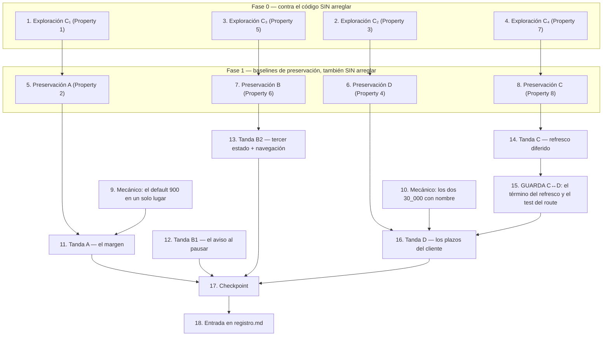

# Implementation Plan

## Overview

Cuatro tandas, cada una con su par de propiedades, y **tres de las cuatro se
pueden shippear solas**. El plan está ordenado por fase y no por tanda porque hay
dos cosas que sólo se pueden hacer contra el código SIN arreglar y no se
recuperan después; pero cada tanda es un corte vertical y la tabla de abajo dice
cuáles son sus tareas.

| Tanda | Qué cierra | Tareas | Depende de |
|---|---|---|---|
| **A** | Bug 1 — margen del umbral (2.1–2.4) | 1, 5, 9, 11 | — |
| **B1** | Bug 3 — el aviso al pausar, sólo servidor (2.11) | 12 | — |
| **B2** | Bug 3 — tercer estado + navegación, sólo cliente (2.9, 2.10, 2.12) | 3, 7, 13 | — |
| **C** | Bug 4 — `refrescarJerarquia` fuera del camino crítico (2.13–2.15) | 4, 8, 14 | — |
| **D** | Bug 2 — plazos del cliente (2.5–2.8) | 2, 6, 10, 16 | **C**, vía la 15 |

### Las dos cosas que no se pueden recuperar

1. **Los cuatro tests de exploración (tareas 1 a 4) tienen que correr contra el
   código sin arreglar y tienen que FALLAR.** El fallo es el entregable: confirma
   que la causa es la que hipotetizó el diseño. Si alguno **no** falla, la
   hipótesis de esa tanda está mal y hay que volver al diseño antes de escribir
   una línea de arreglo.
2. **Los cuatro baselines de preservación (tareas 5 a 8) tienen que verse
   PASANDO contra el código sin arreglar.** Un test de preservación que nunca se
   corrió antes del arreglo no prueba que el arreglo preservó nada: prueba que el
   arreglo es consistente consigo mismo.

### El acoplamiento C↔D es la trampa de este plan

El plazo del cliente tiene que ser mayor que el peor caso del servidor (2.7). Ese
peor caso **cambia cuando C entra**: hoy es `4 s + 30 s + 30 s = ~64 s` por
objeto y con C pasa a `~34 s`. Los tres escenarios, del diseño:

- **C→D** (recomendado): D se calcula una sola vez, con 34 s, y el plazo de la
  fila queda en 44 s.
- **D→C**: D se calcula con 64 s, el plazo queda en 74 s, y **baja solo** cuando C
  entra, porque los dos números salen de la misma suma de `lib/ads/plazos.ts` y C
  borra un término de esa suma en el mismo commit que mueve la llamada.
- **PROHIBIDO**: shippear D con el número post-C mientras C **no** está
  desplegado. Un click cuyo servidor tarda 64 s se abandonaría a los 44 s y
  produciría un desenlace `indeterminado` sobre un pedido que estaba por
  confirmarse. Eso es exactamente lo que 2.7 prohíbe, y es un defecto peor que la
  espera que este spec vino a bajar.

**La guarda no es la memoria de nadie: es la tarea 15**, que fija el término del
refresco en el módulo de plazos y prueba con un test del route (Property 7) que
la respuesta no espera la relectura. La 16 no arranca sin la 15 en verde.

### Los dos refactors mecánicos van aparte

Se verifican distinto que un cambio de comportamiento —la verificación es «el
valor no cambia»— así que son tareas propias (9 y 10) y no un renglón adentro de
la tanda: el default 900 que hoy está copiado en cuatro archivos, y los dos
`AbortSignal.timeout(30_000)` de `lib/ads/meta.ts` que pasan a nombrar
constantes. Las dos son independientes de todo y se pueden adelantar.

### El mapa de las ocho propiedades

Impares de Bug_Condition, pares de preservación, un par por tanda.

| Property | Tanda | Se escribe en | Se verifica en |
|---|---|---|---|
| 1 — Umbral con margen | A | tarea 1 | 11.4 |
| 2 — «No sé de cuándo es este dato» sigue releyendo | A | tarea 5 | 11.5 |
| 3 — El plazo cubre el peor caso | D | tarea 2 | 16.4 |
| 4 — El plazo vencido es indeterminado | D | tarea 6 | 16.5 |
| 5 — El control distingue la entrega sin cambiar de posición | B2 | tarea 3 | 13.5 |
| 6 — Coherencia y accionabilidad del interruptor | B2 | tarea 7 | 13.6 |
| 7 — La respuesta no espera la relectura | C | tarea 4 | 14.4 y **15** |
| 8 — El pintado, la reversión y la marca de desaparición | C | tarea 8 | 14.5 |

## Task Dependency Graph



Sin dependencias de entrada: **1**, **2**, **3**, **4**, **9**, **10** y **12**.

```json
{
  "waves": [
    {
      "wave": 1,
      "description": "Los cuatro contraejemplos, contra el código SIN arreglar. Son cuatro gates independientes: el que no falla para su tanda al diseño, y no frena a las otras tres.",
      "tasks": [
        { "id": "1", "title": "Exploración C₁ — el umbral sin margen", "dependsOn": [], "files": ["lib/ads/acciones.margen.test.ts", "lib/ads/acciones.ts"] },
        { "id": "2", "title": "Exploración C₂ — el POST sin plazo", "dependsOn": [], "files": ["app/(panel)/anuncios/togglePlazo.test.ts"] },
        { "id": "3", "title": "Exploración C₃ — el control sin entrega", "dependsOn": [], "files": ["app/(panel)/anuncios/senalEntrega.test.ts"] },
        { "id": "4", "title": "Exploración C₄ — la relectura en el camino crítico", "dependsOn": [], "files": ["app/api/ads/acciones/route.diferido.test.ts"] },
        { "id": "9", "title": "Mecánico: el default 900", "dependsOn": [], "files": ["lib/ads/frescura.ts", "lib/ads/acciones.ts", "app/api/data/ads/route.ts", "app/(panel)/anuncios/page.tsx", "app/(panel)/anuncios/GestorAnuncios.tsx"] },
        { "id": "10", "title": "Mecánico: los dos 30_000", "dependsOn": [], "files": ["lib/ads/plazos.ts", "lib/ads/meta.ts", "lib/ads/acciones.ts"] },
        { "id": "12", "title": "Tanda B1 — el aviso al pausar", "dependsOn": [], "files": ["lib/ads/previsualizacion.ts", "lib/ads/previsualizacion.test.ts", "app/api/ads/acciones/route.advertencia.test.ts"] }
      ]
    },
    {
      "wave": 2,
      "description": "Los baselines de preservación, todavía contra el código SIN arreglar. Última ventana para verlos pasar antes del arreglo.",
      "tasks": [
        { "id": "5", "title": "Preservación A + los dos casos de 3.15 que faltan", "dependsOn": ["1"], "files": ["lib/ads/acciones.margen.test.ts", "lib/ads/acciones.relectura.test.ts"] },
        { "id": "6", "title": "Preservación D — la forma `plazo` del generador", "dependsOn": ["2"], "files": ["app/(panel)/anuncios/toggleEstado.test.ts"] },
        { "id": "7", "title": "Preservación B — ortogonalidad e inventario de los toEqual", "dependsOn": ["3"], "files": ["app/(panel)/anuncios/senalEntrega.test.ts"] },
        { "id": "8", "title": "Preservación C — el baseline del route", "dependsOn": ["4"], "files": ["app/api/ads/acciones/route.frescura.test.ts", "app/api/ads/acciones/route.discrepancia.test.ts"] }
      ]
    },
    {
      "wave": 3,
      "description": "Las tandas. A, B2 y C son independientes entre sí y se pueden hacer en paralelo por personas distintas; ojo con los tres archivos compartidos de `conflicts`.",
      "tasks": [
        { "id": "11", "title": "Tanda A — el margen del umbral", "dependsOn": ["5", "9"], "files": ["lib/ads/frescura.ts", "lib/ads/frescura.test.ts", "lib/ads/frescura.cron.test.ts", "lib/ads/acciones.ts"] },
        { "id": "13", "title": "Tanda B2 — tercer estado y navegación", "dependsOn": ["7"], "files": ["app/(panel)/anuncios/celdas.tsx", "app/(panel)/anuncios/TablaAds.tsx", "app/(panel)/anuncios/ChipCascada.tsx", "app/(panel)/anuncios/page.tsx", "app/(panel)/anuncios/GestorAnuncios.tsx", "app/(panel)/anuncios/toggleEstado.test.ts", "app/(panel)/anuncios/senalEntrega.test.ts", "app/(panel)/anuncios/navegacionCampania.test.ts"] },
        { "id": "14", "title": "Tanda C — refresco diferido y escritura confirmada local", "dependsOn": ["8"], "files": ["app/api/ads/acciones/route.ts", "app/api/ads/acciones/route.diferido.test.ts", "app/api/ads/acciones/route.frescura.test.ts", "app/(panel)/anuncios/GestorAnuncios.tsx", "app/(panel)/anuncios/TablaAds.tsx", "app/(panel)/anuncios/celdas.tsx"] }
      ]
    },
    {
      "wave": 4,
      "description": "La guarda del acoplamiento y la tanda que depende de ella.",
      "tasks": [
        { "id": "15", "title": "GUARDA C↔D", "dependsOn": ["14"], "files": ["lib/ads/plazos.ts", "app/api/ads/acciones/route.diferido.test.ts"] },
        { "id": "16", "title": "Tanda D — los plazos del cliente", "dependsOn": ["6", "10", "15"], "files": ["lib/ads/plazos.ts", "lib/ads/plazos.test.ts", "app/(panel)/anuncios/GestorAnuncios.tsx", "app/(panel)/anuncios/togglePlazo.test.ts", "app/(panel)/anuncios/toggleEstado.test.ts"] }
      ]
    },
    {
      "wave": 5,
      "description": "Cierre.",
      "tasks": [
        { "id": "17", "title": "Checkpoint: typecheck, suite completa y las dos verificaciones a mano", "dependsOn": ["11", "12", "13", "16"], "files": [] },
        { "id": "18", "title": "Entrada en registro.md", "dependsOn": ["17"], "files": ["registro.md"] }
      ]
    }
  ],
  "conflicts": [
    { "files": ["app/(panel)/anuncios/GestorAnuncios.tsx"], "tasks": ["9", "13", "14", "16"], "nota": "Cuatro editores en cuatro regiones distintas: la 9 toca `UMBRAL_FRESCURA_DEFAULT` (:112); la 13 agrega `subirACampania` al lado de `bajarNivel` (:959) y lo cablea en el render; la 14 agrega el estado de ids en curso junto al ref (:1135); la 16 toca `ejecutarToggle` (:446) y el plazo del lote (:1312). Serializar 9 → 13 → 14 → 16, y ver la nota del final sobre el spec de parseo, que también edita este archivo." },
    { "files": ["app/(panel)/anuncios/toggleEstado.test.ts"], "tasks": ["6", "13.2", "16"], "nota": "La 6 agrega la forma `plazo` al generador (:511) y su caso en la Property 2 (:673). La 13.2 endurece los `toEqual` de la Property 1 (:210, :230, :662). La 16 no lo edita: sólo lo corre. Regiones distintas del mismo archivo." },
    { "files": ["lib/ads/acciones.ts"], "tasks": ["1", "9", "10", "11.3"], "nota": "La 1 sólo agrega un `export` a `causaDeRelectura`. La 9 importa el default. La 10 re-exporta `PRESUPUESTO_RELECTURA_MS` desde plazos. La 11.3 cambia UNA línea de la comparación. Ninguna toca `relecturaSelectiva`." },
    { "files": ["lib/ads/plazos.ts"], "tasks": ["10", "15", "16.1"], "nota": "La 10 lo crea con las constantes. La 15 agrega el término del refresco. La 16.1 agrega las dos funciones. En ese orden." },
    { "files": ["lib/ads/frescura.ts"], "tasks": ["9", "11.1"], "nota": "La 9 lo crea con el default 900 y nada más. La 11.1 le agrega el período, el margen y el umbral de relectura. Dos tareas, dos commits: la 9 es mecánica y la 11.1 cambia comportamiento." },
    { "files": ["app/api/ads/acciones/route.frescura.test.ts"], "tasks": ["8", "14.2"], "nota": "La 8 lo corre sin editar (baseline). La 14.2 le agrega el `await esperarRefrescosPendientes()`. Único editor: la 14.2." }
  ]
}
```

## Tasks

### Fase 0 — Los cuatro contraejemplos, contra el código SIN arreglar

- [ ] 1. Escribir el test de exploración de C₁ — el umbral sin margen
  - **Property 1: Bug Condition** — Umbral con margen contra el período del cron
  - **CRÍTICO: este test se escribe ANTES del arreglo y TIENE QUE FALLAR.** El fallo es el entregable: confirma que la causa es la del diseño (§Hypothesized Root Cause, punto 1) y no otra.
  - **NO arreglar el test ni el código cuando falle.** El test codifica el comportamiento esperado; la tarea 11.4 lo vuelve a correr y ahí sí tiene que pasar.
  - Archivo propuesto: `lib/ads/acciones.margen.test.ts`. Puro, sin base y sin red.
  - **Precondición mecánica:** `causaDeRelectura` (`lib/ads/acciones.ts:835`) hoy es privada. Hay que exportarla para poder cuantificar sobre ella. Es lo **único** que se toca del código sin arreglar, no cambia comportamiento y sigue el criterio que el repo ya usa («exportada para el test de la Property 1»: `dibujoDeEstado`, `frescuraDeFila`, `accionDeToggle`). Sin export, la única entrada sería `relecturaSelectiva`, que es privada, pega a la base y mockea `fetchObjeto`: la property quedaría atada a un integration test.
  - **La property, las dos mitades juntas.** Para todo par (umbral, período) con `período > 0` y `umbral >= período`, y para todo `synced_at` legible con `desaparecido_at` nulo:
    - **mitad de 2.1**: edad `<= período + duraciónDeLaCorrida` ⇒ `causaDeRelectura` devuelve `null`;
    - **mitad de 2.2**: edad `>= 2 × período` ⇒ devuelve `'vieja'`.
    - Generar el par con `fc.integer` y **no contra el 900 del default**: el valor efectivo del umbral sale de `settings` en runtime, así que un test contra 900 no dice nada de una base con otro valor. Es el hueco que A3 declara y la razón por la que acá una property vale más que unos casos.
  - **El contraejemplo concreto, además de la property, para que sea reproducible sin depender de la semilla**: `synced_at` de hace **905 s** con umbral 900 y período 900 → hoy `'vieja'`, o sea una lectura a Meta en el camino crítico de un click sobre un objeto que el cron acaba de confirmar. Anotarlo en el cuerpo del test como comentario, con el valor devuelto textual.
  - **RESULTADO ESPERADO: el test FALLA** en la mitad de 2.1 (toda la ventana `(900, 1350]` devuelve `'vieja'`) y **pasa** en la mitad de 2.2. Que la segunda mitad pase desde el principio es correcto y hay que dejarlo escrito: es la cota superior del margen, y sirve para detectar si el arreglo la rompe.
  - **CONDICIÓN DE CORTE:** si la mitad de 2.1 **no** falla, el umbral efectivo no es el que se cree. **Parar, no escribir el arreglo**, y revisar si la base tiene otro valor de `ads_frescura_umbral_segundos` antes de volver al diseño.
  - _Requirements: 1.1, 1.2, 1.3, 2.1, 2.2_

- [ ] 2. Escribir el test de exploración de C₂ — el POST sin plazo
  - **Property 3: Bug Condition** — El plazo del cliente cubre el peor caso del servidor
  - **CRÍTICO: se escribe ANTES del arreglo y TIENE QUE FALLAR.** No arreglar nada cuando falle; la tarea 16.4 lo vuelve a correr.
  - Archivo propuesto: `app/(panel)/anuncios/togglePlazo.test.ts`. Reusa el `tabla()` y el `fila()` de `toggleEstado.test.ts` (copiarlos o extraerlos; no hace falta tocar ese archivo en esta tarea).
  - **Caso (a) — el `pedir` que nunca resuelve.** La afirmación es «esto no termina», así que se verifica con un timeout **del test y acotado**, no con el `testTimeout: 30_000` del `vitest.config.ts`: `Promise.race([ejecutarToggle(f, entorno), esperar(50).then(() => 'colgado')])` y afirmar que la carrera **no** volvió `'colgado'`. Hoy vuelve `'colgado'` siempre.
    - Afirmar además el estado en el que queda todo, que es el síntoma de 1.8: la fila sigue pintada con el valor nuevo, el id sigue en `enVuelo` (así que un segundo click se descarta) y no hubo ningún aviso.
    - Y la forma directa del defecto: el `init` que `ejecutarToggle` le pasa a `pedir` **no trae `signal`**. El `pedir` del test lo registra y el test lo mira; hoy es `undefined`.
    - **Por qué no se prueba el abort real de 44 s:** ningún test de esta suite puede esperar 44 s de reloj, y `AbortSignal.timeout` no respeta los fake timers de vitest. Lo verificable es que el `signal` sale en el `init` con el plazo que dice el módulo, y que un `pedir` que rechaza con un error de nombre `TimeoutError` produce el desenlace correcto (tarea 16). El vencimiento contra el reloj real queda sin test y hay que decirlo, no taparlo con un mock de `AbortSignal`.
  - **Caso (b) — la desigualdad, evaluada con los timeouts que el código declara.** `60_000 > peorCaso(1)` donde `peorCaso(1) = 4_000 + 30_000 + 30_000 = 64_000`: hoy es **falso**. Escribirlo con las constantes leídas del código (`PRESUPUESTO_RELECTURA_MS` de `lib/ads/acciones.ts:116` y los dos `AbortSignal.timeout(30_000)` de `lib/ads/meta.ts:247` y `:291`) y no con literales, así el test sigue diciendo la verdad cuando alguno cambie.
  - **RESULTADO ESPERADO: los dos casos FALLAN.** Documentar los contraejemplos textuales: `init.signal === undefined`, la carrera devolviendo `'colgado'`, y `60000 > 64000 → false`.
  - **CONDICIÓN DE CORTE:** si (a) no falla, el `pedir` de `GestorAnuncios.tsx:1152` no es el `fetch(url, init)` pelado que se leyó. Si (b) no falla, alguno de los tres timeouts no es el que se leyó. En los dos casos: **parar y volver al diseño**.
  - _Requirements: 1.6, 1.7, 1.8, 1.9, 2.5, 2.7_

- [ ] 3. Escribir el test de exploración de C₃ — el control sin entrega
  - **Property 5: Bug Condition** — El control distingue la entrega sin cambiar de posición
  - **CRÍTICO: se escribe ANTES del arreglo y TIENE QUE FALLAR.** La tarea 13.5 lo vuelve a correr.
  - Archivo propuesto: `app/(panel)/anuncios/senalEntrega.test.ts`. Puro: sólo `dibujoDeEstado`, que ya está exportada.
  - **La property**: para todo par (`status`, `effectiveStatus`) que dibuje interruptor, si `effectiveStatus` es `CAMPAIGN_PAUSED` o `ADSET_PAUSED` entonces el dibujo trae una Senal_Entrega de antepasado apagado que **nombra al antepasado**; en todo otro caso trae `sin_senal`. Y en los dos casos `encendido === (status === 'ACTIVE')`.
  - **Reusar el generador `statusArbitrario` de `toggleEstado.test.ts`** (ya incluye `null`, `''`, minúsculas, los efectivos y texto libre). Hoy es un `const` sin exportar dentro de un archivo de test, así que hay que copiarlo o extraerlo a un helper compartido; **lo que no se hace es escribir uno más pobre**, que es lo que dejaría afuera justo los valores que a nadie se le ocurren.
  - **El contraejemplo concreto**: `{ status: 'ACTIVE', effectiveStatus: 'CAMPAIGN_PAUSED' }` —el caso de los **92 de 169 conjuntos**— devuelve hoy `{ control: 'interruptor', encendido: true }`, sin ningún campo de entrega. Anotarlo textual.
  - Incluir el caso que fija la decisión de alcance B2 y que **también falla hoy** por la misma razón (falta el campo): `{ status: 'ACTIVE', effectiveStatus: 'PENDING_BILLING_INFO' }` tiene que devolver `sin_senal`. El tercer estado NO se extiende ahí: es decisión de alcance, y queda fijada por un test y no por un comentario.
  - **RESULTADO ESPERADO: el test FALLA**, y el fallo es por campo ausente, no por valor equivocado. Eso es información: el defecto es que el dato no existe, no que esté mal calculado.
  - **CONDICIÓN DE CORTE:** si no falla, `dibujoDeEstado` no es la de `celdas.tsx:427`. **Parar y volver al diseño.**
  - _Requirements: 1.10, 1.13, 1.14, 2.9, 2.10_

- [ ] 4. Escribir el test de exploración de C₄ — la relectura en el camino crítico
  - **Property 7: Bug Condition** — La respuesta no espera la relectura, y el refetch no retrocede
  - **CRÍTICO: se escribe ANTES del arreglo y TIENE QUE FALLAR.** La tarea 14.4 lo vuelve a correr, y la tarea 15 lo usa como guarda del acoplamiento C↔D.
  - Archivo propuesto: `app/api/ads/acciones/route.diferido.test.ts`. Necesita base: `describe.skipIf(!dbAvailable)`, con el mismo armado que `route.frescura.test.ts` (mock de `lib/auth`, mock de `lib/ads/meta` con `enviar`, `fetchObjeto` y `fetchMinimoPresupuesto`, cuenta sembrada con sufijo único, nivel campaña porque es el único que se ejercita de punta a punta).
  - **Caso (a) — la respuesta espera a `fetchObjeto`.** Mockear `fetchObjeto` con una promesa que el test controla (un deferred que **no** se resuelve todavía) y correr el POST dentro de `Promise.race` contra un timer corto. Afirmar que la respuesta llegó **antes** de resolver el deferred. Hoy la carrera la gana el timer: la respuesta no sale hasta que la relectura vuelve. **No** mockear `fetchObjeto` con un `setTimeout` de 30 s: el test no puede esperar 30 s y el deferred controlado mide exactamente lo mismo, sin reloj.
  - **Caso (b) — el refetch retrocede, que es la regresión de 1.19 y conviene verla una vez.** Con `fetchObjeto` devolviendo `null` (Meta confirma la escritura pero no devuelve el objeto: caso real y ya sembrado en `route.frescura.test.ts` como `CAMP_AUSENTE`), afirmar que **cuando la respuesta sale, la base ya tiene el `status` confirmado**. Hoy no lo tiene: `refrescarJerarquia` corta en el `return` temprano y la fila queda con el `status` anterior, así que un refetch inmediato del cliente devuelve la posición vieja y el interruptor vuelve para atrás.
  - **RESULTADO ESPERADO: los dos casos FALLAN.** Anotar los contraejemplos: en (a), que la carrera la gana el timer; en (b), el `status` textual que la base devuelve después de un `confirmado`.
  - **CONDICIÓN DE CORTE:** si (a) no falla, `refrescarJerarquia` no está en el `await` de `route.ts:576`. **Parar y volver al diseño.** Si (b) no falla, algo más está escribiendo el `status` y hay que encontrar qué antes de agregar un segundo escritor.
  - _Requirements: 1.16, 1.18, 1.19, 2.13, 2.14_

### Fase 1 — Los baselines de preservación, también contra el código SIN arreglar

- [ ] 5. Preservación de la tanda A, y los dos casos de 3.15 que hoy no tienen test
  - **Property 2: Preservation** — «No sé de cuándo es este dato» sigue releyendo
  - **IMPORTANTE: metodología de observación primero.** Se corre el código SIN arreglar sobre los inputs de ¬C₁, se anota lo que devuelve y el test afirma eso.
  - **Los seis casos que ya existen y tienen que seguir pasando SIN una línea de cambio**, en `lib/ads/acciones.relectura.test.ts`: el Objeto_Desaparecido con dato fresco, el `fetchObjeto` que tira, el que no devuelve el objeto, el tope de `TOPE_RELECTURA = 10`, el backoff por cuota activo y el presupuesto de 4 s agotado. Correrlos ahora y anotar que pasan: es el baseline.
  - **Verificado antes de escribir, y por eso ninguno de esos seis cambia:** sus dos fechas son `VIEJO = hace 48 h` (172 800 s) y `FRESCO = hace 60 s`, y el margen mueve el borde de 900 a 1350. Las dos siguen del mismo lado. Lo mismo vale para `route.edad.test.ts`, cuyo `VIEJO` es de 5 días. **Si alguno de esos archivos falla después de la tarea 11, es una regresión del arreglo y no un caso esperado.**
  - **Los dos casos de 3.15 que HOY NO TIENEN TEST y esta tarea agrega:** `synced_at` **nulo** y `synced_at` **ilegible** (una fecha que `new Date()` deja en `NaN`). Están escritos en el comentario de `causaDeRelectura` y verificados **por lectura, no por ejecución**, y son justo los dos que el margen podría romper: los dos tienen que seguir devolviendo `'vieja'`, para todo umbral y **todo margen**.
  - **Y el tercero, que sí tiene test pero cuantificado sobre el margen**: `desaparecido_at` no nulo devuelve `'desaparecida'` aunque el dato sea fresco, antes de mirar la edad.
  - Escribirlos como property sobre (umbral, período, edad) en `lib/ads/acciones.margen.test.ts`, para que la afirmación sea «ningún margen los toca» y no «con 450 no se rompen».
  - **RESULTADO ESPERADO: todo PASA contra el código sin arreglar.** Los dos casos nuevos pasan hoy porque las ramas ya cortocircuitan antes de la comparación; eso es exactamente lo que hace que 3.15 se preserve **por la forma del código y no por cuidado**, y es lo que esta tarea deja fijado antes de tocarlo.
  - _Requirements: 3.15, 3.16_

- [ ] 6. Preservación de la tanda D — la forma `plazo` del generador
  - **Property 4: Preservation** — El plazo vencido es indeterminado y nunca un fallo
  - **IMPORTANTE: metodología de observación primero**, y acá el oráculo ya existe: la forma `red` de `formaArbitraria` (`toggleEstado.test.ts:511`) es un `pedir` que rechaza, y el desenlace observado hoy es reversión + aviso que no afirma que el cambio no ocurrió. La forma `plazo` es el **mismo desenlace por otra causa**.
  - Agregar `{ tipo: 'plazo' }` al generador, al lado de `red`: un `pedir` que rechaza con un error de `name: 'TimeoutError'` (Node/undici) y, como segundo caso, `name: 'AbortError'` (algunos navegadores).
  - La Property 2 de ese archivo («no hay éxito silencioso») tiene que clasificar las dos formas como **no confirmadas**, igual que `red`: la fila vuelve a `statusPrevio` sólo si todavía muestra el valor pintado, el id se libera de `enVuelo` en el `finally`, y hay un aviso no vacío.
  - Afirmar también las tres cosas de 3.2, 3.3 y 3.4 que el plazo no puede cambiar: la reversión restaura `statusPrevio` y no `PAUSED`/`ACTIVE`, se decide con `aplicado` y no con la nulidad del aviso, y un `confirmado` con advertencia sigue sin revertir y sigue pidiendo el refetch.
  - Y la guarda de 3.11: dos clicks sobre la misma fila con un pedido en vuelo siguen produciendo un solo pedido, y dos filas distintas siguen pudiendo tocarse a la vez.
  - **RESULTADO ESPERADO: PASA contra el código sin arreglar.** El `catch` que el plazo va a usar ya existe y ya hace las tres cosas; lo único que la tanda D le cambia es el **texto**. Que esta property pase antes del arreglo es lo que hace que su fallo después signifique algo.
  - **Lo que esta tarea NO afirma todavía**: que el texto del aborto nombre el plazo. Eso lo agrega la 16.2 y lo verifica la 16.5, porque hoy el aviso interpola `e.message` y diría `The operation was aborted due to timeout`.
  - _Requirements: 2.6, 3.1, 3.2, 3.3, 3.4, 3.11_

- [ ] 7. Preservación de la tanda B — la ortogonalidad, y el inventario de los `toEqual` que van a romper
  - **Property 6: Preservation** — Coherencia y accionabilidad del interruptor
  - **IMPORTANTE: metodología de observación primero.** La mitad de esta property ya existe y pasa: es la Property 1 de `toggleEstado.test.ts`. Lo que esta tarea agrega es la mitad que el tercer estado hace necesaria.
  - **La mitad nueva, en `app/(panel)/anuncios/senalEntrega.test.ts`**: para todo `status` y todo par de `effectiveStatus` que **los dos** dibujen interruptor, `dibujoDeEstado(f).encendido` **no cambia** al variar `effectiveStatus`. El cuantificador importa y hay que escribirlo así: `effectiveStatus` **sí** decide interruptor vs badge (`NO_TOGGLEABLE` lo mira), así que la ortogonalidad se afirma **dentro** de la rama del interruptor y no fuera.
  - **Y la mitad que ya está y hay que dejar corrida como baseline** (`toggleEstado.test.ts`): la fila dibujada apagada pide `activate` y la encendida pide `pause` para todo `status` incluidos `null`, `''`, minúsculas y desconocidos; después de una acción confirmada el interruptor queda accionable en la otra dirección; la fila que dibuja badge no tiene `encendido` y su texto nunca queda vacío (`''` cuenta como ausente).
  - **INVENTARIO — los tres lugares que van a romper al agregar el campo `entrega`, listados acá para que la tarea 13.2 no los descubra como sorpresas:**
    1. `toggleEstado.test.ts:210` — `expect(dibujo).toEqual({ control: 'interruptor', encendido })` dentro del loop de la tabla `DIRECCIONES` (8 filas: `ACTIVE`, `PAUSED`, `null`, `''`, `ADSET_PAUSED`, `CAMPAIGN_PAUSED`, `active`, `UN_ESTADO_QUE_NO_CONOCEMOS`).
    2. `toggleEstado.test.ts:662` — `expect(dibujoDespues).toEqual({ control: 'interruptor', encendido: !dibujo.encendido })`, el de «queda accionable en la otra dirección».
    3. Los `toEqual({ control: 'badge', texto: s })` de `:230` y `:236` **no** rompen: la rama badge no lleva `entrega` y no tiene que llevarlo (3.10, y la Senal_Entrega vive sólo en la rama del interruptor por la misma razón por la que `encendido` vive sólo ahí).
  - **LA REGLA, y va acá y no en una nota al pie: la expectativa se ENDURECE, no se afloja.** Cada `toEqual` se extiende con **el valor esperado de `entrega`** para ese caso. **Pasar a `toMatchObject` está PROHIBIDO**: aflojaría la aserción y dejaría de fijar que no hay campos de más, que es la mitad del valor que tiene ese test. Dos filas de `DIRECCIONES` van a llevar `entrega: { estado: 'antepasado_apagado', … }` por su `status`, no por su efectivo —`ADSET_PAUSED` y `CAMPAIGN_PAUSED` aparecen ahí como valores de **`status`**, con el efectivo por default— así que hay que mirar caso por caso qué `effectiveStatus` arma el helper `fila()` antes de escribir el valor esperado.
  - **RESULTADO ESPERADO: PASA contra el código sin arreglar**, incluida la property de ortogonalidad nueva (hoy es trivialmente verdadera porque `encendido` no mira `effective_status`; después del arreglo sigue teniendo que ser verdadera, y eso es lo que se está protegiendo).
  - _Requirements: 3.6, 3.7, 3.10, 3.17_

- [ ] 8. Preservación de la tanda C — el baseline del route
  - **Property 8: Preservation** — El pintado, la reversión y la marca de desaparición
  - **IMPORTANTE: metodología de observación primero, y acá es correr lo que ya hay sin editarlo.**
  - Correr y anotar que pasan, **sin tocar una línea**: `route.frescura.test.ts` (los dos casos: la relectura que trae la fila limpia la marca y adelanta `synced_at`; la que no trae nada deja la marca y el `synced_at` viejo intactos) y `route.discrepancia.test.ts`.
  - **Verificado antes de escribir, y es la razón por la que la tanda C no rompe esos dos casos:** el segundo afirma `marca` y `sync`, **no `status`**. La Escritura_Confirmada_Local escribe `status` y nada más, así que no lo contradice. Si después de la tarea 14 ese caso falla, es que se escribió algo más de lo que C2 autoriza.
  - Afirmar además, como baseline observado, las tres cosas que la tanda C no puede cambiar: la fila de `ad_actions` se abre **antes** del POST y queda `confirmado` (3.9), `conservarPintadoEnVuelo` conserva el `status` en pantalla de los ids en vuelo (3.12), y la lectura de filas conserva su presupuesto y su número de secuencia con una respuesta vieja sin poder pisar una más nueva (3.13).
  - **RESULTADO ESPERADO: todo PASA contra el código sin arreglar.**
  - _Requirements: 3.9, 3.12, 3.13_

### Fase 2 — Los dos refactors mecánicos (sin comportamiento)

Van aparte porque **se verifican distinto**: acá la verificación es «el valor no
cambia y ningún test se edita». Un cambio de comportamiento se verifica con un
test nuevo; un refactor mecánico se verifica con los que ya están.

- [ ] 9. El default 900 deja de estar copiado en cuatro archivos
  - Crear `lib/ads/frescura.ts` con **una sola constante por ahora**: `UMBRAL_FRESCURA_DEFAULT_SEGUNDOS = 900`, con el comentario de que repite el seed de la migración 025. Módulo puro, sin imports: lo van a importar un módulo de servidor, dos endpoints y dos archivos de cliente.
  - Reemplazar las cuatro copias, que hoy son literales sueltos: `lib/ads/acciones.ts:557` (dentro de `topesDeSettings`), `app/api/data/ads/route.ts:301`, `app/(panel)/anuncios/page.tsx:223` y `app/(panel)/anuncios/GestorAnuncios.tsx:112` (`UMBRAL_FRESCURA_DEFAULT`).
  - **El seed de `db/migrations/025_ads_frescura.sql:144` NO se toca.** Es SQL y no puede importar nada; queda como quinta copia y eso está declarado, no olvidado. Lo que compra este cambio es que la próxima vez sean dos lugares en vez de cinco.
  - **VERIFICACIÓN, que es toda la tarea: el valor no cambia.** `npx tsc --noEmit` limpio y `npm test` sin editar **ningún** test. En particular tienen que pasar tal cual `frescuraFila.test.ts` (que declara su propio `const UMBRAL = 900`, «el que seedea la migración 025»), `acciones.relectura.test.ts` y `route.edad.test.ts`. Si alguno cambia de resultado, el reemplazo no fue mecánico.
  - **Los tres `UMBRAL = 900` de los tests se quedan como están.** Son el valor esperado, no la fuente: un test que importa la constante que está probando no prueba nada.
  - _Requirements: 1.4, 2.3_

- [ ] 10. Los dos `AbortSignal.timeout(30_000)` de Meta pasan a tener nombre
  - Crear `lib/ads/plazos.ts` con **las constantes solamente** (las dos funciones las agregan la 15 y la 16.1): `PLAZO_META_ESCRITURA_MS = 30_000` (el de `enviar`), `PLAZO_META_LECTURA_MS = 30_000` (el de `pedir`, que es el que usa `fetchObjeto`), `PRESUPUESTO_RELECTURA_MS = 4_000` y `HOLGURA_CLIENTE_MS = 10_000`.
  - **Módulo puro, sin un solo import de servidor**: lo importan `lib/ads/meta.ts` (server) y `app/(panel)/anuncios/GestorAnuncios.tsx` (client). Si alguna vez importa `pg` o `next/headers`, el bundle del cliente se rompe.
  - `lib/ads/meta.ts:291` (`enviar`) y `:247` (`pedir`) pasan a nombrar las constantes. **`meta.ts:519` no se toca**: ése ya recibe un `timeoutMs` por parámetro.
  - `lib/ads/acciones.ts:116` deja de declarar su propio `PRESUPUESTO_RELECTURA_MS` y lo **re-exporta** desde `plazos.ts`. El re-export importa: `acciones.relectura.test.ts` lo importa desde `lib/ads/acciones` y su mensaje de «presupuesto agotado» lo interpola, así que cambiar el path del import sería editar un test en una tarea mecánica.
  - **VERIFICACIÓN, que es toda la tarea: los valores no cambian.** Siguen siendo 30 000, 30 000 y 4 000. `npx tsc --noEmit` limpio, `meta.test.ts` y `acciones.relectura.test.ts` pasan sin editarse, y `grep -rn "AbortSignal.timeout(30_000)" lib/` no devuelve nada.
  - **Por qué esto no es cosmética:** es lo que hace que la desigualdad de 2.8 se verifique contra el número que las llamadas usan de verdad y no contra una copia. Si alguien baja el timeout de `enviar`, el plazo del cliente baja con él.
  - _Requirements: 2.8_

### Fase 3 — Las cuatro tandas

- [ ] 11. Tanda A — el margen del umbral de frescura
  - Las especificaciones que las sub-tareas tienen que satisfacer, todas del diseño:
  - _Bug_Condition: `esC1_UmbralSinMargen(X)` de §Bug Details — `pause`/`activate`, `desaparecido_at` nulo, `synced_at` legible, y `edad > umbral AND edad <= período + duraciónDeLaCorrida`_
  - _Expected_Behavior: Property 1 — las dos cotas del margen: mayor que la duración de la corrida, y **menor que el período**_
  - _Preservation: §Preservation Requirements, tanda A — los tres casos de 3.15, `relecturaSelectiva` sin tocar, `frescuraDeFila` sin tocar, el default sigue siendo 900_
  - _Requirements: 1.1, 1.2, 1.3, 1.4, 1.5, 2.1, 2.2, 2.3, 2.4, 3.15, 3.16_

  - [ ] 11.1 `lib/ads/frescura.ts`: el período, el margen y el umbral de relectura
    - Sumar al módulo que creó la tarea 9: `PERIODO_SYNC_JERARQUIA_SEGUNDOS = 900`, declarada **como espejo de `deploy/cron.panel:113`** en el comentario. Que sea espejo y no fuente es inevitable: la fuente es el crontab del host.
    - `margenDeRelectura(periodoSegundos)` devuelve `periodoSegundos / 2`, con las dos cotas escritas en el comentario: la inferior tiene que absorber la duración de la corrida más el jitter, y la superior tiene que ser **menor que el período**, o una corrida perdida (edad ≈ 2 × período) dejaría de disparar la relectura y se perdería 2.2, que es la razón por la que la relectura existe.
    - `umbralDeRelectura(umbralSegundos, periodoSegundos)` devuelve la **suma**.
    - **EL SIGNO, que es el detalle que hay que escribir en el código y no sólo en el diseño:** `pisoDeFrescura` de `lib/ads/live.ts:71` **resta** el margen, porque allá la comparación es `edad < piso ⇒ está fresco` y bajar el piso adelanta el sync. Acá es la inversa: `edad > umbral ⇒ releé`. Con el margen restado el umbral quedaría en **675 s** y la relectura se dispararía en **más** clicks que hoy. Es el mismo razonamiento con el signo opuesto, y es la única parte del precedente que no se copia.
    - **Límite declarado, en el comentario y no como defensa:** si alguien pone `ads_frescura_umbral_segundos` por debajo del período, el margen no lo rescata (con umbral 60 el umbral de relectura queda en 510 s, menor que el período). Se evaluó `max(umbral, período) + margen` y **se descartó**: haría que el preflight ignore en silencio un valor que un operador puso a propósito.
    - Tests en `lib/ads/frescura.test.ts`: el par del mundo real (900/900 → margen 450, umbral 1350) y los degenerados: período 0 (margen 0, umbral = umbral), umbral 0, umbral menor que el período, y un período impar (margen fraccionario: decidir y fijar por test que no se redondea, o que se redondea, pero que esté escrito).
    - _Requirements: 2.1, 2.2, 2.4_

  - [ ] 11.2 El test que lee `deploy/cron.panel` — la verificación ejecutable de 2.3
    - Archivo propuesto: `lib/ads/frescura.cron.test.ts`. Un `readFileSync` en un test de entorno node, **sin red y sin CLI**. Ningún test del repo lee todavía `deploy/`: esto sienta un precedente y conviene que quede solo en su archivo.
    - Buscar la línea de `scripts/sync-ads-jerarquia.ts` en `deploy/cron.panel`, traducir su schedule a segundos (`*/15` → 900) y compararlo con `PERIODO_SYNC_JERARQUIA_SEGUNDOS`.
    - **El caso de que la línea NO exista también tiene que fallar**, y con un mensaje que diga qué se buscó: un test que pasa porque no encontró nada es peor que no tenerlo.
    - **VERIFICACIÓN DE QUE LA GUARDA GUARDA, y hay que hacerla a mano una vez:** cambiar `*/15` por `*/30` en `deploy/cron.panel`, correr la suite, ver que **rompe**, y volver el archivo atrás. Sin esa comprobación el test es una afirmación sobre sí mismo. Anotar en la tarea 18 que se hizo.
    - **Lo que este test NO cubre, declarado en su comentario**: que el crontab instalado en el host sea `deploy/cron.panel`. Compara contra el archivo del repo, no contra `crontab -l`. El propio `deploy/cron.panel` ya advierte ese hueco.
    - _Requirements: 1.4, 2.3_

  - [ ] 11.3 `causaDeRelectura`: la comparación pasa por `umbralDeRelectura`
    - Una línea, en `lib/ads/acciones.ts:842`: `edad > umbralSegundos` pasa a `edad > umbralDeRelectura(umbralSegundos, PERIODO_SYNC_JERARQUIA_SEGUNDOS)`.
    - **La rama de `desaparecidoAt` queda arriba y sin tocar, y el `edad === null` sigue cortocircuitando antes de la comparación.** 3.15 se preserva por la forma del código, no por cuidado del que edita: si alguien mueve una de esas dos ramas debajo de la comparación, la tarea 5 lo agarra.
    - **`relecturaSelectiva` no se toca**: sigue secuencial, con tope 10, con el presupuesto de 4 s para el lote entero, sin bloquear la acción cuando falla y dejando anotado por qué no se pudo revalidar (3.16).
    - **`frescuraDeFila` (`celdas.tsx:129`) y `MarcaFrescura` NO se tocan** (decisión A1): son dos preguntas distintas sobre el mismo número. El margen movería el borde de la marca visual de 900 a 1350 s, que es un cambio de producto que nadie pidió y que rompe la semántica documentada del `>` y no `>=`.
    - **El valor de `settings` no se cambia.** Sigue siendo 900.
    - _Requirements: 2.1, 2.2, 3.15, 3.16_

  - [ ] 11.4 Verificar que la exploración de C₁ ahora pasa
    - **Property 1: Expected Behavior** — Umbral con margen contra el período del cron
    - **IMPORTANTE: volver a correr EL MISMO test de la tarea 1. No escribir un test nuevo.**
    - **RESULTADO ESPERADO: PASA**, las dos mitades: la de 2.1 (que fallaba) y la de 2.2 (que ya pasaba y tiene que seguir pasando, porque es la cota superior del margen).
    - _Requirements: 2.1, 2.2, 2.4_

  - [ ] 11.5 Verificar que la preservación de A sigue pasando
    - **Property 2: Preservation** — «No sé de cuándo es este dato» sigue releyendo
    - **IMPORTANTE: volver a correr LOS MISMOS tests de la tarea 5.**
    - Los seis casos de `acciones.relectura.test.ts` pasan **sin una línea editada** (`git diff --stat` en 0 sobre ese archivo). Los tres de 3.15, cuantificados sobre el margen, siguen devolviendo la misma causa.
    - **RESULTADO ESPERADO: PASAN.** Si alguno falla, es una regresión del arreglo: la respuesta por defecto es corregir `causaDeRelectura`, no el test.
    - _Requirements: 3.15, 3.16_

- [ ] 12. Tanda B1 — el aviso al pausar (sólo servidor, cero cambios de cliente)
  - **Ships sola y no depende de nada.** Es el corte más chico de la tanda B: `lib/ads/previsualizacion.ts` y sus tests.
  - `advertenciaPadreApagado` gana la variante de `pause`, con **otro texto** porque dice otra cosa: al activar, «no entrega» es una advertencia sobre el futuro; al pausar, es una aclaración sobre lo que se está apagando.
    - `pause`, conjunto (nuevo): «la campaña está pausada: el conjunto ya no estaba entregando, así que pausarlo no cambia la entrega». Nombra al antepasado —lo necesita el link de B4—, dice el hecho y no promete nada del futuro.
    - `pause`, anuncio: las mismas tres variantes que ya existen para `activate` (conjunto, campaña, los dos), en la forma del pasado.
    - **`activate` no cambia: los cuatro textos quedan textuales, carácter por carácter** (3.5), y siguen siendo advertencia y no bloqueo.
  - El llamador de `previsualizacion.ts:414` deja de filtrar por `accion === 'activate'` y pasa a filtrar por **«`activate`, o `pause` sobre una fila con `status === 'ACTIVE'`»**.
    - **El `status === 'ACTIVE'` es la mitad de la decisión**: pausar algo que ya está `PAUSED` llega con `motivo: 'ya_esta_en_ese_estado'` y la aclaración no agrega nada. Con eso el aviso nuevo aparece exactamente sobre los **92** y no sobre los **67**, y el «ruido sobre la operación de lote más común» que el comentario de hoy teme queda acotado a las filas que efectivamente se están apagando.
    - **La asimetría con `activate` se conserva y tiene motivo propio**: `activate` sí se suma sobre `ya_esta_en_ese_estado`, porque «ya está activo y sigue sin entregar» ES el síntoma reportado.
  - Tests en `lib/ads/previsualizacion.test.ts`: los textos nuevos de conjunto y de anuncio; que `activate` sigue devolviendo los de hoy **carácter por carácter**; que un `pause` sobre una fila `PAUSED` **no** trae aviso; y que a nivel campaña sigue devolviendo `null` (una campaña no tiene padre).
  - Integration en `app/api/ads/acciones/route.advertencia.test.ts`: `pause` sobre un conjunto `ACTIVE` con campaña `PAUSED` trae el texto nuevo en la previa; sobre uno `PAUSED`, no lo trae.
  - _Bug_Condition: 1.12 — el aviso llega en el SEGUNDO click, después de que el usuario ya apagó creyendo que apagaba la entrega_
  - _Expected_Behavior: 2.11 — se dice en el momento del click y no en el siguiente_
  - _Preservation: 3.5 — los textos de `activate` intactos, sigue siendo advertencia y no bloqueo_
  - _Requirements: 1.12, 2.11, 3.5_

- [ ] 13. Tanda B2 — el tercer estado y la navegación (sólo cliente)
  - _Bug_Condition: `esC3_ControlSinEntrega(X)` de §Bug Details — la fila dibuja interruptor, `encendido = true`, y `effectiveStatus IN ['CAMPAIGN_PAUSED','ADSET_PAUSED']`_
  - _Expected_Behavior: Property 5 — la Senal_Entrega nombra al antepasado y `encendido` sigue siendo exactamente `status === 'ACTIVE'`_
  - _Preservation: Property 6 y §Preservation Requirements, tanda B — la misma comparación, las dos direcciones, el badge que no lleva `encendido`, el badge de `TablaAds.tsx:254` intacto_
  - _Requirements: 1.10, 1.11, 1.13, 1.14, 1.15, 2.9, 2.10, 2.12, 3.6, 3.7, 3.10, 3.17_

  - [ ] 13.1 `SenalEntrega`, `senalDeEntrega` y el campo `entrega` en la unión
    - En `app/(panel)/anuncios/celdas.tsx`: `SenalEntrega` como unión discriminada de dos casos (`sin_senal` y `antepasado_apagado` con `antepasado: 'campaign' | 'adset'`), y `DibujoEstado` gana `entrega` **sólo en la rama `interruptor`**.
    - **La rama `badge` no lo lleva**, por la misma razón por la que no lleva `encendido`: «togglear una fila que dibuja un badge» tiene que seguir siendo imposible por tipo y no por cuidado del llamador (3.10).
    - `senalDeEntrega(effectiveStatus)` es pura, exportada y **no mira `status`**. Ésa es la ortogonalidad que 2.10 pide, dicha en la firma: la posición sale de `status`, la señal sale de `effective_status`, y la única función que ve las dos cosas es `dibujoDeEstado`, que las junta sin mezclarlas.
    - **Ninguno de los dos casos se llama `entrega`.** `sin_senal` es «Meta no dice que un antepasado lo tenga sin entregar», que NO es «entrega»: un `PENDING_BILLING_INFO` tampoco entrega y cae ahí. Nombrarlo `entrega` afirmaría algo que este dato no alcanza para afirmar, y el comentario tiene que decirlo.
    - **`encendido` sigue siendo `fila.status === 'ACTIVE'`, la misma expresión, sin tocar.**
    - Tests en `senalEntrega.test.ts`: los dos efectivos que devuelven señal, `null`, `''`, y `PENDING_BILLING_INFO` → `sin_senal` (la decisión de alcance B2 queda fijada por un test y no por un comentario).
    - _Requirements: 2.9, 2.10, 3.6, 3.10_

  - [ ] 13.2 Endurecer las expectativas de `toggleEstado.test.ts`
    - Los tres lugares están inventariados en la tarea 7 con su línea. Extender cada `toEqual` con **el valor esperado de `entrega`** para ese caso.
    - **`toMatchObject` está PROHIBIDO.** Aflojaría la aserción y dejaría de fijar que no hay campos de más, que es la mitad del valor de ese test. Lo mismo vale para cualquier otra forma de no mirar el objeto completo (`expect.objectContaining`, borrar el campo antes de comparar, comparar `dibujo.encendido` en vez de `dibujo`).
    - Mirar caso por caso qué `effectiveStatus` arma el helper `fila()`: en la tabla `DIRECCIONES`, `ADSET_PAUSED` y `CAMPAIGN_PAUSED` aparecen como valores de **`status`**, no de efectivo, así que su `entrega` esperada depende de lo que el helper ponga por default y no de su nombre.
    - **Si algún test de ese archivo falla y no es uno de los tres inventariados, es una regresión de esta tanda y se arregla el código, no el test.**
    - _Requirements: 3.6, 3.7, 3.10_

  - [ ] 13.3 `ToggleEstado`: el dibujo, la accesibilidad y el link
    - **La posición no se toca**: `translate-x-4` y el fondo de encendido siguen saliendo de `encendido`. Lo que cambia con `antepasado_apagado` es el **tono de la pista** (de `bg-good-500` a `bg-warn-500`, que ya existe en `tailwind.config.ts`), el nombre accesible y el `title`.
    - **`aria-checked` sigue siendo booleano y sigue saliendo de `encendido`.** `aria-checked="mixed"` **se descartó con motivo y no se rediscute**: `mixed` significa «parcialmente encendido», y acá el interruptor está completamente encendido —el `status` ES `ACTIVE`—; lo apagado es el padre. Decirlo con `mixed` sería mentirle al lector de pantalla sobre el estado del control que va a accionar.
    - El tercer estado va en el **nombre accesible** (`aria-label`, que ya se arma con el nombre del objeto y la acción) y en un **`aria-describedby`** que apunta al texto que nombra la campaña y la enlaza.
    - **Consecuencia declarada**: para un usuario de lector de pantalla el control se sigue anunciando como un switch encendido, y el «no entrega» llega por la descripción. Es lo correcto —el switch refleja el `status` que va a invertir— y es coherente con 3.6.
    - El link a la campaña aparece acá para las filas con Senal_Entrega de antepasado apagado (los 92): el dato es `effective_status` + `campaignId`, los dos en la fila.
    - `TablaAds.tsx` pasa el callback de navegación a `ToggleEstado`. **El badge de `TablaAds.tsx:254` no se toca** (3.17): el tercer estado se suma, no lo reemplaza.
    - _Requirements: 2.9, 2.12, 3.17_

  - [ ] 13.4 `subirACampania`, la cascada inicial y el texto del chip
    - `subirACampania` en `GestorAnuncios.tsx`, **espejo de `bajarNivel` (`:959`)**: pone el nivel de arriba con el `campaignId` de la fila como única cascada, escribe la URL y **no pasa por la máquina de estados de `seleccion.ts`**. El precedente es `bajarNivel`, que tampoco pasa: `seleccion.ts` no tiene evento para subir y agregarlo es más cambio que las dos líneas de acá.
    - **Verificado antes de elegirlo, y por eso no hay SQL nuevo**: el filtro de cascada de `lib/queries/ads.ts` es `o."campaignId" = ANY($campaignIds)` en el `WHERE` de afuera, y a nivel campaña el `SELECT` emite `c.campaign_id AS "campaignId"`. `level=campaign&campaignIds=<id>` ya filtra a esa campaña.
    - `page.tsx:131`: la cascada inicial se arma también para `nivel === 'campaign'`. **Sin esto el filtro se pierde al recargar o al compartir el link**, porque `construirUrl` lo toma del estado y no de la URL.
    - `ChipCascada.tsx`: un caso de texto para «la campaña X» en el nivel campaña. Hoy `NIVEL_DE` sólo tiene `campaign` y `adset` como niveles de origen, así que diría «dentro de 1 campaña» estando en el nivel campaña, que se lee raro.
    - **Alternativas descartadas, que no se rediscuten**: filtrar por `nombre` (es substring e insensible a mayúsculas: con dos campañas de nombres parecidos lleva a la fila equivocada o a dos); cambiar de nivel y sólo resaltar la fila sin filtrar (la tabla está paginada y ordenada por gasto, y una campaña pausada sin gasto puede no estar en la página, o quedar escondida por `status=active` o por `ocultarSinDatos`).
    - **Y la decisión de producto que ya está cerrada: es navegación, no cascada.** La campaña se activa con su propio interruptor en su propia fila. Activar una campaña cambia la entrega y el gasto de todos sus conjuntos, y hoy no hay ninguna previa que muestre ese alcance antes de tocar 92 objetos.
    - Tests en `navegacionCampania.test.ts`: la URL que arma `subirACampania` para una fila de conjunto, y que `page.tsx` reconstruye la cascada a partir de esa URL (**la ida y vuelta**, que es lo que 2.12 necesita para que el link sea compartible). Más el caso de texto del chip.
    - _Requirements: 1.15, 2.12_

  - [ ] 13.5 Verificar que la exploración de C₃ ahora pasa
    - **Property 5: Expected Behavior** — El control distingue la entrega sin cambiar de posición
    - **IMPORTANTE: volver a correr EL MISMO test de la tarea 3. No escribir un test nuevo.**
    - **RESULTADO ESPERADO: PASA**, incluido el caso de `PENDING_BILLING_INFO` → `sin_senal`.
    - _Requirements: 2.9, 2.10, 2.12_

  - [ ] 13.6 Verificar que la preservación de B sigue pasando
    - **Property 6: Preservation** — Coherencia y accionabilidad del interruptor
    - **IMPORTANTE: volver a correr LOS MISMOS tests de la tarea 7**, con los `toEqual` endurecidos de la 13.2 y **sin** haber aflojado ninguno.
    - La property de ortogonalidad tiene que seguir pasando: `encendido` no cambia al variar `effective_status` entre dos valores que los dos dibujen interruptor. **Ahora sí es una afirmación con contenido**, porque el dibujo ya mira `effective_status` para otra cosa.
    - **RESULTADO ESPERADO: PASAN.**
    - _Requirements: 3.6, 3.7, 3.10, 3.17_

- [ ] 14. Tanda C — la escritura confirmada local y el refresco diferido
  - _Bug_Condition: `esC4_RelecturaEnCaminoCritico(X)` de §Bug Details — `pause`/`activate` confirmado y la respuesta esperando a `refrescarJerarquia`_
  - _Expected_Behavior: Property 7 — la respuesta sale sin esperar a `fetchObjeto`, y la base ya tiene el `status` confirmado cuando sale_
  - _Preservation: Property 8 y §Preservation Requirements, tanda C — `refrescarJerarquia` sigue existiendo y corriendo con el mismo `UPDATE` y el mismo `catch {}`; lo único que cambia es CUÁNDO_
  - _Requirements: 1.16, 1.17, 1.18, 1.19, 2.13, 2.14, 2.15, 3.9, 3.12, 3.13_

  - [ ] 14.1 `escribirStatusConfirmado` — un `UPDATE`, cero llamadas a Meta
    - En `app/api/ads/acciones/route.ts`, en la rama `r.estado === 'confirmado'`, después de `cerrarAccion(id, 'confirmado')`: un `UPDATE` de **una sola columna** con `campos.status`.
    - **Se usa `campos.status` y no `after`** para que no haya una segunda derivación del mismo hecho: `campos` es literalmente lo que salió en el POST y lo que Meta confirmó.
    - **QUÉ NO ESCRIBE, y cada uno tiene su motivo (decisión C2):**
      - **`effective_status`: no.** No lo sabemos. Pausar un conjunto cambia también el efectivo de sus anuncios, y activar uno bajo una campaña pausada lo deja en `CAMPAIGN_PAUSED`. Derivarlo exigiría reimplementar la resolución de Meta, que el repo ya documentó dos veces como sutil (el estado propio gana sobre el del padre).
      - **Presupuestos: no.** La acción de estado no los toca.
      - **`synced_at`: no.** Ponerlo en `now()` afirmaría que la fila entera está fresca —incluidos el `effective_status` que no actualizamos y los presupuestos— cuando lo único confirmado es un campo. Es la misma frescura falsa que la tanda A está arreglando del otro lado.
      - **`desaparecido_at`: no.** La sigue limpiando **sólo la relectura**, por la regla evidenciaria: «una escritura confirmada seguida de una relectura que trajo la fila es evidencia directa de que existe». Si la escritura local la limpiara, se estaría limpiando con la mitad de la evidencia.
    - **Las dos consecuencias visibles, que van al comentario y a la tarea 18:** después de pausar uno de los 92 la fila queda `PAUSED` con `effective_status = CAMPAIGN_PAUSED` hasta que el refresco diferido vuelva (segundos), así que el badge dice «campaña pausada» sobre una fila cuyo propio estado es `PAUSED` —dato atrasado, no afirmación falsa: no entrega de las dos formas—; y la fila puede seguir viéndose «vieja» en la Marca_Frescura inmediatamente después de una acción, que es honesto porque nadie confirmó la fila entera.
    - **Las dos salidas descartadas, que no se rediscuten**: devolver el estado nuevo en la respuesta (el cliente **ya** tiene ese valor: es el que pintó, y sería un segundo lugar clasificando el mismo hecho, que es la forma del bug original); y aceptar el refetch viejo con una guarda del estilo de `conservarPintadoEnVuelo` (esa guarda sólo actúa mientras el id está en `enVuelo`, y el `refrescar()` dispara el GET **después** de que el `finally` lo sacó del set; mantenerlo adentro hasta que la lectura vuelva alargaría el tiempo en que la fila descarta clicks, o sea convertir un dato viejo en un control temporalmente muerto).
    - _Requirements: 2.14, 1.19_

  - [ ] 14.2 El diferimiento, con el helper que lo hace testeable
    - `refrescarJerarquia(d.level, objeto.objectId)` deja de tener `await` y pasa por un helper de diferimiento **fire-and-forget**.
    - **Por qué es legítimo acá y no lo sería en una lambda, y por eso queda escrito:** `refrescarJerarquia` ya no rechaza nunca (su `catch {}` se come todo), así que no puede dejar un rejection sin manejar; y el panel corre en un proceso Node de vida larga bajo PM2, no en una función serverless que se apaga cuando la respuesta sale. El trabajo diferido efectivamente corre.
    - El helper lleva un registro de promesas en vuelo a nivel de módulo y expone `esperarRefrescosPendientes()` para los tests. **Sin eso, `route.frescura.test.ts` pasaría a depender del timing y se volvería flaky**, que es la forma más cara de romper una suite.
    - `route.frescura.test.ts` gana un `await esperarRefrescosPendientes()` antes de mirar la base, en sus dos casos. **Es el único cambio que ese archivo recibe**; las aserciones no se tocan.
    - **El cuerpo del `UPDATE` de `refrescarJerarquia` no se toca**, ni su `catch {}`, ni su regla de no limpiar la marca cuando no vio la fila. **Los caminos de `rename` (`route.ts:1192` y `:1401`) tampoco**: tienen su propia copia de la lógica y este spec no los reportó (§Alcance, punto 3).
    - **Consecuencia declarada:** R4.7 pedía limpiar `desaparecido_at` «sin el atraso del cron» y sigue cumpliéndose, con el atraso del refresco diferido en lugar de cero. Segundos, no 15 minutos. Es un debilitamiento acotado y declarado, y preserva la regla en lugar de aflojarla.
    - _Requirements: 2.13, 3.9_

  - [ ] 14.3 La señal de «en curso» (2.15)
    - Mientras el id está en vuelo, el interruptor se dibuja con `aria-busy="true"`, atenuado y con `title` de «cambiando el estado…». Hoy el único indicio es el pintado optimista, que es **indistinguible de un cambio ya confirmado**.
    - **Dos estructuras con dos trabajos, y el reparto es la decisión:**
      - el `Set` del `useRef` (`GestorAnuncios.tsx:1135`) sigue siendo **la guarda** (3.11) y tiene que ser síncrono: dos clicks en el mismo tick no pueden pasar los dos, y un `setState` es asíncrono;
      - un `useState<ReadonlySet<string>>` con los ids que se **dibujan** como en curso.
    - **El argumento del comentario original no se pierde, se acota**: el camino del toggle ya renderiza la tabla entera, porque el pintado optimista llama a `setData`. El render que ese comentario quería evitar era el de consultar la guarda en cada click —incluidos los descartados—, y eso sigue saliendo del ref. El estado nuevo agrega un render al arrancar y uno al terminar, sobre un camino que ya tenía uno de cada.
    - El set baja a `TablaAds` y de ahí a `ToggleEstado`, que es donde ya llegan `fila` y `onToggle`.
    - _Requirements: 2.15, 3.11_

  - [ ] 14.4 Verificar que la exploración de C₄ ahora pasa
    - **Property 7: Expected Behavior** — La respuesta no espera la relectura, y el refetch no retrocede
    - **IMPORTANTE: volver a correr EL MISMO test de la tarea 4. No escribir un test nuevo.**
    - **RESULTADO ESPERADO: PASAN los dos casos.** El (a): la respuesta llega antes de resolver el deferred. El (b): con `fetchObjeto` devolviendo `null`, la base ya tiene el `status` confirmado cuando la respuesta sale.
    - Agregar los dos casos de integración que el diseño pide y que sólo existen después del arreglo: la relectura diferida que **trae** la fila deja `desaparecido_at` en NULL y adelanta `synced_at` después de `esperarRefrescosPendientes()`; la que **no** la trae deja la marca (la regla evidenciaria de C3).
    - _Requirements: 2.13, 2.14_

  - [ ] 14.5 Verificar que la preservación de C sigue pasando
    - **Property 8: Preservation** — El pintado, la reversión y la marca de desaparición
    - **IMPORTANTE: volver a correr LOS MISMOS tests de la tarea 8.**
    - `route.discrepancia.test.ts` pasa **sin editarse**. `route.frescura.test.ts` pasa con el `await esperarRefrescosPendientes()` de la 14.2 y **sin ninguna aserción cambiada**: en particular el caso 2 sigue afirmando que `marca` y `sync` quedan intactos, que es lo que prueba que la escritura local no escribió de más.
    - **RESULTADO ESPERADO: PASAN.**
    - _Requirements: 3.9, 3.12, 3.13_

- [ ] 15. GUARDA DEL ACOPLAMIENTO C↔D — el término del refresco vive en el módulo de plazos y un test lo prueba
  - **Esta tarea existe porque el acoplamiento C↔D es la trampa de este plan, y la guarda no puede ser la memoria de nadie.** No es una nota al pie de la tanda D: es la tarea sin la cual la 16 no arranca.
  - **El hecho:** el plazo del cliente tiene que ser mayor que el peor caso del servidor (2.7), y ese peor caso **cambia cuando C entra**. Con el refresco en el camino crítico son `4 s + 30 s + 30 s = ~64 s` por objeto; sin él, `~34 s`.
  - **Los tres escenarios, y el tercero está PROHIBIDO:**
    1. **C→D** (recomendado, y el que este plan ordena): D se calcula una sola vez con 34 s y el plazo de la fila queda en **44 s**.
    2. **D→C**: D se calcula con 64 s, el plazo queda en **74 s**, y baja solo cuando C entra porque los dos números salen de la misma suma y C borra un término de esa suma **en el mismo commit** que mueve la llamada.
    3. **PROHIBIDO: shippear D con el número post-C mientras C no está desplegado.** Un click cuyo servidor tarda 64 s se abandonaría a los 44 s y produciría un desenlace `indeterminado` sobre un pedido que estaba por confirmarse. Es exactamente lo que 2.7 prohíbe, y es peor que la espera: un `indeterminado` sobre un pedido que iba a confirmarse deja al usuario sin saber si el cambio ocurrió, que es el síntoma que este spec vino a arreglar.
  - **La guarda, concreta:** `refrescoEnCaminoCritico()` es el único punto donde el acoplamiento vive, en `lib/ads/plazos.ts`, y **la Property 7 es lo que impide que quede mintiendo**. El test del route de la tarea 4 —el que prueba que la respuesta no espera a `fetchObjeto`— es la verificación de que el término se puede sacar de la suma. Sin ese test en verde, el término se queda.
  - **Qué hace esta tarea, en dos pasos:**
    1. Agregar `refrescoEnCaminoCritico()` a `lib/ads/plazos.ts`, con el comentario que dice que su valor tiene que coincidir con lo que el route hace de verdad y que quien lo verifica es el test del route, nombrado por archivo.
    2. Dejar en `route.diferido.test.ts` la aserción que **liga las dos cosas**: si `refrescoEnCaminoCritico()` es `false`, entonces la respuesta sale sin esperar a `fetchObjeto`. Es una sola línea de `if` en el test, y es lo que convierte una convención en una falla de suite. Si alguien pone el flag en `false` sin haber movido la llamada, **rompe**.
  - **VERIFICACIÓN A MANO, una vez:** poner `refrescoEnCaminoCritico()` en el valor equivocado para el estado del route, correr la suite, ver que rompe, y volverlo. Igual que la guarda del cron de la 11.2: sin esa comprobación el test es una afirmación sobre sí mismo.
  - **La cota es sobre las llamadas a Meta y no sobre el request entero**, y eso también va en el comentario: el preflight, las consultas a la base y `abrirAccion`/`cerrarAccion` no tienen deadline, así que el request puede pasarse de la cota si Postgres se arrastra. `HOLGURA_CLIENTE_MS = 10_000` es lo que se le reserva a eso y **es una estimación**, no una medición: no hay filas de producción con tiempos reales. Por eso 2.6 existe y no es opcional.
  - _Requirements: 2.7, 2.8, 2.13_

- [ ] 16. Tanda D — los plazos del POST de acciones
  - **No arranca sin la tarea 15 en verde.**
  - _Bug_Condition: `esC2_PostSinPlazo(X)` de §Bug Details — la fila sin plazo, y el lote con `plazoCliente <= peorCasoServidor(n)`_
  - _Expected_Behavior: Property 3 — `Plazo_Cliente(n) > Peor_Caso_Servidor(n)` para todo `n >= 1`, en los dos mundos del refresco_
  - _Preservation: Property 4 y §Preservation Requirements, tanda D — el plazo vencido es indeterminado, la reversión con su guarda condicional, `duplicate` en 300 s_
  - _Requirements: 1.6, 1.7, 1.8, 1.9, 2.5, 2.6, 2.7, 2.8, 3.1, 3.2, 3.3, 3.4, 3.11, 3.14_

  - [ ] 16.1 `peorCasoEstadoMs` y `plazoClienteEstadoMs`
    - En `lib/ads/plazos.ts`, sobre las constantes que creó la tarea 10 y el flag que creó la 15.
    - `peorCasoEstadoMs(n) = PRESUPUESTO_RELECTURA_MS + n × (PLAZO_META_ESCRITURA_MS + (refrescoEnCaminoCritico() ? PLAZO_META_LECTURA_MS : 0))`.
    - **`PRESUPUESTO_RELECTURA_MS` va FUERA del `n ×`, y ésta es una de las dos correcciones al material de entrada**: su presupuesto es del **lote entero** y no por objeto (`limite` se calcula una vez antes del loop en `relecturaSelectiva`). Para un objeto da lo mismo —64 s de las dos formas—, pero para 20 la diferencia es `4 + 20 × 60 = 1204 s` contra `20 × 64 = 1280 s`, y es el número que el plazo del lote usa.
    - `plazoClienteEstadoMs(n) = peorCasoEstadoMs(n) + HOLGURA_CLIENTE_MS`.
    - Tests en `lib/ads/plazos.test.ts`: `n = 1, 2, 20` en los dos mundos del refresco, y la desigualdad `plazoClienteEstadoMs(n) > peorCasoEstadoMs(n)` cuantificada sobre `n` con `fast-check`. Los números que tienen que salir: **64 s / 74 s** (n=1, pre-C), **34 s / 44 s** (n=1, post-C), **1204 s / 1214 s** (n=20, pre-C), **604 s / 614 s** (n=20, post-C).
    - **La consecuencia declarada, que va al comentario del módulo y a la tarea 18:** el plazo crece linealmente con `n` y para un lote grande llega a decenas de minutos. Eso **no es un objetivo de UX: es un piso que impone 2.7.** Un plazo menor que el peor caso convierte pedidos que estaban por confirmarse en desenlaces indeterminados, y 2.7 dice explícitamente que eso es peor que la espera. Se evaluó ponerle un techo —los mismos 300 s de `duplicate`— y **se descartó**: con 300 s, todo lote de más de 5 objetos volvería a violar 2.7.
    - _Requirements: 2.7, 2.8_

  - [ ] 16.2 `ejecutarToggle` lleva el `signal`, y el texto del vencimiento
    - **El plazo entra en `ejecutarToggle` y NO en el `pedir` del componente.** Es la función que sabe que manda un objeto y es la que está testeada sin render: si el plazo lo pusiera el `pedir: (url, init) => fetch(url, init)` de `GestorAnuncios.tsx:1152`, el número quedaría en la parte del archivo que ningún test puede tocar. El `init` lleva `signal: AbortSignal.timeout(plazoClienteEstadoMs(1))` y el `pedir` del componente lo pasa tal cual.
    - **El desenlace del vencimiento no necesita código nuevo**: un abort cae en el `catch` que ya existe, que ya revierte con la guarda condicional, ya avisa y ya libera el id en el `finally`. Lo único que cambia es el texto, y por dos razones: hoy el aviso interpola `e.message`, que para un `AbortSignal.timeout` es `The operation was aborted due to timeout` —una frase en inglés en un aviso en castellano, que además no dice cuánto se esperó—; y el vencimiento del plazo y un error de red son dos hechos distintos para el usuario aunque el desenlace sea el mismo.
    - `textoDeFalloDeToggle(error, plazoMs)`: función pura y exportada, el mismo patrón que `accionDeToggle` y `statusOptimista`. Dos ramas, y **la segunda oración es TEXTUAL en las dos**: «La fila quedó como estaba; si el pedido llegó a Meta, el resultado se define cuando corra la reconciliación». Es la que 2.6 pide y la que el test de red ya verifica buscando la palabra «reconciliación».
    - `esAbortoPorPlazo(error)` mira `error.name` (`TimeoutError` en Node/undici, `AbortError` en algunos navegadores) y **cae al segundo texto cuando no reconoce nada**: decir menos, no afirmar más.
    - **Lo que el aviso NO puede decir: que el cambio no ocurrió.** Un POST cortado pudo haberse aplicado igual (3.1), y el plazo del cliente es una segunda instancia del mismo criterio con el que `enviar` clasifica su propio timeout.
    - Tests en `togglePlazo.test.ts`: que el `init` trae un `AbortSignal` y que el plazo es el que dice `plazoClienteEstadoMs(1)`; la rama del plazo nombra el plazo; la rama del error interpola el mensaje; **las dos** terminan con la oración de la reconciliación.
    - _Requirements: 2.5, 2.6, 3.1, 3.2_

  - [ ] 16.3 El plazo del lote
    - `GestorAnuncios.tsx:1312`: `AbortSignal.timeout(accion === 'duplicate' ? 300_000 : 60_000)` pasa a usar `plazoClienteEstadoMs(ids.length)` **para `pause`/`activate`**.
    - **`duplicate` sigue en 300 s, sin cambio** (3.14), con sus filas fantasma en ≤2 s y su vaciado completo al responder.
    - **`budget_set`, `rename` y `schedule` quedan en 60 s**, y es una decisión de alcance escrita en el diseño (§Alcance, punto 2): tienen la misma clase de problema, pero 1.9 y 2.5–2.8 hablan de `pause`/`activate`, y extenderlo pide medir el peor caso de cada una. **Anotarlo en la tarea 18 como pendiente con dueño conocido, no dejarlo implícito en un `if`.**
    - **El `catch` del lote no se toca**: ya conserva la ambigüedad («los resultados sin confirmar se definen cuando corra la reconciliación») y ya vacía las filas en proceso. **`TOPES_ABORTO = 10_000` (`:191`) tampoco**: es el presupuesto de una lectura, no de una escritura (3.13).
    - _Requirements: 1.9, 2.5, 2.7, 3.13, 3.14_

  - [ ] 16.4 Verificar que la exploración de C₂ ahora pasa
    - **Property 3: Expected Behavior** — El plazo del cliente cubre el peor caso del servidor
    - **IMPORTANTE: volver a correr EL MISMO test de la tarea 2. No escribir un test nuevo.**
    - **RESULTADO ESPERADO: PASAN los dos casos.** El (a): el `init` trae `signal`. El (b): la desigualdad se cumple con los números que el código declara.
    - **Lo que sigue sin test y hay que decirlo**: el vencimiento contra el reloj real. Ningún test de esta suite puede esperar 44 s, y `AbortSignal.timeout` no respeta los fake timers de vitest. Lo verificado es que el `signal` sale con el plazo correcto y que un rechazo con nombre de timeout produce el desenlace correcto.
    - _Requirements: 2.5, 2.7, 2.8_

  - [ ] 16.5 Verificar que la preservación de D sigue pasando
    - **Property 4: Preservation** — El plazo vencido es indeterminado y nunca un fallo
    - **IMPORTANTE: volver a correr LOS MISMOS tests de la tarea 6.**
    - Las formas `plazo` y `red` del generador siguen clasificándose como no confirmadas; la reversión sigue restaurando `statusPrevio` con la guarda condicional; se sigue decidiendo con `aplicado`; `duplicate` sigue en 300 s.
    - Sumar el recorrido de punta a punta que ahora sí se puede escribir: el toggle con el plazo vencido deja la fila en `statusPrevio`, libera el id y **el aviso no afirma que el cambio no ocurrió**.
    - **RESULTADO ESPERADO: PASAN.**
    - _Requirements: 2.6, 3.1, 3.2, 3.3, 3.4, 3.11, 3.14_

### Fase 4 — Cierre

- [ ] 17. Checkpoint — que todo pase
  - `npx tsc --noEmit`: **limpio, sin una sola línea de salida.**
  - `npm test` (que es `vitest --run`): **en verde, 0 fallos.** El baseline era **86 archivos y 1041 tests** en el commit `e3e7e8b`. Este plan agrega archivos y casos y no borra ninguno, así que **los dos números tienen que ser MAYORES**. Si el conteo bajó, algo se borró o quedó en `skip` y hay que encontrar qué antes de seguir.
  - **La suite necesita Postgres arriba en `127.0.0.1:5433`.** Con la base apagada fallan **~79 tests que no tienen nada que ver con este cambio**: aparecen como errores de `createScheduledPayment` en `lib/queries/finance.ts` y el error real es `connect ECONNREFUSED 127.0.0.1:5433`. Ya pasó una vez y está anotado en `registro.md` (entrada del 2026-08-24). **Antes de investigar un fallo en masa, verificar que la base está viva.** Los tests de las tandas C y D que pegan a la base son `describe.skipIf(!dbAvailable)`: con la base apagada se saltean en silencio, o sea que **una corrida sin Postgres no verifica la tanda C**.
  - **Las tres verificaciones que la suite no hace sola y hay que hacer a mano, una vez cada una:**
    1. **La guarda del cron**: cambiar `*/15` por `*/30` en `deploy/cron.panel`, correr `npm test -- lib/ads/frescura.cron`, ver que **rompe**, volver el archivo. Un test que nadie vio fallar no es una guarda.
    2. **La guarda del acoplamiento C↔D**: poner `refrescoEnCaminoCritico()` en el valor equivocado para el estado del route, correr `npm test -- app/api/ads/acciones/route.diferido`, ver que **rompe**, volverlo.
    3. **La corrida del route con `fetchObjeto` lento**: el test de la tarea 4 con el deferred, corrido a propósito y leído, no sólo visto en verde. Es el que hace verdadera la afirmación del módulo de plazos y por lo tanto el que sostiene el acoplamiento C↔D.
  - Si algo falla, cotejarlo primero contra los tres `toEqual` inventariados en la tarea 7 y contra los archivos que las tareas 5, 8, 9 y 10 declaran **sin editar**. Lo que no esté en ninguna de esas listas es una regresión de este arreglo.
  - Preguntar si aparece algo que no está previsto en el diseño, en lugar de decidir sobre la marcha.
  - _Requirements: 2.3, 2.8, 3.15, 3.16_

- [ ] 18. Registrar el cambio en `registro.md`
  - **Es una tarea, no un opcional.** La regla del proyecto (`.kiro/steering/registro.md`) obliga a anotar el cambio en **la misma tanda de trabajo**: el motivo se olvida en horas y es lo único que ese archivo aporta.
  - Va **después** del checkpoint y no antes por una razón concreta: la entrada tiene que decir **qué se corrió**, y eso son los números de la tarea 17.
  - Entrada nueva arriba, con la fecha y el hash del commit. Las tres preguntas de la regla, en orden: qué pasaba, por qué se resolvió así, qué se verificó. Una sección por tanda si se shippean por separado; en ese caso cada entrada dice qué tanda entró y qué quedó afuera.
  - **Qué pasaba**, con los números y los textos textuales: el interruptor dibujado **encendido y verde** con `aria-checked="true"` para los **92 de 169** conjuntos `ACTIVE`/`CAMPAIGN_PAUSED`, donde apagar y prender escribe en Meta de verdad, Meta confirma las dos escrituras y la entrega no cambia en ninguna; el `pedir` de `GestorAnuncios.tsx:1152` como `fetch(url, init)` pelado, sin `AbortSignal`, así que un POST que no vuelve deja la fila pintada y el id en `enVuelo` para siempre; el lote con `60_000` contra un peor caso de `64_000` **por un solo objeto**; y `refrescarJerarquia` con `await` en `route.ts:576` haciendo esperar 30 s por una operación que su propio comentario declara best-effort.
  - **Por qué se resolvió así, y qué se descartó.** Esto es lo que le sirve al que venga, y son ocho cosas:
    - **El margen se SUMA, no se resta.** Es el detalle que invierte el signo respecto de `pisoDeFrescura` de `live.ts:71`: allá la comparación es `edad < piso ⇒ está fresco` y restar adelanta el sync; acá es `edad > umbral ⇒ releé` y restar **empeoraría** el bug (umbral 675 s, relectura en más clicks que hoy). Y las **dos cotas** del margen: mayor que la duración de la corrida, y **menor que el período**, porque con margen ≥ período una corrida perdida (edad ≈ 2 × período) dejaría de disparar la relectura, que es la razón por la que la relectura existe.
    - **El margen va sólo en la relectura y NO en `frescuraDeFila`**: son dos preguntas distintas sobre el mismo número. «¿este dato alcanza para decidir una escritura?» lleva margen; «¿este dato se le tiene que ver viejo a una persona?» no, y metérselo movería el borde de la marca de 900 a 1350 s, que es un cambio de producto que nadie pidió.
    - **El tercer estado se limita a los 92** (`effective_status` de pausa de antepasado) y **los 67 `PAUSED`/`PAUSED` quedan afuera A PROPÓSITO**, porque su interruptor no miente: está apagado y el objeto no entrega. Con el costo de la salida disponible escrito, para que el que la necesite sepa lo que compra: llevar el `status` del padre a la fila toca `MetricasObjeto` (campos obligatorios y `| null` a propósito), el `UNION ALL` de `lib/queries/ads.ts` (que resuelve tres niveles con filas de sólo gasto donde el padre puede no existir), el endpoint de datos y **la entrada del motor de reglas**.
    - **`aria-checked="mixed"` se descartó con motivo**: ARIA 1.2 lo admite en `role="switch"`, pero `mixed` significa «parcialmente encendido» y acá el interruptor está **completamente** encendido —el `status` ES `ACTIVE`—; lo apagado es el padre. Decirlo con `mixed` sería mentirle al lector de pantalla sobre el control que va a accionar.
    - **La navegación es link y no cascada**, y por qué: activar una campaña mueve la entrega **y el gasto** de todos sus conjuntos, un radio mucho mayor que la fila que el usuario tocó, y hoy no hay ninguna previa que muestre ese alcance antes de tocar 92 objetos. Una cascada sin esa previa es una escritura a ciegas sobre la cuenta entera.
    - **El plazo del cliente crece linealmente con `n`** y para un lote grande llega a decenas de minutos: **es un piso que impone 2.7, no un objetivo de UX.** El techo de 300 s se descartó porque a partir de 5 objetos volvería a violarla.
    - **Qué NO escribe la Escritura_Confirmada_Local, cada uno con su motivo**: `effective_status` (no lo sabemos: la resolución de Meta es sutil y el estado propio gana sobre el del padre), presupuestos (la acción de estado no los toca), `synced_at` (afirmaría que la fila entera está fresca cuando se confirmó un campo: la misma frescura falsa que la tanda A arregla del otro lado) y la marca. **`desaparecido_at` la sigue limpiando sólo la relectura**, por la regla evidenciaria: una escritura confirmada más una relectura que trajo la fila es evidencia directa de que existe; la escritura sola es la mitad. Consecuencia: R4.7 pasa de cero atraso al atraso del diferido —**segundos, no 15 min**—, que es un debilitamiento acotado y declarado.
    - Y **el acoplamiento C↔D con su prohibición**: no se puede shippear D con el número post-C sin C desplegado, y la guarda es el test del route, no la memoria de nadie.
  - **Las cuatro cosas que el diseño declara NO verificables, textualmente y sin ablandarlas:**
    1. que el crontab instalado en el host sea `deploy/cron.panel` (el test compara contra el archivo del repo, no contra `crontab -l`, y el propio archivo ya advierte ese hueco);
    2. que `ads_frescura_umbral_segundos` valga 900 en la base de producción (la Property 1 cubre cualquier valor, pero nadie verifica cuál está puesto: se mira con una consulta a mano);
    3. cuánto tarda una corrida de la jerarquía y cuánto jitter tiene el cron (es la cota inferior del margen y está elegida **por argumento, no por medición**: si una corrida tardara más de 450 s el margen quedaría corto y el síntoma sería el de hoy, más raro);
    4. los tiempos reales de los clicks del usuario (`ad_actions` tiene UNA fila local y no es de la base donde se clickeó: los plazos salen de los timeouts que el código declara, no de latencias medidas).
  - **Las dos correcciones al material de entrada**, que cambian números y por eso quedan escritas:
    1. **`PRESUPUESTO_RELECTURA_MS` es del lote entero y no por objeto** (`limite` se calcula una vez antes del loop), así que el peor caso es `4 s + n × 60 s` y no `n × 64 s`.
    2. **El camino de lote SÍ tenía plazo** (`GestorAnuncios.tsx:1312`, con su `catch` que ya conservaba la ambigüedad); lo que estaba mal era **el número**: 60 s es menor que el peor caso del servidor para un solo objeto. El que no tenía plazo era el toggle de UNA fila.
  - **Los pendientes, dichos ahí mismo**: `budget_set`, `rename` y `schedule` siguen con los 60 s y tienen la misma clase de defecto (§Alcance, punto 2); la relectura del renombrado (`route.ts:1192` y `:1401`) sigue sincrónica con su propia copia de la lógica; el seed de la migración 025 queda como quinta copia del 900 porque el SQL no puede importar; y el motor de reglas sigue apagado y forzado a dry-run (3.18), **fuera de alcance y a confirmar si ese apagado es intencional**.
  - **Qué se verificó**: los números de la tarea 17 (`npx tsc --noEmit` limpio, y el conteo de archivos y tests contra el baseline de 86/1041 en `e3e7e8b`), que las dos guardas rompen cuando se las provoca a mano (el `*/15` del cron y el flag del refresco), y la corrida del route con `fetchObjeto` lento. Y **qué quedó sin verificar**: las cuatro cosas de arriba, más el vencimiento del plazo contra el reloj real y cualquier prueba a mano contra la cuenta real de Meta.
  - Si este cambio llegara a causar una caída de deploy, va también en `COMO-DEPLOYAR.md` §«Cosas que ya pasaron y no conviene repetir». Hoy no aplica.
  - _Requirements: 2.3, 2.4, 2.7, 2.12, 3.18_

## Notes

### Cómo se shippea cada tanda sola

Cada tanda es un corte vertical: su exploración, su preservación, su arreglo y sus
dos verificaciones. Lo que hace falta para cada una:

- **Tanda A** (margen del umbral): tareas **1, 5, 9, 11**. Toca `lib/ads/` y tres
  archivos que sólo importan una constante. Cero cambios de UI y cero cambios del
  route. Es el corte más aislado de los cuatro.
- **Tanda B1** (aviso al pausar): tarea **12**. Sólo `lib/ads/previsualizacion.ts`
  y sus tests. **Cero cambios de cliente**, así que no comparte archivo con
  ninguna otra tanda ni con el spec de parseo.
- **Tanda B2** (tercer estado + navegación): tareas **3, 7, 13**. Sólo cliente. No
  necesita B1 ni al revés: los 92 ganan el tercer estado con B2 y el aviso al
  pausar con B1, y cada mitad se sostiene sola.
- **Tanda C** (refresco diferido): tareas **4, 8, 14**. Route más la señal de «en
  curso» del cliente. **Sus tests necesitan Postgres**: con la base apagada se
  saltean y la tanda queda sin verificar.
- **Tanda D** (plazos): tareas **2, 6, 10, 16**, y **no sin la 15**. Si se shippea
  antes de C, el plazo se calcula con 64 s y queda en 74 s; nunca con el número
  post-C.

### Riesgo de conflicto con `.kiro/specs/parseo-montos-anuncios/`

Ese spec está completo y **sin ejecutar**, y los dos planes tocan archivos
compartidos. Tres superficies, en orden de riesgo:

1. **`app/(panel)/anuncios/GestorAnuncios.tsx` — riesgo real de conflicto de
   merge, no de semántica.** Las regiones no se pisan: el spec de parseo toca
   `:236` (`bloqueo: textoDeMotivo(importe.motivo)` → `importe.texto`) y declara
   `textoDeImporte` (`:249`) como intocable; este spec toca `:112` (la constante
   del default), `:446` (`ejecutarToggle`), `:959` (al lado de `bajarNivel`),
   `:1135` (el ref de la guarda) y `:1312` (el plazo del lote). **Ninguna función
   en común.** Pero es un archivo de 81 KB editado por seis tareas entre los dos
   planes: si se ejecutan en ramas paralelas, el conflicto es de líneas y hay que
   resolverlo a mano. **Recomendación: no ejecutar las dos tandas que lo tocan en
   paralelo.** Si hay que elegir un orden, el spec de parseo primero: su cambio en
   ese archivo es de una línea.
2. **`app/(panel)/anuncios/ChipCascada.tsx` — dos editores, dos regiones.** La
   tarea 7 del spec de parseo cambia `hover:text-good-100` → `hover:text-good-200`
   en `:53`; la 13.4 de este spec agrega un caso de texto en el `NIVEL_DE` de
   `:17`. No se pisan, pero conviene que no sean simultáneas.
3. **`lib/paleta.test.ts` (lo crea la tarea 7 del spec de parseo) interactúa con la
   13.3 de este.** Esa guarda barre las clases de color literales de `app/`,
   `components/` y `lib/` y verifica que cada tono exista en `tailwind.config.ts`.
   Si entra primero, **cualquier clase nueva que la 13.3 escriba tiene que existir
   en la paleta**. `warn-500` existe (`tailwind.config.ts:127`), y la escala `warn`
   tiene 200, 300, 400, 500 y 600: **no hay `warn-100`.** No es un conflicto: es
   una restricción a respetar, y es exactamente lo que esa guarda vino a hacer.

**Lo que NO comparten**: `lib/ads/presupuesto.ts`, `lib/monto.ts`,
`reglas/ReglasView.tsx` y `FormularioPresupuesto.tsx` son sólo del spec de parseo;
`lib/ads/frescura.ts`, `lib/ads/plazos.ts`, `celdas.tsx`, `TablaAds.tsx`,
`previsualizacion.ts` y el route de acciones son sólo de este. El bugfix de este
spec ya declara que son independientes, y la revisión de archivo por archivo lo
confirma: no hay ninguna decisión de uno que dependa del otro.

### Decisiones que estas tareas dan por cerradas

- **Tercer estado en el control**, no dibujarlo apagado ni delegar el aviso al
  badge. Dibujarlo apagado rompería la invariante que la Property 1 de
  `toggleEstado.test.ts` protege: un interruptor apagado sobre un conjunto
  `ACTIVE` pediría `activate` y el preflight lo omitiría como
  `ya_esta_en_ese_estado`, dejando el control muerto en una dirección.
- **Navegación, no cascada, y no bloqueo.** Activar un conjunto con la campaña
  pausada es legítimo cuando se está preparando algo para prender después.
- **El margen se suma y va sólo en la relectura.** Las otras dos opciones de 2.4
  están evaluadas y descartadas en el diseño (subir el valor de `settings` mueve el
  borde de la marca visual y no arregla 1.4; derivar el umbral del crontab en
  runtime es parsear cron para calcular un umbral y borra una perilla que tres
  consumidores leen).
- **`toMatchObject` está prohibido** en los `toEqual` de `toggleEstado.test.ts`.
- **La Escritura_Confirmada_Local escribe una sola columna.** Cualquier tarea que
  proponga escribir `effective_status`, presupuestos, `synced_at` o
  `desaparecido_at` en ese `UPDATE` está fuera de alcance.
- **`ads_rules_enabled = false` y `ads_rules_force_dry_run = true` no se tocan**
  (3.18), y queda como pendiente a confirmar si ese apagado es intencional.

### Los nombres de los archivos de test nuevos son propuestas

El diseño fija los archivos de producción (§Changes Required) pero no los de test.
Los nombres de acá siguen la convención `modulo.tema.test.ts` que el repo ya usa
(`lib/ads/acciones.antiguedad.test.ts`, `jerarquia.desaparecidos.test.ts`,
`route.frescura.test.ts`) y se pueden cambiar. Lo que **no** es negociable es qué
archivo contiene qué: el test que lee `deploy/cron.panel` va solo en su archivo
—sienta un precedente y conviene que no arrastre nada—, y la exploración de C₄ va
en un archivo distinto de `route.frescura.test.ts`, que es el baseline que no se
edita salvo por el `await esperarRefrescosPendientes()`.

**El `include` de `vitest.config.ts` toma `.test.ts` y no `.test.tsx`.** Todo lo nuevo va en
`.ts`, y por eso ninguna tarea de este plan renderiza componentes: lo que se
prueba de `celdas.tsx` son sus funciones puras exportadas, que es el patrón que el
repo ya usa.

### Verificaciones que ya se hicieron y no hay que repetir

- **`acciones.relectura.test.ts` no cambia con el margen.** Sus dos fechas son
  `VIEJO = hace 48 h` y `FRESCO = hace 60 s`, y el borde se mueve de 900 a 1350:
  las dos siguen del mismo lado. Lo mismo con `route.edad.test.ts`, cuyo `VIEJO`
  es de 5 días.
- **El caso 2 de `route.frescura.test.ts` afirma `marca` y `sync`, NO `status`.**
  Por eso la Escritura_Confirmada_Local no lo contradice.
- **`causaDeRelectura` y `relecturaSelectiva` son privadas hoy**; la tarea 1
  exporta la primera y la segunda no se toca.
- **`fast-check` 4.9.0 ya está en `devDependencies` y se usa en 25 archivos.** El
  generador `statusArbitrario` de `toggleEstado.test.ts` ya incluye `null`, `''`,
  minúsculas, los efectivos y texto libre: se reusa y no se reescribe.
- **`level=campaign&campaignIds=<id>` ya filtra sin SQL nuevo**: el `WHERE` de
  afuera de `lib/queries/ads.ts` es `o."campaignId" = ANY($campaignIds)` y a nivel
  campaña el `SELECT` emite `c.campaign_id AS "campaignId"`.
- **`deploy/cron.panel:113` es `*/15`** y ningún test del repo lee `deploy/`
  todavía.
- **El reparto 92/67/10 sobre 169 conjuntos es dato real de la cuenta.** Los
  conteos de frescura de la base local no lo son y el bugfix ya lo declara: ahí no
  corre ningún cron.
