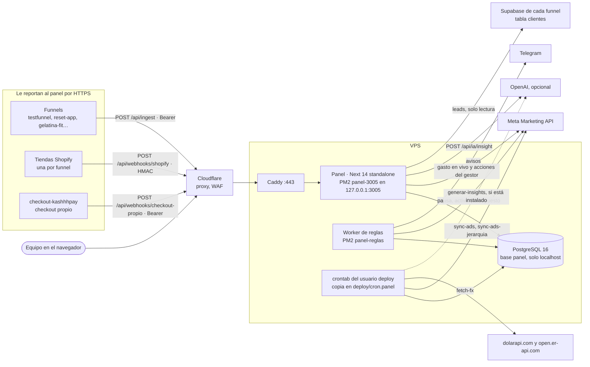

# Panel — tracking, ventas y publicidad de los funnels

Dashboard interno (Next.js 14 + PostgreSQL 16) donde se mira y se opera el
negocio de funnels: el embudo paso a paso, las ventas de todas las tiendas
consolidadas en una moneda, el gasto de Meta Ads y su resultado, un gestor de
campañas con motor de reglas automáticas, el patrimonio, los leads, las tareas
del equipo y un tracker de creativos.

| | |
|---|---|
| **Repo** | `github.com/drasticcurl/dashboard-admin` (privado) |
| **Producción** | `https://panel.hilvanapp.com` (EUR), más **otra instancia que deploya del mismo `origin/main`** |
| **Deploy** | manual, con `deploy/deploy.sh` en la VPS. **No hay CI** |
| **Idioma** | castellano en todo: código, comentarios, UI, commits y docs |
| **Leer primero** | este README → `.kiro/steering/instancias.md` → las entradas más nuevas de `registro.md` |

> **¿Sos un agente de IA?** Leé [§13 Para agentes de IA](#13-para-agentes-de-ia)
> antes de tocar nada. En tres líneas: este repo lo deployan dos paneles en
> producción; el módulo de Anuncios mueve plata real en Meta; y cada cambio se
> anota en `registro.md` con su porqué.

## Contenido

1. [Qué es y qué problema resuelve](#1-qué-es-y-qué-problema-resuelve)
2. [Stack y versiones](#2-stack-y-versiones)
3. [Arquitectura](#3-arquitectura)
4. [Mapa del repo](#4-mapa-del-repo)
5. [Setup local](#5-setup-local)
6. [Variables de entorno](#6-variables-de-entorno)
7. [Comandos del día a día](#7-comandos-del-día-a-día)
8. [Convenciones](#8-convenciones)
9. [Cómo hacer tareas comunes](#9-cómo-hacer-tareas-comunes)
10. [Gotchas y decisiones no obvias](#10-gotchas-y-decisiones-no-obvias)
11. [Deuda técnica conocida](#11-deuda-técnica-conocida)
12. [Estado actual y roadmap](#12-estado-actual-y-roadmap)
13. [Para agentes de IA](#13-para-agentes-de-ia)
14. [Mapa de la documentación](#14-mapa-de-la-documentación)

---

## 1. Qué es y qué problema resuelve

El negocio vende infoproductos con **funnels**: un quiz o landing, una página de
venta, el checkout y un upsell. Cada funnel es una app aparte (repos hermanos
como `testfunnel`, `reset-app` o `gelatina-fit`, que corren en la misma VPS),
cobra por su propia tienda de Shopify o por el checkout propio
(`checkout-kashhhpay`), vende en su moneda local (hoy ARS o USD) y consigue casi
todo el tráfico con **Meta Ads**.

Antes de este panel cada funnel medía por su cuenta en su propio Supabase, y no
había un lugar donde contestar las preguntas de todos los días: dónde se cae la
gente paso por paso, cuánto se vendió **neto** (descontando devoluciones,
comisión de la pasarela y costo de producto) en una moneda común, cuánto costó
la publicidad y si cada funnel —y cada campaña— gana o pierde. El panel es ese
lugar: los funnels le mandan sus eventos de navegación (`/api/ingest`), las
tiendas le mandan cada venta por webhook, un cron trae el gasto de Meta, y todo
se cruza en una base Postgres propia de la que el panel es el **único cliente**
(los funnels hablan HTTP, nunca con la base).

Además de mostrar, el panel **opera**: desde `/anuncios` se editan presupuestos
y se pausan, activan, duplican y renombran objetos de Meta, y un worker
(`panel-reglas`) ejecuta reglas automáticas que pausan campañas y escalan
presupuestos **con plata real**. Suma el patrimonio medido a mano (`/finanzas`),
los leads que siguen en el Supabase de cada funnel (`/leads`), un kanban del
equipo (`/tareas`), un tracker de creativos (`/creativos`) y un análisis con IA
opcional sobre Resumen y Finanzas.

### Las dos instancias

Este repo lo deployan **dos paneles distintos** desde el mismo `origin/main`,
cada uno con su dominio, su base, su `.env.production` y su moneda de reporte.
El detalle está en `.kiro/steering/instancias.md` y `COMO-DEPLOYAR.md`. Este
README documenta la instancia principal:

| | hilvanapp |
|---|---|
| Dominio | `panel.hilvanapp.com` |
| En la VPS | `/srv/panel` · puerto 3005 · PM2 `panel-3005` |
| Base | `panel` (+ `panel_test`) |
| Moneda de reporte · marca | EUR · `Hilvan` |
| Anuncios | activo, con worker `panel-reglas` |
| Deploy | `/srv/panel/repo/deploy/deploy.sh` |

La otra instancia reporta en otra moneda, tiene el módulo de Anuncios apagado y
su script de deploy vive fuera del repo.

Un cambio que se mergea acá llega a las dos en su próximo deploy. Por eso todo lo
que varía entre instancias va por variable de entorno con default al valor de
hilvanapp (ver [§8](#8-convenciones)).

### Los funnels de hilvanapp

| slug | Funnel | De dónde sale su fila en `funnels` |
|---|---|---|
| `chauhinchazon` | Chau Hinchazón (repo `testfunnel`) | `db/migrations/009_seed_funnels.sql` |
| `reset` | Protocolo Reset+ (repo `reset-app`) | `009_seed_funnels.sql` |
| `chauhinchazon-latam` | la versión LATAM, vende en USD | `026_funnel_latam.sql` |
| `gelatina` | Gelatina Fit (repo `gelatina-fit`) | **fuera de este repo**: un `029_funnel_gelatina.sql` aplicado a mano en producción ([§11](#11-deuda-técnica-conocida)) |
| `almagemela` | Alma Gemela | **fuera de este repo**: `_seed-funnel-almagemela.sql` del repo del funnel (ver `registro.md`, 2026-09-22) |

### Las pestañas

| Ruta | Qué hay |
|---|---|
| `/resumen` | KPIs multi-funnel del período (neto, gasto, resultado, ROI) en widgets que se mueven y se guardan; switch EUR/USD; análisis con IA |
| `/embudo` | embudo de sesiones paso a paso y por etapas; cards de los tests A/B (pitch del upsell, estética del quiz) |
| `/ventas` | ventas por funnel: bruto, devoluciones, comisiones, costos, neto; cajón de "ventas sin atribuir" |
| `/anuncios` | gestor de Meta por nivel (campaña/conjunto/anuncio) con vistas guardadas y acciones en lote; `/anuncios/reglas` (motor de reglas) y `/anuncios/historial` |
| `/finanzas` | patrimonio **medido** (saldo tipeado por cuenta y día), movimientos y pagos programados |
| `/leads` | leads del Supabase de cada funnel, solo lectura |
| `/tareas` | kanban del equipo, con dueño por tarjeta |
| `/creativos` | tracker manual de rendimiento de videos |
| `/config` | funnels, pasos, etapas, productos, tiendas, comisiones, cotizaciones, publicidad (cuentas y mapeo de campañas), ajustes, usuarios y salud del sistema |

Fuera del panel: `/` (login), `/cambiar-clave` y `/sin-acceso`.

---

## 2. Stack y versiones

Versiones instaladas por `package-lock.json` (entre paréntesis, el rango del
`package.json` cuando difiere):

| Pieza | Versión | Nota |
|---|---|---|
| Node.js | **20.20.2 en la VPS** | Sin `.nvmrc` ni `engines`. Mínimo práctico 20.12: los crons usan `node --env-file` y los tests `process.loadEnvFile`. En desarrollo también anda con 24.14.0 |
| Next.js | 14.2.5 (exacta) | App Router, `output: 'standalone'`, middleware en Edge |
| React | 18.3.1 (`^18`) | |
| TypeScript | 5.9.3 (`^5`) | `strict`, `target: es2022`, alias `@/*` → raíz del repo |
| PostgreSQL | 16 (16.15 en la VPS) | paquete de Ubuntu en producción; `postgres:16` en Docker solo para desarrollo |
| Acceso a datos | `pg` 8.23.0 (`^8.13.1`) | **sin ORM**: SQL a mano, siempre parametrizado (`lib/db.ts`) |
| Validación | `zod` 3.25.76 (`^3.23.8`) | |
| Estilos | Tailwind 3.4.19 + PostCSS/autoprefixer | tokens propios en `tailwind.config.ts` |
| UI | `recharts` 2.15.4, `@dnd-kit/core` 6.3.1 + `@dnd-kit/sortable` 10, `@phosphor-icons/react` 2.1.10, `geist` 1.7.2 | sin librería de componentes: las primitivas están en `components/ui.tsx` |
| Tests | `vitest` 2.1.9 (`^2.1.8`), `fast-check` 4.9.0 (exacta) | entorno `node`, sin jsdom: se testean funciones puras y SQL |
| Scripts y crons | `tsx` 4.23.12 (`^4.19.2`) | es devDependency pero se usa en producción: por eso el deploy hace `npm ci` sin `--omit=dev` |
| Lint | `eslint` 8.57.1 + `eslint-config-next` 14.2.5 | instalados pero **sin configuración** ([§7](#7-comandos-del-día-a-día)) |
| Infra | Ubuntu 24.04.4, PM2 7.0.3, Caddy 2.11.4, Cloudflare | verificado en `COMO-DEPLOYAR.md` §12 el 2026-09-13 |

El `package.json` se declaró con los mismos rangos que `testfunnel` para correr
en el Node 20.20.2 de la VPS.

---

## 3. Arquitectura

### 3.1 Vista general



### 3.2 Los flujos de punta a punta

**Tracking (lo que alimenta el embudo).** El funnel manda lotes de hasta 50
eventos a `POST /api/ingest` con `Authorization: Bearer <ingest key>`.
`app/api/ingest/route.ts` valida en este orden, y el orden importa: tamaño
(64 KB) → bearer → funnel por hash de la key (`lib/funnels.ts`, cacheado 60 s) →
`timingSafeEqual` → JSON → cantidad de eventos → schema de zod
(`lib/ingest/schema.ts`). Después `lib/ingest/apply.ts` hace, en una transacción,
el upsert de `sessions` y el insert de `events`. El embudo mide sesiones por
`sessions.max_step_index`; `events` es el log crudo, particionado por mes. Lo que
no se entiende se guarda igual y se anota en `ingest_errors`; el endpoint nunca
responde 5xx.

**Venta por Shopify.** `POST /api/webhooks/shopify` verifica el HMAC-SHA256 del
body **crudo** contra cada secret de `SHOPIFY_WEBHOOK_SECRETS`
(`lib/orders/verify.ts`) y `lib/orders/upsert.ts` resuelve:

1. atribución (`note_attributes` → `landing_site` → `fbclid` → herencia por email);
2. funnel (atributo `funnel` → `product_map` → `shop_map`; si nada resuelve,
   `funnel_id NULL` y la venta aparece en "ventas sin atribuir");
3. día local, en SQL con la TZ del funnel;
4. conversión a moneda de reporte, comisión y costo, **congelados en la fila**;
5. `INSERT … ON CONFLICT (source, external_id) DO NOTHING` y marca
   `sessions.purchased_at`.

Con firma válida responde **siempre 200** (un 5xx hace que Shopify reintente por
horas) y cada entrega deja una fila en `webhook_events`. Detalle y un `curl` de
prueba en `lib/orders/README.md`.

**Venta por el checkout propio.** `POST /api/webhooks/checkout-propio` lo llama
`checkout-kashhhpay`. Se autentica con el mismo Bearer que el ingest (la key de
cualquier funnel) y `lib/orders/checkout-propio.ts` inserta en `orders` con
`source='checkout_propio'`.

**Gasto de Meta.** Tres caminos llegan al mismo dato (`ad_spend`):

- el cron horario `scripts/sync-ads.ts`, el único que corre aunque nadie tenga el
  panel abierto;
- el refresco en vivo (`lib/ads/live.ts`) cuando alguien abre Resumen, Ventas o
  Anuncios con un rango que incluye hoy, frenado por `ADS_LIVE_TTL_SECONDS`
  contra `ad_accounts.last_sync_at`;
- el polling del cliente (`lib/ads/polling.ts`), cada
  `NEXT_PUBLIC_ADS_POLL_SECONDS` y solo con la pestaña visible.

La jerarquía (campañas, conjuntos, anuncios) la trae `sync-ads-jerarquia.ts` cada
15 minutos. El gasto se imputa al funnel de la cuenta publicitaria, salvo las
campañas mapeadas a otro funnel en `ad_campaign_funnel` (migración 033).

**Resumen.** Lee `daily_metrics`, un agregado **congelado** que recalcula
`scripts/rollup.ts`: cada 10 minutos los últimos 3 días y a las 05:25 los
últimos 35. Si cambiás algo que afecta días pasados (un mapeo de campaña, el
`funnel_id` de una orden, una cotización), hay que correr el rollup de ese rango.

**Una pantalla del panel.** Cloudflare → Caddy → `middleware.ts` (Edge: valida
firma y vencimiento de la cookie `panel_token`; en `/api/*` sin sesión devuelve
401 JSON, en páginas redirige al login) → `app/(panel)/layout.tsx` (lee la sesión
de la base; con clave pendiente manda a `/cambiar-clave`) →
`app/(panel)/<sección>/layout.tsx` (`requerirSeccion`) → `page.tsx` (server
component con `force-dynamic` que hace el fetch inicial con `lib/queries/*`) →
`<Sección>View.tsx` (client) que refetchea contra `/api/data/*`, donde cada route
llama a `guardSeccion(req)`.

**Motor de reglas.** `panel-reglas` corre `scripts/run-ad-rules.ts --daemon`.
Cada tick (unos 60 s): lee los interruptores → toma un lease en la base →
reconcilia acciones pendientes → refresca el gasto → evalúa reglas
(`lib/ads/reglas/motor.ts`, puro, y `ejecutor.ts`) → escribe en Meta o solo
registra si está en modo sombra → avisa por Telegram. Frenos: interruptor global,
sombra forzada, techo absoluto de presupuesto, tope por tick, cooldown y backoff
por cuota. Toda regla nueva nace apagada y en sombra. Ver
`ARQUITECTURA-BACKEND.md` §6 y `docs/runbook-anuncios.md`.

### 3.3 Autenticación y permisos

El permiso se hace cumplir en tres capas y ninguna sobra:

1. **`middleware.ts`** (Edge): firma y vencimiento del token (12 h). No puede
   consultar la base. Su `matcher` deja **afuera** `/api/ingest` y
   `/api/webhooks/*`, que tienen su propia auth.
2. **El `layout.tsx` de cada sección**: `requerirSeccion('<sección>')` redirige a
   la primera sección permitida, o a `/sin-acceso`.
3. **Cada route de `/api/**`**: `guardSeccion(req)` busca la ruta exacta en
   `MAPA_API` (`lib/permisos.ts`). Ruta sin mapear = 403: falla cerrado.
   `app/api/rutas-mapeadas.test.ts` recorre `app/api/**` y se pone en rojo si
   aparece una `route.ts` que no está en el mapa.

Esconder un link del nav es cosmético: el permiso lo niega el server. Los
usuarios tienen clave propia (scrypt) desde la migración 030, y el permiso por
pestaña se lee de la base en cada request (apagar una pestaña tiene efecto
inmediato). Con la tabla `usuarios` **vacía**, `DASHBOARD_PASSWORD` entra como
admin (el "fallback D10"); se apaga solo en cuanto existe un usuario. El rate
limit del login vive en la memoria del proceso (5 intentos cada 15 min por IP):
por eso PM2 corre **una sola instancia**.

### 3.4 Modelo de datos

El DDL está en `db/migrations/` y cada archivo explica su porqué en la cabecera.

| Dominio | Tablas | Migraciones |
|---|---|---|
| Catálogo | `funnels`, `funnel_steps`, `funnel_stages` | 001, 017; alias 019; experimentos 020, 023, 027, 035 |
| Tracking | `sessions`, `events` (particionada por mes, retención de 180 días) | 002, 003 |
| Ventas | `orders`, `order_items`, `product_map`, `shop_map`, `commissions` | 004, 011–013, 032 |
| Cotizaciones | `fx_rates` (editable a mano) | 005 |
| Métricas | `daily_metrics` (rollup del Resumen) | 006 |
| Red de seguridad y ajustes | `ingest_errors`, `webhook_events`, `settings` | 007, 010 |
| Publicidad | `ad_accounts`, `ad_spend`, `ad_campaigns`, `ad_sets`, `ads`, `ad_rules`, `ad_rule_conditions`, `ad_rule_runs`, `ad_actions`, `ad_alcance`, `ad_campaign_funnel` | 008, 014–016, 018, 021, 024, 025, 033 |
| Finanzas | `finance_accounts`, `finance_account_balances`, `finance_movements`, `finance_scheduled_payments`, `finance_scheduled_payment_runs` | 022, 028 (que borró `finance_daily_profit`) |
| IA | `ai_insights` | 029 |
| Usuarios y tareas | `usuarios`, `usuario_secciones`, `tareas`, `tarea_links`, `tarea_comentarios` | 030, 031 |
| Creativos | `creativos` | 034 |

`scripts/migrate.ts` registra lo aplicado en `schema_migrations` (por nombre de
archivo).

### 3.5 Servicios externos

| Servicio | Para qué | Código | Credencial |
|---|---|---|---|
| Meta Graph API | gasto, jerarquía, escrituras del gestor y del motor | `lib/ads/meta.ts` | `META_ADS_TOKEN`, versión en `META_API_VERSION` |
| Shopify (entrante) | ventas | `app/api/webhooks/shopify/`, `lib/orders/` | `SHOPIFY_WEBHOOK_SECRETS` |
| `checkout-kashhhpay` (entrante) | ventas del checkout propio | `app/api/webhooks/checkout-propio/` | ingest key de un funnel |
| Funnels (entrante) | eventos del embudo | `app/api/ingest/`, `lib/ingest/` | una ingest key por funnel; en la base solo su hash |
| dolarapi.com y open.er-api.com | cotizaciones diarias | `lib/fx-fetch.ts` | ninguna |
| OpenAI (`/v1/chat/completions`) | análisis con IA | `lib/ia/` | `OPENAI_API_KEY` (sin ella, la feature no existe) |
| Telegram Bot API | avisos del motor de reglas | `lib/ads/notificar.ts` | token y chat id en `settings`, los carga `npm run ads:telegram` |
| Supabase de cada funnel (PostgREST) | leads | `lib/supabase-leads.ts` | `SUPABASE_URL_<SLUG>` y `SUPABASE_SERVICE_KEY_<SLUG>` |
| Cloudflare | TLS, WAF, bloqueo de Brasil fuera de `/api/` | fuera del repo | ver `COMO-DEPLOYAR.md` §2 |

---

## 4. Mapa del repo

```
.
├── app/
│   ├── page.tsx                 login (usuario + clave; fallback a DASHBOARD_PASSWORD)
│   ├── cambiar-clave/  sin-acceso/
│   ├── layout.tsx  globals.css  icon.svg
│   ├── (panel)/                 route group: todo lo que está detrás del login
│   │   ├── layout.tsx           guard de sesión + Shell (nav, filtros, aviso de saldos)
│   │   └── <sección>/           resumen, embudo, ventas, anuncios, finanzas, leads, tareas, creativos, config
│   │       ├── layout.tsx       requerirSeccion('<sección>')
│   │       ├── page.tsx         server component, force-dynamic, fetch inicial
│   │       ├── loading.tsx      esqueleto de carga
│   │       └── <X>View.tsx      client component que refetchea contra /api
│   └── api/
│       ├── ingest/              público: eventos de los funnels
│       ├── webhooks/            público: shopify, checkout-propio
│       ├── data/                lecturas de cada pestaña (overview, funnel, pitch, sales, leads, ads, ads/historial)
│       ├── config/              ABM de catálogos; _lib.ts tiene json(), guard(), parseJson()
│       ├── ads/                 acciones del gestor, reglas (+ CSV), interruptores
│       ├── finanzas/  tareas/  usuarios/  creativos/  ia/
│       └── rutas-mapeadas.test.ts   exige que toda route.ts esté en MAPA_API
├── components/                  Shell, Nav (TABS), ui.tsx (primitivas, fmtMoney), WidgetGrid, Portal, RangePicker…
├── lib/
│   ├── db.ts                    pool de pg y los helpers q / q1 / tx
│   ├── auth.ts  permisos.ts     cookie firmada, scrypt, rate limit · SECCIONES, MAPA_API, guards
│   ├── queries/                 la capa de datos de cada pantalla/módulo (funnel, sales, overview, ads, saldo, finance, tareas…)
│   ├── ingest/                  schema de zod y aplicación del lote
│   ├── orders/                  ventas: verify, attribution, resolve, upsert, refund, checkout-propio (+ README)
│   ├── ads/                     Meta: cliente, sync, jerarquía, acciones, presupuesto, live/polling, reglas/ (motor, ejecutor, repo)
│   ├── ia/                      briefs, cliente de OpenAI, caché de insights
│   ├── widgets/                 catálogos de widgets de Resumen y Ventas y su layout
│   ├── fx.ts  fx-fetch.ts       conversión congelada y fetcher de cotizaciones
│   ├── moneda-reporte.ts  brand.ts   lo que varía por instancia
│   ├── monto.ts                 EL parseo de montos tipeados
│   ├── day.ts                   días y rangos resueltos en SQL con la TZ del funnel
│   └── test/                    generadores de fast-check compartidos
├── middleware.ts                auth en Edge y headers de seguridad
├── db/migrations/               001…035, SQL plano
├── scripts/                     crons, backfills, seeds y verificaciones contra Meta (tsx)
├── deploy/                      deploy.sh, ecosystem.config.js (PM2), cron.panel, Caddyfile.panel
├── docs/                        recetas de tareas comunes, runbooks, bitácora del rediseño v3, CSV de reglas
├── tasks/                       planes por módulo (finanzas, saldo-cuentas, usuarios-y-tareas) con prompts y verificaciones
├── .kiro/                       steering (reglas del repo) y specs de bugfixes de Anuncios
├── registro.md                  el porqué de cada cambio, lo más nuevo arriba
├── ARQUITECTURA-BACKEND.md      referencia técnica del backend
├── COMO-DEPLOYAR.md             VPS, Cloudflare, deploy, rollback, crons, backups
└── docker-compose.yml           Postgres SOLO para desarrollo local
```

### Puntos de entrada

| Qué | Dónde |
|---|---|
| Request HTTP | `middleware.ts` → `app/(panel)/layout.tsx` o `app/api/**/route.ts` |
| Login | `app/page.tsx` (server action `loginAction`) |
| App en producción | `.next/standalone/server.js` bajo PM2 `panel-3005` (`deploy/ecosystem.config.js`) |
| Worker de reglas | `scripts/run-ad-rules.ts --daemon` bajo PM2 `panel-reglas` |
| Crons | `deploy/cron.panel`: copia de referencia del crontab vivo ([§10](#10-gotchas-y-decisiones-no-obvias)) |
| Migraciones | `scripts/migrate.ts` (`npm run db:migrate`) |
| Deploy | `deploy/deploy.sh` |

Los archivos que más cambian (por cantidad de commits), todos bajo
`app/(panel)/` salvo el primero y el último: `registro.md`,
`finanzas/FinanzasView.tsx`, `embudo/EmbudoView.tsx`,
`anuncios/GestorAnuncios.tsx`, `ventas/VentasView.tsx`,
`anuncios/reglas/ReglasView.tsx` y `lib/widgets/catalogo-resumen.tsx`. Los más
grandes: `app/(panel)/anuncios/reglas/ReglasView.tsx` (~2.660 líneas),
`app/(panel)/anuncios/GestorAnuncios.tsx` (~2.230) y
`app/api/ads/acciones/route.ts` (~1.570).

---

## 5. Setup local

### Requisitos

- Node 20.12 o más nuevo (producción usa 20.20.2) y npm.
- PostgreSQL 16: el `docker-compose.yml` del repo (Docker o Colima) o uno
  instalado, por ejemplo con Homebrew.
- `psql`, para un paso de la primera migración.

### Paso a paso

```bash
# 1. Dependencias
npm install

# 2. Entorno
cp .env.example .env
#   POSTGRES_PASSWORD     openssl rand -hex 32   ← hex: una "/" de base64 rompe DATABASE_URL
#   DATABASE_URL          postgres://panel:<esa clave>@127.0.0.1:<DB_PORT>/panel
#   DASHBOARD_PASSWORD    cualquier cosa; con menos de 24 caracteres solo avisa en el log
#   NEXT_PUBLIC_SITE_URL  vaciala o poné http://localhost:3005 (el ejemplo trae el dominio de producción)
#   El resto es opcional para arrancar (ver §6).

# 3. Postgres local. SOLO desarrollo: en la VPS no hay Docker
docker compose up -d
#   Escucha en 127.0.0.1:${DB_PORT:-5432}. Si el 5432 está ocupado:
#   DB_PORT=5433 en .env y el mismo puerto en DATABASE_URL.

# 4. tsx NO lee .env: exportalo a la shell (una vez por terminal)
set -a; . ./.env; set +a

# 5. Migraciones. En una base VACÍA la 021 corta a propósito
npm run db:migrate
#   → aplica 001–020 y termina con:
#     «021 abortada: no existe ninguna Cuenta_Activa (ad_accounts.active = true AND platform = 'meta')…»
psql "$DATABASE_URL" -c "INSERT INTO ad_accounts (account_id, name, active) VALUES ('act_local_placeholder', 'placeholder local', true)"
npm run db:migrate          # sigue de la 021 a la última
#   Opcional: sacar el placeholder. Primero las 6 reglas que la 021 le asignó
#   (el FK ad_rules_cuenta_fk es ON DELETE RESTRICT) y después la cuenta:
psql "$DATABASE_URL" \
  -c "DELETE FROM ad_rules WHERE account_id = 'act_local_placeholder'" \
  -c "DELETE FROM ad_accounts WHERE account_id = 'act_local_placeholder'"

# 6. Levantar
npm run dev                 # http://localhost:3005 (Next sí lee .env solo)
```

Esta secuencia se verificó el 2026-09-29 contra una base vacía: la primera
corrida aplica 001–020 y corta en la 021, la segunda aplica 021–035, y una
tercera no aplica nada. Con la base así, la suite completa pasa (ver
[§7](#7-comandos-del-día-a-día)).

### Entrar al panel

- **Con la tabla `usuarios` vacía** (recién migrada): cualquier nombre de usuario
  más `DASHBOARD_PASSWORD` entra como admin.
- **Con usuarios:** `npm run usuarios:seed` crea `lucho` (o
  `PANEL_ADMIN_USUARIO`) con la clave `123456` y `debe_cambiar_clave = true`. El
  primer login te manda a `/cambiar-clave` (mínimo 15 caracteres). Correrlo de
  nuevo no toca a los usuarios que ya existen.

### Datos

La base local arranca vacía y el panel muestra ceros. No hay un seed de datos de
demo en el repo (TODO). Para ver algo:

- una venta de prueba: el `curl` firmado con los fixtures de
  `lib/orders/__fixtures__/`, en `lib/orders/README.md` → "Verificación rápida"
  (necesita `SHOPIFY_WEBHOOK_SECRETS` en el `.env` y el panel levantado);
- eventos de tracking: cargá una key con `npm run db:ingest-key -- chauhinchazon <key>`
  y mandá un lote a `/api/ingest` con la forma de `lib/ingest/schema.ts`
  (`lib/ingest/schema.test.ts` tiene payloads válidos).

**No traigas dumps de producción ni exports de Shopify a tu máquina "para
probar"**: tienen nombre, email, teléfono y dirección de clientes (ver
`.gitignore`).

---

## 6. Variables de entorno

La referencia comentada es `.env.example`. En producción viven en
`/srv/panel/shared/.env.production` (`chmod 600`), que el deploy copia a la
release. **Next lee `.env` solo; `tsx` (scripts y crons) no**: en local exportalo
con `set -a; . ./.env; set +a`, y en la VPS los crons usan
`node --env-file=.env.production`.

| Variable | ¿Obligatoria? | Default en código | Qué es | Dónde se consigue |
|---|---|---|---|---|
| `DATABASE_URL` | **sí** (el deploy la exige) | — (sin ella `lib/db.ts` tira) | conexión a Postgres | local: armala con los `POSTGRES_*`; prod: `.env.production` de la VPS |
| `POSTGRES_USER`, `POSTGRES_PASSWORD`, `POSTGRES_DB`, `DB_PORT` | solo local | `DB_PORT` 5432 | las lee únicamente `docker-compose.yml` | las inventás vos; la clave con `openssl rand -hex 32` |
| `DASHBOARD_PASSWORD` | **sí** (deploy) | — | clave compartida: fallback de login con `usuarios` vacía y secreto de la cookie si no hay `PANEL_SESSION_SECRET` | `openssl rand -base64 24` |
| `PANEL_SESSION_SECRET` | no | `DASHBOARD_PASSWORD` | secreto HMAC de la cookie. Rotarlo corta TODAS las sesiones: es la única forma de echar a alguien en el acto | `openssl rand -hex 32` |
| `NEXT_PUBLIC_SITE_URL` | **sí** (deploy) | — | URL canónica: el middleware redirige al login con ella | prod: el dominio de la instancia; local: vacía o `http://localhost:3005` |
| `DASHBOARD_TZ` | no | `America/Argentina/Buenos_Aires` | zona del "hoy" del panel (crons, techo diario de IA, pagos programados) | — |
| `PANEL_BRAND` | no | `Hilvan` | nombre en el header y la pestaña | por instancia |
| `NEXT_PUBLIC_REPORT_CURRENCY` | no | `EUR` | moneda de reporte, `EUR` o `USD` (otra hace fallar el arranque). Se hornea en el build. **No se cambia en una base con historial** | por instancia |
| `PANEL_ADMIN_USUARIO`, `PANEL_ADMIN_NOMBRE` | no | `lucho` / `Lucho` | el admin que crea `usuarios:seed` | por instancia |
| `SHOPIFY_WEBHOOK_SECRETS` | **sí** (deploy) | — | secrets de las tiendas, separados por coma. Sin ninguno, el webhook responde 401 a todo | los mismos del env de cada funnel (firman las suscripciones creadas desde el admin de Shopify) |
| `SUPABASE_URL_<SLUG>`, `SUPABASE_SERVICE_KEY_<SLUG>` | no | — (Leads dice "no configurado") | leads de cada funnel, solo lectura | el proyecto de Supabase del funnel. El sufijo es el slug en mayúsculas **sin normalizar**: `chauhinchazon-latam` → `SUPABASE_URL_CHAUHINCHAZON-LATAM` |
| `META_ADS_TOKEN` | **sí** (deploy de hilvanapp) | — | token de un usuario del sistema con `ads_read` y `ads_management`, con la cuenta asignada como administrador. **No** es el token de CAPI de los funnels | Meta Business; verificalo con `npm run ads:token` |
| `META_API_VERSION` | no | `v21.0` | versión de la Graph API (formato `vXX.Y`, validado) | — |
| `ADS_LIVE_TTL_SECONDS` | no | `60` | cuánto se considera fresco el último sync de gasto; es el freno real contra el rate limit | — |
| `ADS_LIVE_TIMEOUT_MS` | no | `8000` | cuánto espera un `/api/data/*` al sync antes de responder con lo guardado | — |
| `ADS_JERARQUIA_TTL_SECONDS` | no | `300` | lo mismo para la jerarquía (solo con `forzar=1`). **No está en `.env.example`** | — |
| `ADS_JERARQUIA_TIMEOUT_MS` | no | `10000` | ídem. **No está en `.env.example`** | — |
| `NEXT_PUBLIC_ADS_POLL_SECONDS` | no | `60` | cada cuánto repite el pedido la pestaña visible; `0` lo apaga, mínimo 15. Se hornea en el build | — |
| `ADS_TEST_OBJECT_ID` | no | — | allowlist del objeto PAUSADO y descartable sobre el que `ads:token` escribe su no-op | elegido a mano en Meta |
| `ADS_TEST_ACCOUNT_ID` | no | — | cuenta para `ads:campos` y `ads:dsa`. **No está en `.env.example`** | — |
| `ADS_TEST_CAMPAIGN_ID` | no | — | campaña PAUSADA para `ads:copies`, que crea copias reales. **No está en `.env.example`** | — |
| `OPENAI_API_KEY` | no | — | **prende** la IA: sin ella el widget y la tarjeta no aparecen y el cron sale con 0. Nunca `NEXT_PUBLIC_` | `https://platform.openai.com/api-keys` |
| `OPENAI_MODEL` | no | `gpt-4o-mini` | modelo; en hilvanapp lo fija `scripts/setear-openai-key.sh` | — |
| `OPENAI_INSIGHTS_MAX_DIA` | no | `20` | techo duro de análisis por día (los aciertos de caché no cuentan) | — |
| `OPENAI_TIMEOUT_MS` | no | `60000` | plazo de la respuesta del modelo | — |

`TZ` solo la usa `docker-compose.yml` (zona del contenedor; default Buenos
Aires). El guard de `deploy/deploy.sh` aborta si falta alguna de las cinco
obligatorias (`DATABASE_URL`, `DASHBOARD_PASSWORD`, `NEXT_PUBLIC_SITE_URL`,
`SHOPIFY_WEBHOOK_SECRETS`, `META_ADS_TOKEN`).

---

## 7. Comandos del día a día

### Desarrollo y verificación

```bash
npm run dev                 # next dev -p 3005
npm run build               # next build (standalone): lo mismo que corre deploy.sh
npm test                    # vitest --run, todas las *.test.ts
npm run test:watch          # vitest en modo watch
npx vitest --run lib/ingest # un subconjunto
npx tsc --noEmit            # typecheck completo, tests incluidos
```

Estado medido el 2026-09-29, en `rediseno-panel-v3` @ `5677106`:

| Comando | Resultado |
|---|---|
| `npm run build` | OK |
| `npx tsc --noEmit` | **1 error conocido y viejo**: `app/(panel)/tareas/tablero.test.ts(18,5): error TS2783`. El criterio del repo es "sin errores nuevos". `next build` no lo ve porque su typecheck ignora los `*.test.*` |
| `DATABASE_URL= npm test` (sin base) | 91 archivos OK y 44 salteados · 1339 tests OK y 425 salteados · ~1 min |
| `npm test` contra una base recién migrada | 135/135 archivos · 1764/1764 tests · ~80 s |

### Tests: lo que hay que saber antes de correrlos

- Hay 135 archivos `*.test.ts` al lado del código. Unos 50 son de integración y
  pegan a un **Postgres real**; se saltean con `describe.skipIf` cuando no hay
  `DATABASE_URL`.
- **Los tests cargan tu `.env` solos** (`process.loadEnvFile`), así que corren
  contra la base de tu `DATABASE_URL` y **escriben en ella**:
  `lib/queries/overview.test.ts` hace `DELETE FROM daily_metrics` (la tabla
  entera) y `lib/orders/webhook.test.ts` vacía `fx_rates` y la restaura. Usá una
  base de test aparte, como hace el deploy con `panel_test`. Una variable ya
  exportada le gana al `.env`:

  ```bash
  # una vez: crear y migrar la base de test (con el mismo paso de la 021 que en §5)
  psql "$DATABASE_URL" -c "CREATE DATABASE panel_test"
  export TEST_DB_URL="${DATABASE_URL%/*}/panel_test"
  DATABASE_URL="$TEST_DB_URL" npm run db:migrate      # corta en la 021
  psql "$TEST_DB_URL" -c "INSERT INTO ad_accounts (account_id, name, active) VALUES ('act_local_placeholder', 'placeholder local', true)"
  DATABASE_URL="$TEST_DB_URL" npm run db:migrate
  psql "$TEST_DB_URL" \
    -c "DELETE FROM ad_rules WHERE account_id = 'act_local_placeholder'" \
    -c "DELETE FROM ad_accounts WHERE account_id = 'act_local_placeholder'"

  # cada vez (y volvé a migrarla cuando aparezca una migración nueva)
  DATABASE_URL="$TEST_DB_URL" npm test
  ```

- Sin base: `DATABASE_URL= npm test` corre solo las puras.
- Los archivos corren en serie (`fileParallelism: false`) porque los de
  integración comparten tablas, con 30 s de timeout.
- **Si fallan decenas de tests a la vez con errores de queries** (por ejemplo en
  `createScheduledPayment`), mirá primero si Postgres está vivo: el error real
  suele ser `connect ECONNREFUSED 127.0.0.1:<puerto de tu DATABASE_URL>`.

### Lint

`npm run lint` corre `next lint`, pero **no hay configuración de ESLint** (ningún
`.eslintrc*`): el comando abre el asistente interactivo que escribe una. No lo
corras sin decidir antes qué config se quiere. `next build` saltea el lint en
silencio.

### Deploy (resumen)

El procedimiento completo, el rollback y la verificación están en
`COMO-DEPLOYAR.md`.

```bash
git push origin main                          # deploy.sh toma origin/main
ssh funnel-vps                                # entra como el usuario deploy (sin sudo)
/srv/panel/repo/deploy/deploy.sh              # hilvanapp. NUNCA como root
DEPLOY_BRANCH=mi-rama /srv/panel/repo/deploy/deploy.sh   # probar una rama
```

Desde otro usuario con sudo (por ejemplo root), cada línea va con
`sudo -u deploy bash <script>`.

`deploy.sh`, en orden: guards → `flock` → `git reset --hard origin/<rama>` →
release nueva → guard de env vars → `npm ci` + `npm run build` + migrar
`panel_test` + `npm test` → completa el standalone → para `panel-reglas` →
`db:migrate` en producción → `usuarios:seed` → verifica que el token de Meta
escribe → swap atómico de `current` → `pm2 reload` + health check (vuelve solo a
la release anterior si falla) → levanta `panel-reglas` → deja 5 releases. **No
instala crontabs.**

### Scripts de `package.json`

Todos corren con `tsx`: en local exportá el `.env` antes. En la VPS, desde
`/srv/panel/current`, con
`/usr/bin/node --env-file=.env.production ./node_modules/.bin/tsx scripts/<x>.ts`
(un `npm run <x>` pelado falla con `DATABASE_URL no está configurada`).

| Área | Comando | Qué hace |
|---|---|---|
| Base | `db:migrate` | aplica `db/migrations/*.sql` en orden, cada una en su transacción; idempotente |
| | `db:partitions` | crea las particiones mensuales de `events` (cron mensual) |
| | `db:ingest-key -- <slug> <key>` | guarda el hash de la ingest key de un funnel |
| | `days:recompute` | recalcula `orders.day`, `sessions.day` y `events.day` después de cambiar la TZ de un funnel |
| Cotizaciones | `fx:fetch` | cotizaciones del día (cron 05:10) |
| | `fx:backfill` | completa órdenes sin conversión cuando ya existe la cotización del día |
| | `fx:historico` | carga ARS→reporte de días pasados |
| | `fx:historico-alternativa` | carga la moneda alternativa (USD↔EUR) de días pasados, para el switch del Resumen |
| Métricas | `rollup` | recalcula `daily_metrics` (sin args: 3 días; `--days=N`, `--from=… --to=…` o `--all`) |
| Ventas | `import:csv -- --file=… [--dry-run]` | importa un export de órdenes de Shopify |
| | `import:purchases -- --funnel=… [--dry-run]` | importa el histórico de `purchases` de un Supabase |
| | `commissions:backfill` | recalcula comisión y costo de producto de órdenes ya guardadas |
| Anuncios | `ads:sync` | gasto de Meta a `ad_spend` (cron horario) |
| | `ads:jerarquia` | campañas, conjuntos y anuncios (cron cada 15 min) |
| | `ads:reglas` | un tick del motor; `-- --daemon` es el worker; `-- --dry-run` fuerza sombra |
| | `ads:reconciliar` | cierra duplicaciones que quedaron indeterminadas |
| | `ads:token` | ¿el token puede escribir? (el deploy lo corre; escribe un no-op sobre `ADS_TEST_OBJECT_ID`) |
| | `ads:campos`, `ads:dsa`, `ads:copies` | verificaciones contra la Graph API, una vez por versión. **`ads:copies` crea objetos reales** |
| | `ads:auditar-montos` | reporte de solo lectura de montos sospechosos en reglas |
| | `ads:telegram` | configura el bot de Telegram (interactivo) |
| Finanzas | `finance:pagos` | genera los gastos de los pagos programados (cron 05:40) |
| IA | `ia:insights` | análisis diario de Resumen y Finanzas (llamada paga) |
| Usuarios y tareas | `usuarios:seed` | crea el admin si no existe; no toca a los existentes |
| | `tareas:archivar` | archiva tarjetas con más de 2 días en "hecho" (cron 05:50) |

Sin alias en `package.json`: `scripts/seed-product-map-checkout-propio.ts` (se
corre con `tsx`), y `scripts/setear-openai-key.sh` / `setear-openai-key-remoto.sh`
(cargan `OPENAI_API_KEY` en hilvanapp; leé su cabecera antes).

---

## 8. Convenciones

### Idioma y comentarios

- Todo en castellano: nombres de dominio (`requerirSeccion`, `parsearMonto`,
  `guardSeccion`), UI, mensajes de error y commits. Hay nombres heredados en
  inglés, sobre todo en lo más viejo (`upsertOrder`, `getFunnelByIngestKey`).
- Los comentarios explican **por qué**, con la alternativa descartada y, muchas
  veces, el incidente que lo motivó. Antes de "simplificar" algo con un
  comentario largo, leelo: casi siempre es la cicatriz de un bug real.
- Los ids como `D10`, `P-18`, `T12`, `D-A10`, `R4.8` o `§5` son decisiones,
  problemas, tasks y requisitos de los planes de cada módulo (ver
  [§14](#14-mapa-de-la-documentación)). **Cada plan numera desde D1**: `D10` en
  `lib/orders/` (plan maestro: cómo se resuelve el funnel de una venta) y `D10`
  en `lib/permisos.ts` (plan de usuarios: el fallback de `DASHBOARD_PASSWORD`)
  son decisiones distintas. Buscá el plan del módulo del archivo.

### Estructura de una pantalla

- `page.tsx`: server component con `export const dynamic = 'force-dynamic'` que
  hace el fetch inicial con `lib/queries/*`. El guard va en el `layout.tsx` de la
  sección (devuelve `<>{children}</>` y nada más), no en el page.
- `<X>View.tsx`: `'use client'`, refetchea contra `/api/**`.
- `loading.tsx` con el `Skeleton` de `components/ui.tsx`.
- **Un componente cliente no importa nada que importe `lib/db.ts`**: `pg` rompe
  el bundle (`Module not found: fs/net/tls`). Si necesitás una constante de
  `lib/queries/<módulo>.ts` en el cliente, duplicala en un módulo puro al lado de la
  pantalla (`app/(panel)/creativos/rendimiento.ts`,
  `app/(panel)/tareas/prioridad.ts`) y usá `import type` para los tipos.

### API routes

El molde es `app/api/creativos/route.ts`:

- `export const runtime = 'nodejs'` y `export const dynamic = 'force-dynamic'`.
- `guardSeccion(req)` es la primera línea de **cada** método, GET incluido.
- Body con `zod` y `safeParse(await req.json().catch(() => null))`.
- Respuestas con `json(status, body)` de `app/api/config/_lib.ts` y el sobre
  `{ ok: true, … }` o `{ ok: false, error: '<código_estable>', detail: '<mensaje en castellano>' }`.
  La UI muestra `detail`, no `error`.
- Códigos habituales: `400 invalid_payload`, `401 unauthorized`,
  `403 forbidden` / `clave_pendiente`, `404 unknown_<cosa>`.
- La lógica y el SQL viven en `lib/queries/`; el route valida, autoriza y
  traduce errores.

### SQL y datos

- Siempre parametrizado (`$1`, `$2`) con `q`, `q1` o `tx` de `lib/db.ts`. Lo
  único interpolable en un template literal son constantes del propio módulo.
- Dentro de `tx(async (c) => …)` se usa `c.query`, **nunca `q()`**: toma otra
  conexión, queda fuera de la transacción y puede trabarse esperándola.
- `pg` devuelve `bigint`/`bigserial` y `numeric` como **string**: `Number()`.
- Hijos de una fila (links, comentarios) con subconsultas `jsonb_agg` +
  `COALESCE(…, '[]'::jsonb)`, no con un JOIN que multiplica filas.
- "El día" de algo se resuelve **en SQL** con la TZ del funnel (`lib/day.ts`),
  nunca con aritmética de fechas en JS.
- Un dato que falta es `null`, no `0`: denominador 0 devuelve `null` con chequeo
  explícito (nunca `|| 1`, `NaN` ni `Infinity`), y un total al que le falta una
  parte no se muestra.

### Plata

- Todo monto tipeado pasa por `lib/monto.ts` (`parsearMonto`,
  `leerNumeroEscrito`). **Nunca `Number(input)`**: `"1.000"` es ambiguo y un
  campo de plata no adivina, devuelve un error que se muestra.
- La conversión a moneda de reporte, la comisión y el costo se **congelan al
  insertar** y nunca se recalculan al leer.
- Formato con `fmtMoney(n, MONEDA_REPORTE)` (`components/ui.tsx`);
  `SIMBOLO_REPORTE` solo para texto suelto.

### Estilos

- Solo tokens de `tailwind.config.ts` (`bad-500`, `neutral-700`, `surface`…):
  nada de hex ni colores arbitrarios. Un tono que no existe **no rompe el build**,
  simplemente no genera CSS: `lib/paleta.test.ts` es el que lo detecta.
- Breakpoint propio `panel` = 760px (además de los de Tailwind).
- Modales y popovers van por `components/Portal.tsx`: un ancestro con
  `transform`/`filter` les crea containing block y los corta
  (`docs/BITACORA-IMPLEMENTACION.md`).
- `components/ui.tsx` es compartido por todas las pantallas y lo vigila
  `components/ui.tokens.test.ts`.

### Errores y robustez

- Endpoints públicos (ingest, webhooks): con auth válida responden 200 aunque
  algo falle adentro y dejan el registro en `ingest_errors` o `webhook_events`.
- Nada se descarta (D20): un evento o una venta que no se entiende se guarda y
  se avisa. Una venta sin funnel queda con `funnel_id NULL`, no se tira.
- Falla cerrado: sin sesión, sin permiso, sin secreto o con una ruta sin mapear,
  se niega.
- Nada de `catch {}` vacío: un error tragado termina en una pantalla verde con
  datos que faltan (pasó en Finanzas, `registro.md` 2026-08-24).
- Secretos: nunca en query params ni en logs; un hash nunca sale en un JSON;
  `NEXT_PUBLIC_` solo para lo que no es secreto.

### Instancias

Lo que depende del proyecto va por env var con **default al valor de
hilvanapp** (modelos: `lib/brand.ts`, `lib/moneda-reporte.ts`). Una feature
nueva opcional se prende por la presencia de su variable (como
`OPENAI_API_KEY`), así la instancia que no la declara queda byte-idéntica.

### Tests

- `*.test.ts` al lado del archivo que prueban. Propiedades con `fast-check`
  (generadores compartidos en `lib/test/`).
- Lo que garantiza la base (CHECKs, FKs, UNIQUEs) se prueba contra Postgres real,
  no con mocks, con `describe.skipIf(!dbAvailable)` y un prefijo único en los
  datos para limpiar.

### Registro y commits

- **Cada cambio de código se anota en `registro.md`** en la misma tanda: qué
  pasaba, por qué se resolvió así (con lo descartado) y qué se verificó y qué
  no. La regla y el formato están en `.kiro/steering/registro.md`.
- Commits en castellano con el área adelante y el efecto:
  `Resumen: cada card de Funnels muestra su resultado (neto − ads) y ROI`.
- `git add <archivo>` por nombre, no `git add .`.

---

## 9. Cómo hacer tareas comunes

El paso a paso de cada una está en
**[`docs/tareas-comunes.md`](docs/tareas-comunes.md)**. Acá, lo que más se olvida:

| Tarea | Lo que no se puede olvidar |
|---|---|
| [Agregar un endpoint de API](docs/tareas-comunes.md#agregar-un-endpoint-de-api) | la ruta exacta en `MAPA_API` (`lib/permisos.ts`); sin eso, 403 en producción |
| [Agregar una migración](docs/tareas-comunes.md#agregar-una-migración) | próximo número **036**, sin `BEGIN`/`COMMIT`, idempotente, compatible hacia atrás; corre en las dos bases de producción |
| [Agregar una pestaña](docs/tareas-comunes.md#agregar-una-pestaña-sección) | el CHECK `usuario_secciones_valida`, `SECCIONES`, `UsuariosSection.tsx`, `TABS` y `PANTALLAS` |
| [Agregar un funnel](docs/tareas-comunes.md#agregar-un-funnel) | la TZ es la de su tienda; ingest key; `product_map`; los 4 webhooks de su tienda |
| [Cargar o rotar una ingest key](docs/tareas-comunes.md#cargar-o-rotar-una-ingest-key) | la key en claro va al `.env.production` del funnel; en la base, solo el hash |
| [Imputar campañas de una cuenta compartida](docs/tareas-comunes.md#imputar-campañas-de-una-cuenta-compartida-a-otro-funnel) | por ID de campaña, nunca por nombre; rollup del rango |
| [Agregar una variable de entorno](docs/tareas-comunes.md#agregar-una-variable-de-entorno) | default al valor de hilvanapp; `NEXT_PUBLIC_` se hornea en el build |
| [Agregar un cron](docs/tareas-comunes.md#agregar-un-cron) | `deploy.sh` no instala crontabs: va a mano en la VPS |
| [Agregar un widget](docs/tareas-comunes.md#agregar-un-widget-al-resumen-o-a-ventas) | el `id` de un widget no se renombra nunca |

---

## 10. Gotchas y decisiones no obvias

### Operación

- **El error más caro es cruzar los `.env.production` de las dos instancias**:
  tienen las mismas claves con valores distintos, y un env cruzado deja un panel
  escribiendo en la base del otro **sin que nada falle** (build, tests y health
  check pasan). El deploy de la otra instancia tiene un guard de identidad;
  el de hilvanapp, no.
- **`deploy.sh` hace `git reset --hard`**: `/srv/panel/repo` no es un workspace y
  un arreglo a mano en el server dura hasta el próximo deploy.
- **Nunca correr `deploy.sh` como root**: PM2 es por usuario y el deploy "sale
  bien" sin desplegar nada (pasó el 2026-08-13, con caída). El script tiene guard.
- **`deploy/cron.panel` no es el crontab**: el deploy no lo instala y ya
  divergieron (según `COMO-DEPLOYAR.md`, al 2026-09-13 la línea de
  `generar-insights.ts` estaba en el archivo pero no en el crontab). La fuente de
  verdad es `crontab -l` en la VPS. Los backups diarios están en el crontab de
  **root**.
- **`tsx` no lee `.env`**, ni en local ni en la VPS. Cualquier `npm run <script>`
  pelado falla con `DATABASE_URL no está configurada`.
- **Una clave generada con `openssl rand -base64` puede traer `/`**, y una `/`
  dentro de `DATABASE_URL` hace fallar el parseo (`Invalid URL`). Usá hex o
  URL-encodeala.
- **`NEXT_PUBLIC_SITE_URL` copiada tal cual del ejemplo** apunta a producción, y
  el middleware arma con ella el redirect al login: en local, entrar a una
  pantalla sin sesión (o con la sesión vencida) te manda a
  `https://panel.hilvanapp.com/`.
- **Cloudflare bloquea Brasil** en todo lo que no es `/api/`: desde Brasil el
  panel no abre y no es un bug.
- **PM2 corre una sola instancia de la app a propósito** (el rate limit del login
  está en memoria) y **una sola del worker** (dos motores duplicarían acciones).

### Datos

- **Lo convertido se congela**: `amount_eur`, comisión y costo se calculan al
  insertar la venta. Cambiar la moneda de reporte en una base con historial
  mezcla monedas en la misma columna sin error; las columnas se siguen llamando
  `*_eur` aunque en una instancia en USD tengan dólares.
- **`orders.funnel_id` también se congela**: corregir `product_map` no mueve las
  ventas ya guardadas (`registro.md` 2026-09-23). Hay que hacer `UPDATE` de las
  órdenes y rollup.
- **`daily_metrics` es un agregado**, no una vista: después de reimputar gasto o
  ventas, `rollup` del rango. Si no, el Resumen, el brief de IA y la
  reconciliación siguen con lo viejo hasta el cron nocturno.
- **`orders.day` y `sessions.day` se guardan** con la TZ del funnel al ingerir:
  cambiar `funnels.timezone` exige `npm run days:recompute`.
- **El patrimonio no se calcula, se mide**: Finanzas y Resumen tienen fuentes
  distintas y no tienen por qué coincidir. Un día al que le falta una cuenta no
  tiene patrimonio (`null`), no un total parcial.
- **Un `usd` en minúscula hacía cero el gasto** convertido de LATAM: los códigos
  de moneda van en mayúscula (migración 032).
- **PostgREST corta en 1000 filas en silencio**: todo lo que lee de Supabase
  pagina.
- **El gasto que Meta corrige a la baja no se limpia** de `ad_spend`, y el gasto
  tiene el lag de Meta mientras las ventas tienen el del webhook: Anuncios y
  Ventas no van a coincidir exacto.

### Código

- **La migración 021 aborta en una base vacía** (necesita una cuenta de Meta
  activa). Receta en [§5](#paso-a-paso).
- **El `matcher` de `middleware.ts` deja afuera `/api/ingest` y
  `/api/webhooks/*`**. Si la cookie los alcanza, el tracking y las ventas dejan de
  entrar y el panel muestra ceros sin un solo error.
- **Los tests escriben en la base de tu `.env`** ([§7](#7-comandos-del-día-a-día)).
- **`next build` no chequea los tipos de los `*.test.*`**: usá `npx tsc --noEmit`.
- **Tailwind no avisa de una clase inexistente**: ya pasó con 58 usos de
  `bg-overlay/4` sin la escala de opacidad y con `hover:text-good-100`.
- **`animation-fill-mode: both` deja un `transform` que crea containing block** y
  cortaba el modal por la mitad; por eso `.reveal` usa `backwards` y los overlays
  van por `Portal`.
- **En Anuncios, editar un presupuesto pasa siempre por `DialogoConfirmacion` con
  `Previsualizacion`**, también desde el popover de la fila. Ahí viven las
  validaciones de monto (techo, preservación, margen). Conectar el popover directo
  al endpoint saltea la única red que hay sobre la plata.
- **Lo único que el panel escribe en Meta** (`lib/ads/meta.ts`, `lib/ads/copias.ts`):
  `status` (solo `ACTIVE` o `PAUSED`: `ARCHIVED` y `DELETED` no existen en la
  firma), `daily_budget` (entero en unidades mínimas; nunca `lifetime`), `name`,
  `start_time`, y copias por `/copies`, que nacen siempre en `PAUSED`. Nunca
  archiva ni borra. Un resultado `indeterminado` (timeout) significa "pudo
  haberse aplicado": no se reintenta a ciegas.
- **Las reglas de anuncios son por cuenta, no por funnel**: con tres funnels en la
  misma cuenta, una regla evalúa las campañas de los tres (se acota con
  `name_filter`).
- **La clave inicial del seed es `123456`** hasta el primer login. Si un deploy le
  devolviera esa clave a alguien que ya la cambió, el seed dejó de ser idempotente:
  es lo peor que puede fallar en ese módulo.
- **Cambiar el formato de la cookie corta todas las sesiones** en el deploy (pasó
  con la 030, a propósito).

### Decisiones y por qué

| Decisión | Por qué, y qué se descartó |
|---|---|
| Postgres propio, los funnels solo hablan HTTP (D5) | la base no se expone: escucha solo en localhost, el panel es su único cliente y cada funnel se autentica con su ingest key |
| Montos convertidos congelados al insertar | un reporte de marzo no puede cambiar porque hoy se movió el dólar |
| Paridad USD→EUR directa de er-api | cruzarla vía peso le metía el spread argentino a una venta que nunca pasó por pesos |
| Mapeo de campañas por ID, en tabla aparte (033) | por prefijo de nombre, un rename en Meta reimputaría meses de gasto; derivarlo de las ventas deja sin funnel justo a la campaña que gasta y no vende |
| Patrimonio tipeado a mano (028) | el calculado desde el gasto de Meta y `daily_metrics` ya no cerraba con la realidad (en producción lo corregía un ajuste manual de +689). Se descartó sumarle el saldo manual al cálculo: contaba cada gasto dos veces |
| Permiso leído de la base en cada request (D3) | quitar una pestaña o desactivar a alguien tiene efecto en el request siguiente |
| `usuario_secciones` opt-in | una sección nueva no aparece para todos sin que nadie lo pida |
| El worker de reglas como proceso aparte (D-A13) | no se reinicia con la app ni comparte su memoria |
| Reglas nuevas apagadas y en sombra; 24 h en sombra antes de actuar | se mira qué **habría** hecho el motor antes de darle el presupuesto |
| Tests sin jsdom | se prueban funciones puras y SQL; las garantías de la base, contra la base |

---

## 11. Deuda técnica conocida

1. **`029_funnel_gelatina.sql` está aplicada en producción y no en el repo** (y
   choca de número con `029_insights_ia.sql`). Tampoco está el seed de
   `almagemela`. Un clon limpio + `db:migrate` no tiene esos dos funnels, y
   `panel_test` tampoco. La propuesta era copiarla al repo como la 032
   (`registro.md` 2026-09-14 y la reescritura de `COMO-DEPLOYAR.md` §6), pero
   del 032 al 035 ya se usaron: hoy sería la **036**.
2. **El deploy de hilvanapp no tiene guard de identidad del env** (el de la otra
   instancia sí).
3. **No hay backup de la base de la otra instancia.**
4. **Sin CI**: la única red automática es el `npm run build` + `npm test` que
   corre `deploy.sh`.
5. **ESLint sin configurar.**
6. **Un error de tipos viejo** en `app/(panel)/tareas/tablero.test.ts`.
7. **Sin seed de datos de demo** para desarrollo local.
8. **Mapeo manual de campañas** en la cuenta compartida (Alma Gemela), en cada
   tanda nueva.
9. **Reglas de anuncios por cuenta**, no por funnel.
10. **La carga manual de cotizaciones** (`/api/config/fx`) solo escribe base ARS.
11. **Un lote de acciones en Anuncios no es atómico**: si 3 de 10 fallan, 7
    quedaron aplicadas.
12. **`/api/webhooks/hotmart`** está declarado en `MAPA_API` (y en el allowlist
    de `rutas-mapeadas.test.ts`) pero no existe el route: el módulo de Hotmart no
    está en el árbol.
13. **La TZ de los otros funnels** no se verificó contra la configuración de su
    tienda (`registro.md` 2026-09-22 (3)).
14. **Documentación con referencias viejas** ([§14](#14-mapa-de-la-documentación)).
15. **`lib/ads/meta.ts` usa `v21.0` por default**, que Meta da de baja alrededor
    de principios de 2027. Subirla es cambiar `META_API_VERSION` y correr
    `ads:campos`, `ads:dsa` y `ads:copies` contra la versión nueva.

---

## 12. Estado actual y roadmap

**Funciona en producción:** ingest y embudo; ventas por Shopify y por el checkout
propio; Resumen (con switch EUR/USD y resultado/ROI por funnel), Ventas, Leads y
Config; Anuncios con gestor, motor de reglas y avisos por Telegram (solo
hilvanapp); Finanzas con saldo tipeado; usuarios con permisos por pestaña y
tablero de tareas; Creativos; análisis con IA (key cargada en hilvanapp; al
2026-09-13 su cron no estaba instalado).

**Rama actual:** `rediseno-panel-v3` (rediseño v3: tokens, responsive real,
modal y popover que no se cortan, esqueletos de carga). Sus commits ya están en
`origin/main` (`5677106`); el `main` local está 7 commits atrás. Build y suite
completa en verde el 2026-09-29.

**A medias o sin verificar:**

- **Test A/B de estética** de `chauhinchazon` (migración 035): el panel está
  listo; falta que la 035 corra en producción **antes** de prender el test en el
  funnel (`registro.md` 2026-09-28). La corre el próximo deploy.
  TODO: confirmar si ya se deployó.
- **Rediseño v3 en un dispositivo táctil real**: el arrastre de la hoja del
  popover en mobile, `env(safe-area-inset-bottom)` y el drag & drop del kanban
  con `scroll-snap` no se probaron (`docs/BITACORA-IMPLEMENTACION.md`).
- **Cron de `generar-insights.ts`**: en `deploy/cron.panel` pero no instalado al
  2026-09-13. TODO: confirmar el estado actual del crontab.

**Pendientes explícitos:** los puntos 1–3, 13 y 15 de [§11](#11-deuda-técnica-conocida).

> TODO: no hay un roadmap escrito en el repo. Lo de arriba son los pendientes que
> dejaron `registro.md`, la bitácora y `COMO-DEPLOYAR.md`. Completar con lo que
> sigue en el negocio.

---

## 13. Para agentes de IA

### Qué leer primero, en orden

1. Este README completo, en especial [§8](#8-convenciones),
   [§10](#10-gotchas-y-decisiones-no-obvias) y esta sección.
2. `.kiro/steering/instancias.md` (dos instancias, un repo) y
   `.kiro/steering/registro.md` (la regla del registro).
3. Las entradas más nuevas de `registro.md` y cualquiera que nombre los archivos
   que vas a tocar (`grep -n "<archivo>" registro.md`).
4. Si tu tarea es una de las de `docs/tareas-comunes.md` (endpoint, migración,
   pestaña, funnel, variable de entorno, cron, widget…), esa receta completa.
5. Según el área: `ARQUITECTURA-BACKEND.md` (backend), `docs/runbook-anuncios.md`
   y `.kiro/specs/` (Anuncios), `docs/BITACORA-IMPLEMENTACION.md` y
   `tailwind.config.ts` (UI), `COMO-DEPLOYAR.md` (deploy e infra), el plan del
   módulo en `tasks/` (Finanzas, Saldo, Usuarios y Tareas).
6. El archivo que vas a cambiar **completo**, con sus comentarios, y su
   `*.test.ts`.

### No tocar sin confirmar con una persona

| Qué | Por qué |
|---|---|
| `lib/ads/**`, `app/api/ads/**`, `scripts/run-ad-rules.ts`, `app/(panel)/anuncios/reglas/**` y el camino de escritura del gestor (`PopoverFila` → `DialogoConfirmacion` → `Previsualizacion`) | pausan, activan y cambian presupuestos en Meta con plata real |
| `db/migrations/*.sql` existentes | nunca se edita una aplicada. Una nueva, avisá: corre en dos bases de producción en el próximo deploy |
| `lib/permisos.ts`, `lib/auth.ts`, `middleware.ts` (sobre todo el `matcher`) | auth en tres capas que tienen que firmar igual |
| `app/api/ingest/**`, `app/api/webhooks/**`, `lib/ingest/**`, `lib/orders/**` | contratos con sistemas externos; un error pierde datos sin avisar |
| `lib/fx.ts`, `lib/fx-fetch.ts`, `lib/moneda-reporte.ts`, `lib/brand.ts` | montos congelados y lo que varía por instancia |
| `deploy/**`, `docker-compose.yml`, `next.config.mjs`, `tsconfig.json`, `package.json` | infraestructura y dependencias (no instales paquetes) |
| `components/ui.tsx`, `tailwind.config.ts`, `app/globals.css` | los usan todas las pantallas y tienen tests que los vigilan |
| `lib/widgets/tipos.ts` y los contratos marcados CONGELADO en `tasks/*/00-PLAN-*.md` | otros módulos se escribieron contra ellos |

### Restricciones

- **Nada contra producción** sin un pedido explícito: ni SSH a la VPS, ni
  `deploy.sh`, ni SQL contra la base real, ni scripts que escriben en Meta
  (`ads:token` con `ADS_TEST_OBJECT_ID`, `ads:copies`, `ads:reglas` sin
  `--dry-run`) o que tocan servicios externos (`ads:telegram`, `ia:insights`,
  que es una llamada paga).
- **No commitees ni pushees sin que te lo pidan.** `origin/main` es lo que
  deployan las dos instancias. Nada de `git add .`, `--force` ni reescribir
  historia publicada.
- **No mezcles ni descartes cambios ajenos** del working tree: si al arrancar hay
  archivos modificados que no son tuyos, dejalos como están.
- **No cambies el schema sin avisar.** Migración nueva: numerada, idempotente,
  sin `BEGIN`/`COMMIT` y compatible hacia atrás.
- **No hardcodees nada que dependa de la instancia** (moneda, marca, dominio,
  usuario admin).
- **No corras `npm run lint`** (abre un asistente que escribe config) **ni
  `npm test` contra una base con datos que importen**.
- **No abras ni copies `.env`, `.env.production` ni `orders_export*.csv`**
  (secretos y datos personales de clientes).
- Código, comentarios, UI y mensajes en castellano; comentarios que expliquen el
  porqué.
- Una decisión que el pedido no resuelve **se pregunta**, no se decide en el
  código.
- **Anotá el cambio en `registro.md`** en la misma tanda, con lo que verificaste y
  lo que no.

### Cómo verificar un cambio

```bash
npx tsc --noEmit                        # esperado: solo el TS2783 conocido de tablero.test.ts
DATABASE_URL= npm test                  # rápido y sin base (~1 min)
DATABASE_URL="$TEST_DB_URL" npm test    # completo, contra una base de test migrada (§7)
npm run build                           # lo mismo que corre deploy.sh
```

- **Ruta nueva:** `npx vitest --run app/api/rutas-mapeadas.test.ts`.
- **Migración:** base scratch con todas las anteriores, dos corridas seguidas, y
  la suite contra esa base.
- **UI:** `npm run dev` y mirarlo en el navegador, en desktop y a menos de 760px.
  Medí, no deduzcas del CSS: el bug del modal cortado lo encontró una medición,
  no la lectura del código (`docs/BITACORA-IMPLEMENTACION.md`).
- Al terminar, reportá qué corriste con su salida real y qué quedó sin verificar.
  "Compila" no es verificación.

### Glosario

| Término | Qué es |
|---|---|
| funnel · slug | un embudo de venta y su id en texto (`chauhinchazon`) |
| sesión · `max_step_index` | una visita al funnel y el paso más lejano que alcanzó: con eso se arma el embudo |
| paso · etapa | `funnel_steps` es el catálogo fino; `funnel_stages` agrupa pasos para el embudo |
| variante · experimento · brazo | variante del funnel (`ar`, `latam`) y test A/B con sus brazos (`pitch_A`, `estetica_ritual`) |
| tier | rol del producto en la orden (`front`, `bump`, `upsell`, `downsell`); `unknown` si no está en `product_map` |
| moneda de venta · moneda de reporte | la del funnel (`funnels.sell_currency`) y en la que el panel consolida (`NEXT_PUBLIC_REPORT_CURRENCY`) |
| `fx_stale` | la venta se convirtió con una cotización provisoria o todavía no tiene |
| rollup | el recálculo de `daily_metrics` |
| Cuenta_Activa · Jerarquía | cuenta de Meta con `active = true`; el árbol campaña → conjunto → anuncio |
| modo sombra | el motor decide y registra pero no escribe en Meta (`dry_run`) |
| Techo_Absoluto · Tope_Lote | `ads_max_daily_budget_eur` y `ads_max_delta_por_tick_eur` en `settings` |
| fallback D10 | con `usuarios` vacía, `DASHBOARD_PASSWORD` entra como admin |

---

## 14. Mapa de la documentación

| Documento | Qué tiene | Estado al 2026-09-29 |
|---|---|---|
| `README.md` | esto | — |
| `.kiro/steering/instancias.md` | las dos instancias y qué va por env var | vigente |
| `.kiro/steering/registro.md` | la regla y el formato de `registro.md` | vigente. Cita `COMO-DEPLOYAR.md` §"Cosas que ya pasaron y no conviene repetir": la reescritura de ese documento que está en curso (sin commitear al 2026-09-29) no tiene esa sección |
| `registro.md` | el porqué de cada cambio, desde el 2026-08-24 | vigente, obligatorio |
| `COMO-DEPLOYAR.md` | VPS, Cloudflare, deploy, verificación, rollback, crons, backups | en reescritura (sin commitear al 2026-09-29); esa versión dice estar verificada contra la máquina el 2026-09-13. Desde entonces: hay 35 migraciones (dice 31) y el "próximo número libre 032" ya no lo es |
| `ARQUITECTURA-BACKEND.md` | backend con citas `archivo:línea` | del 2026-09-13: no incluye el webhook `checkout-propio` ni las migraciones 032–035 |
| `docs/runbook.md` | instalación desde cero, operación de la base, diagnósticos | vigente en lo operativo; cita `tasks/00-PLAN.md` y `deploy/.env.example`, que no existen (el ejemplo es `.env.example` en la raíz) |
| `docs/runbook-anuncios.md` | prender/apagar el motor, errores de Meta, límites | cita `tasks/anuncios/00-PLAN-ANUNCIOS.md` (borrado); su "el panel no sabe quién hizo cada cosa" es anterior a los usuarios |
| `docs/tareas-comunes.md` | el paso a paso de endpoint, migración, pestaña, funnel, ingest key, campañas compartidas, variable de entorno, cron y widget | nuevo, 2026-09-29 |
| `docs/BITACORA-IMPLEMENTACION.md` | rediseño v3: estado, decisiones, qué se verificó | vigente |
| `lib/orders/README.md` | el webhook de Shopify y cómo probarlo | vigente |
| `deploy/cron.panel` | crontab de referencia, con el porqué de cada hora | su comentario de `archivar-tareas` dice que la línea "la instala el deploy": no es así |
| `tasks/<módulo>/` | plan (decisiones D1…, contratos congelados), tasks, prompts para agentes y verificaciones de Finanzas, Saldo de cuentas y Usuarios y Tareas | históricos: el diseño al momento de construir cada módulo |
| `.kiro/specs/` | specs de bugfixes de Anuncios (requisitos, diseño, tasks) | históricos |

**Los planes originales ya no están en el árbol.** El plan maestro
(`tasks/00-PLAN.md`: decisiones D1–D20, problemas P-xx, tasks T01–T12) y el de
Anuncios (`tasks/anuncios/00-PLAN-ANUNCIOS.md`: D-A1–D-A19, tasks T13–T19) se
borraron en el commit `7d37bba` (2026-08-16), junto con sus tasks. Siguen en la
historia:

```bash
git show 7d37bba^:tasks/00-PLAN.md
git show 7d37bba^:tasks/anuncios/00-PLAN-ANUNCIOS.md
git ls-tree -r --name-only 7d37bba^ -- tasks/   # qué más había
```

> TODO: confirmar si ese borrado fue intencional (el commit es de Finanzas) o si
> conviene restaurarlos.
